# 《从零构建大模型》读书笔记（完整版）

> **Build a Large Language Model (From Scratch)** — Sebastian Raschka｜中文版：人民邮电出版社·图灵

本笔记由三部分资料交叉整理而成：

| 来源 | 覆盖范围 | 说明 |
|---|---|---|
| 📕 **原书 PDF** | 第 1~7 章 + 附录 A~F | 提供全部理论、公式、代码清单与插图 |
| 💻 **官方代码仓库** | `rasbt/LLMs-from-scratch` | 书中全部可运行代码 |
| 📝 **知乎读书笔记** | 环境准备 + 第 2~5 章 | 笔者在 MacBook Pro M4 Pro（24G）上的实机运行记录 |

**第 2~5 章**以知乎笔记原文为主（含实机截图与公式推导），**第 1、6、7 章及附录 A~F**按同样风格补写，配图取自原书。全书图片按出现顺序连续编号（图 1 ~ 图 74）。

> 原书以 GPT-2 small（1.24 亿参数）为目标，在**消费级笔记本**上完整走通“数据处理 → 模型构建 → 预训练 → 微调”全流程，所有代码均可亲手运行。

文末另附四份学习辅助材料：**自测题（每章五问，带答案）**、**超参数速查表**、**踩坑清单**、**延伸阅读与代码速查**。建议先读「怎么用这份笔记」。

---

## 怎么用这份笔记

这份笔记覆盖了原书第 1~7 章和附录 A~F 的全部内容，配有 74 张图。但**读笔记不等于学会**，这本书的价值在于代码可以亲手跑通。建议这样用：

**第一遍：跟着跑代码（最重要）**

不要只读。打开官方仓库，按章节顺序把每个 Notebook 跑一遍。本笔记的作用是**对照参考**——卡住的时候看这里的公式推导、代码解释和预期输出。特别注意：笔记里标注了「代码执行结果如下所示」的地方，你跑出来的结果应该和它一致，不一致就说明环境或代码有问题。

**第二遍：合上笔记，自己复述**

每读完一章，试着回答文末的**自测题**。答不上来的，说明这一章还没真正掌握，回去重看。

**第三遍：查表复习**

临考前或需要快速回忆时，用文末的**速查表**和**踩坑清单**扫一遍。这两节是全书的"索引"。

**关于难度**

全书难度是**递增**的，而且前面章节是后面的基础，跳着读会很痛苦：

| 阶段 | 章节 | 说明 |
|---|---|---|
| 打地基 | 第 1~2 章 | 概念 + 数据处理，最容易，但别跳过 |
| 最烧脑 | 第 3 章 | 注意力机制的公式推导，值得反复看 |
| 组装 | 第 4 章 | 把零件拼成 GPT，代码量大但逻辑清晰 |
| 第一次成就感 | 第 5 章 | 训练出能生成文本的模型 |
| 实用 | 第 6~7 章 | 微调成分类器 / 指令助手，最贴近实际工作 |
| 延伸 | 附录 A / D / E / F | PyTorch 基础、训练优化、LoRA、推理模型 |

**硬件提醒**：不需要 GPU。作者本人用 MacBook Air（M3/M4）全程跑通，第 6 章微调约 6 分钟，第 7 章指令微调约 15 分钟。如果只有 CPU 也能跑，只是慢一些。

---

[《Build a Large Language Model (From Scratch)》](https://book.douban.com/subject/36808317/)是一本畅销的深入浅出介绍大语言模型理论知识和工程实践的书。作者在消费级的个人电脑上，逐步实现大语言模型的数据处理、模型构建、预训练和微调。[《LLMs from scratch》](https://github.com/rasbt/LLMs-from-scratch)是该书的官方代码仓库，包含大语言模型的数据处理、模型构建、预训练和微调的相关代码。[《从零构建大模型》](https://book.douban.com/subject/37305124/)是《Build a Large Language Model (From Scratch)》的中译版本。本文是笔者阅读[《从零构建大模型》](https://book.douban.com/subject/37305124/)的阅读笔记，记录书中涉及的大语言模型的数据处理、模型构建和预训练的理论知识以及笔者在个人电脑上进行工程实践的相关代码和运行结果。文中如有不足之处，欢迎指正。

## 环境准备（对应原书 setup 与附录 A）

笔者个人电脑品牌型号为MacBook Pro，芯片为Apple M4 Pro，内存为24G，操作系统为Sequoia 15.5，且已安装[Git](https://git-scm.com/)（版本为2.39.5）、[Python 3](https://www.python.org/)（版本为3.9.6）和[UV](https://astral.sh/)（版本为0.7.14）。

下载《从零构建大模型》的代码：

```
git clone --depth 1 https://github.com/rasbt/LLMs-from-scratch.git
```

进入代码目录，按照其中“setup/01_optional-python-setup-preferences/README.md”的说明进行环境准备。

创建环境：

```
uv venv --python=python3.10
```

激活环境：

```
source .venv/bin/activate
```

安装依赖：

```
uv pip install -r requirements.txt
```

检查环境：

```
python setup/02_installing-python-libraries/python_environment_check.py
```

执行上述脚本，检查requirements.txt中要求的依赖是否已安装。requirements.txt的内容如下所示：

```
torch >= 2.3.0             # all
jupyterlab >= 4.0          # all
tiktoken >= 0.5.1          # ch02; ch04; ch05
matplotlib >= 3.7.1        # ch04; ch06; ch07
tensorflow >= 2.18.0       # ch05; ch06; ch07
tqdm >= 4.66.1             # ch05; ch07
numpy >= 1.26, < 2.1       # dependency of several other libraries like torch and pandas
pandas >= 2.2.1            # ch06
psutil >= 5.9.5            # ch07; already installed automatically as dependency of torch
```

执行脚本后的输出如图1所示，依赖已安装。

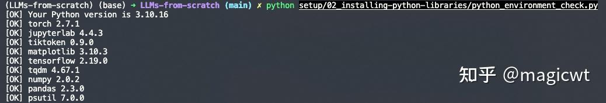

图1 检查环境、执行脚本后的输出

启动JupyterLab：

```
jupyter lab
```

启动后，浏览器输入“http://localhost:8888/lab”，打开JupyterLab，可以浏览代码，如图2所示。


图2 浏览代码

也可以运行代码，如图3所示。

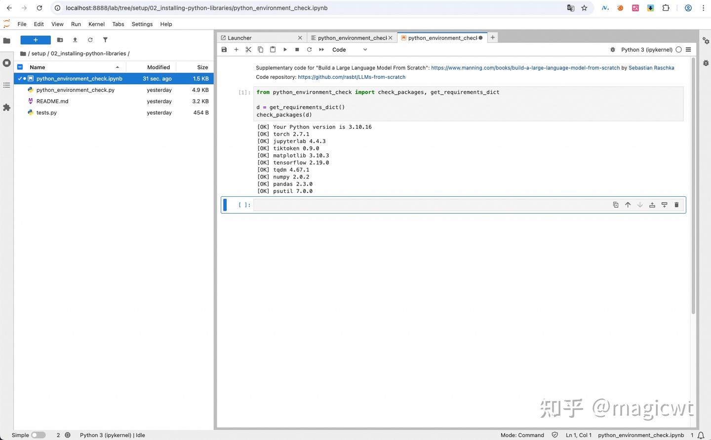

图3 运行代码

## 第 1 章　理解大语言模型

本章没有代码，是全书的概念地基。它回答三个问题：大语言模型到底是什么、它和机器学习/深度学习是什么关系、以及本书打算怎样一步步把它造出来。

### 什么是大语言模型

大语言模型是一种用于**理解、生成和响应**类似人类语言文本的**神经网络**。它属于深度神经网络，通过大规模文本数据训练而成，训练资料甚至可能涵盖互联网上大部分公开的文本。

“大语言模型”里的“大”，既体现了训练所依赖的庞大数据集，也反映了模型本身庞大的参数规模——这类模型通常拥有数百亿甚至数千亿个参数。这些参数是神经网络中的可调整权重，在训练过程中不断被优化，用来预测文本序列中的**下一个词**。

用“下一单词预测”来训练模型，合理利用了语言本身具有顺序这一特性，使模型能够理解文本中的上下文、结构和各种关系。有意思的是，这项任务本身非常简单，因此许多研究人员对其能够孕育出如此强大的模型深感惊讶。

大语言模型采用 **Transformer 架构**，这种架构允许模型在预测时有选择地关注输入文本的不同部分，从而特别擅长应对人类语言的细微差别和复杂性。由于它们能生成文本，因此通常也被归类为**生成式人工智能**（GenAI）。

### 大语言模型与机器学习、深度学习的关系

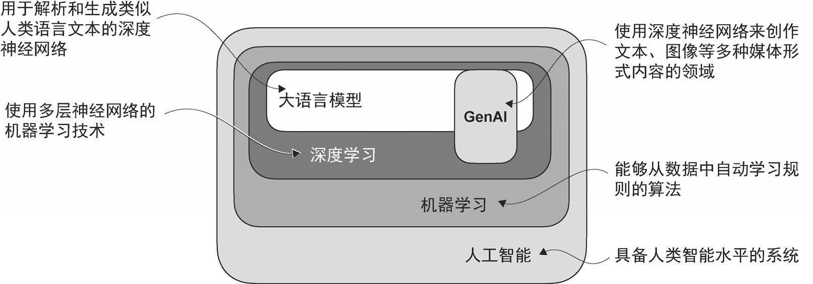

图4 不同领域之间的层级关系：大语言模型是深度学习技术的具体应用；深度学习是机器学习的一个分支，主要使用多层神经网络；机器学习和深度学习致力于开发让计算机能够从数据中学习、并执行需要人类智能水平任务的算法

深度学习是机器学习的一个分支，主要利用 3 层及以上的神经网络（深度神经网络）来建模数据中的复杂模式和抽象特征。与深度学习不同，传统的机器学习往往需要**人工进行特征提取**——以垃圾邮件分类为例，人类专家需要手动从邮件文本中提取诸如特定触发词（“prize”“win”“free”）的出现频率、感叹号数量、全大写单词的使用情况等特征。而深度学习不依赖人工提取的特征，不再需要由人类专家为模型识别和选择最相关的特征。

不过要注意，无论是传统机器学习还是深度学习，垃圾邮件分类这类任务仍然需要收集**标签**（由专家或用户提供）。这一点在下面讲预训练时会有个重要的例外。

### 构建和使用大语言模型的各个阶段

大语言模型的构建通常包括**预训练**和**微调**两个阶段。

- **预训练**（pre-training）：“预”表明它是模型训练的初始阶段，此时模型会在大规模、多样化的数据集上训练，以形成全面的语言理解能力。这一步使用的数据被称为**原始文本**（raw text）——“原始”指的是这些数据只是普通文本，没有附加任何标注信息。
- **微调**（fine-tuning）：以预训练模型为基础，在规模较小的特定任务或领域数据集上做针对性训练，进一步提升特定能力。

这里有个关键点值得强调：**预训练阶段不需要标签**。传统的机器学习模型和常规监督学习范式训练的深度神经网络通常需要标签信息，但这不适用于大语言模型的预训练。在此阶段，大语言模型使用**自监督学习**——模型从输入数据中生成自己的标签，也就是把句子或文档中的下一个词作为预测标签。正因为标签可以“动态”创建，我们才能利用海量的无标注文本数据来训练大语言模型。

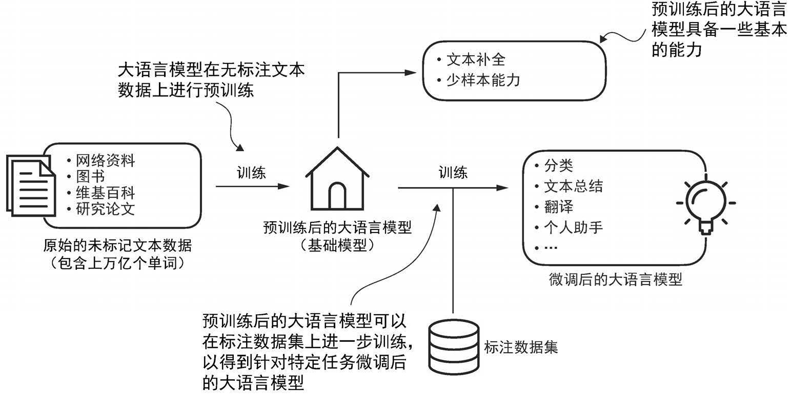

图5 大语言模型的预训练目标是在大量无标注的文本语料库上进行下一单词预测；预训练完成后，可以使用较小的带标注数据集对大语言模型进行微调

预训练完成后的大语言模型通常称为**基础模型**（foundation model），典型例子是 ChatGPT 的前身 GPT-3。微调最流行的两种方式是：

- **指令微调**：标注数据集由“指令−答案”对组成，比如翻译任务中的“原文−正确翻译文本”；
- **分类微调**：标注数据集由文本及其类别标签组成，比如已被标记为“垃圾邮件”或“非垃圾邮件”的邮件文本。

自己从零构建大语言模型不只是深入了解模型机制和局限性的机会，也是掌握**预训练和微调开源大语言模型、使其适应特定领域数据集或任务**的必要知识。研究表明，针对特定领域或任务量身打造的大语言模型，在性能上往往优于 ChatGPT 等通用模型，例如专用于金融领域的 BloombergGPT、专用于医学问答的模型。

使用定制模型还有几个实际优势：**数据隐私**方面，公司可能不愿把敏感数据共享给第三方大语言模型提供商；**部署**方面，较小的定制模型可以直接部署到客户设备（笔记本和手机）上，显著减少延迟并降低服务器成本；**自主权**方面，开发者可以完全控制模型的更新和修改。

### Transformer 架构介绍

大部分现代大语言模型基于 Transformer 架构，这是谷歌 2017 年论文《Attention Is All You Need》首次提出的深度神经网络架构。Transformer 最初是为机器翻译任务（比如把英文翻译成德语和法语）开发的。

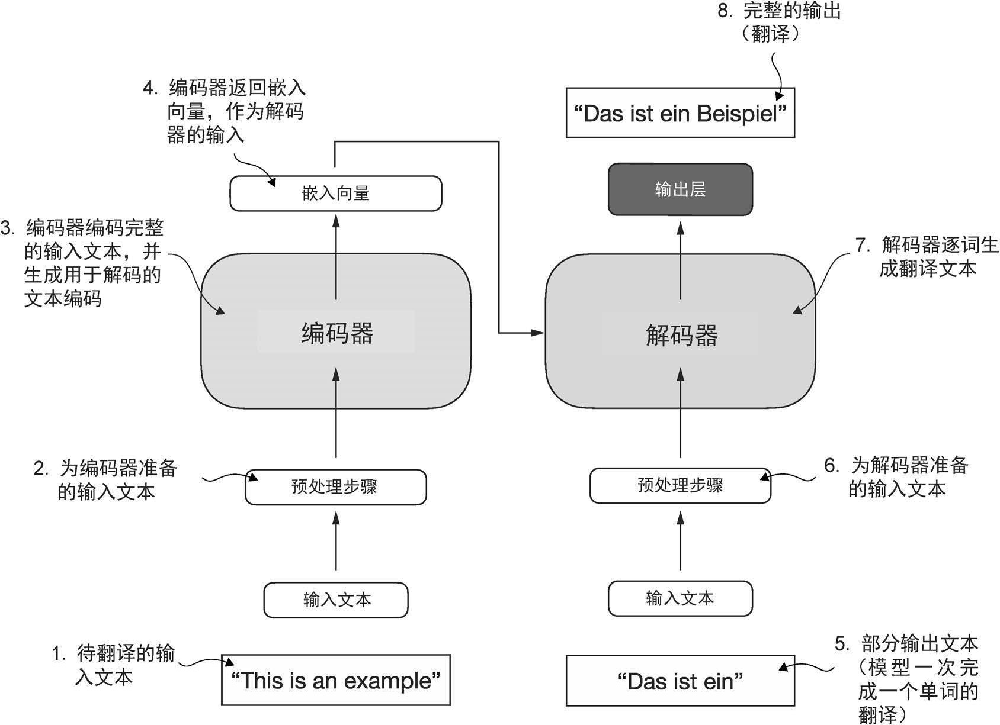

图6 原始 Transformer 架构的简化描述。Transformer 由两部分组成：编码器用于处理输入文本并生成文本嵌入；解码器用这些嵌入逐词生成翻译后的文本。图中展示的是翻译的最后阶段，解码器根据原始输入（“This is an example”）和部分翻译（“Das ist ein”），生成最后一个单词（“Beispiel”）以完成翻译

- **编码器**（encoder）负责处理输入文本，将其编码为一系列数值表示或向量，以捕捉输入的上下文信息；
- **解码器**（decoder）接收这些编码向量，据此生成输出文本。

编码器和解码器都由多层组成，这些层通过**自注意力机制**（self-attention）连接。自注意力允许模型衡量序列中不同单词或词元之间的相对重要性，使模型能够捕捉输入数据中长距离的依赖和上下文关系。

后续的变体都基于这一理念构建：

| 模型 | 使用的部分 | 训练方式 | 擅长任务 |
|---|---|---|---|
| **BERT** | 仅编码器 | 掩码预测（预测被掩码的词） | 情感预测、文档分类等文本分类任务 |
| **GPT** | 仅解码器 | 下一单词预测 | 机器翻译、文本摘要、小说写作、代码编写 |

BERT 的训练方法与 GPT 不同：GPT 主要用于生成任务，而 BERT 及其变体专注于掩码预测。这种独特的训练策略使 BERT 在文本分类任务上具有优势——例如截至本书撰写时，X（以前的 Twitter）在检测有害内容时使用的就是 BERT。

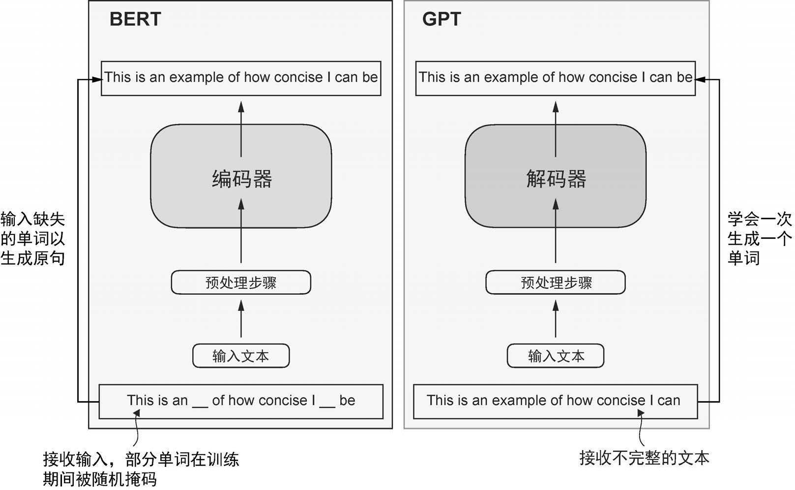

图7 Transformer 编码器和解码器的可视化展示。左侧的编码器部分展示了专注于掩码预测的类 BERT 大语言模型，主要用于文本分类等任务；右侧的解码器部分展示了类 GPT 大语言模型，主要用于生成任务和生成文本序列

GPT 模型主要被设计和训练用于**文本补全**，但它们表现出了出色的可扩展性，擅长执行**零样本学习**（在没有任何特定示例的情况下泛化到从未见过的任务）和**少样本学习**（从用户提供的少量示例中学习）。

### 利用大型数据集

主流的 GPT、BERT 等模型所使用的训练数据集涵盖多样而全面的文本语料库，包含数十亿词汇。表 1-1 总结了用于预训练 GPT-3 的数据集：

| 数据集名称 | 数据集描述 | 词元数量 | 训练数据中的比例 |
|---|---|---|---|
| CommonCrawl（过滤后） | 网络抓取数据 | 4100 亿 | 60% |
| WebText2 | 网络抓取数据 | 190 亿 | 22% |
| Books1 | 基于互联网的图书语料库 | 120 亿 | 8% |
| Books2 | 基于互联网的图书语料库 | 550 亿 | 8% |
| Wikipedia | 高质量文本 | 30 亿 | 3% |

注意表中的词元数量合计为 4990 亿，但 **GPT-3 实际只在 3000 亿个词元上进行了训练**，论文作者并没有具体说明为什么没有用完全部词元。为了有个直观感受：CommonCrawl 数据集包含 4100 亿个词元，需要约 **570 GB** 的存储空间。

这些模型的预训练特性使它们在针对下游任务微调时表现出极高的灵活性，因此也被称为“基础模型”。但预训练大语言模型需要大量资源，成本极其高昂——预训练 GPT-3 的云计算费用估计高达 **460 万美元**。

好消息是，许多预训练大语言模型是开源的，可以作为通用工具使用；同时它们可以用相对较小的数据集对特定任务进行微调，这不仅减少了计算资源需求，还提升了特定任务上的性能。

### 深入剖析 GPT 架构

GPT 最初由 OpenAI 的 Radford 等人在论文《Improving Language Understanding by Generative Pre-Training》中提出。GPT-3 是该模型的扩展版本，拥有更多参数并在更大的数据集上训练。ChatGPT 中提供的原始模型，则是通过 OpenAI 的 InstructGPT 论文中的方法，在一个大型指令数据集上微调 GPT-3 而创建的。

GPT 的通用架构比原始 Transformer 更简洁：**本质上它只包含解码器部分，不包含编码器**。由于像 GPT 这样的解码器模型是逐词预测生成文本的，因此被认为是一种**自回归模型**（autoregressive model）——把之前的输出作为未来预测的输入。

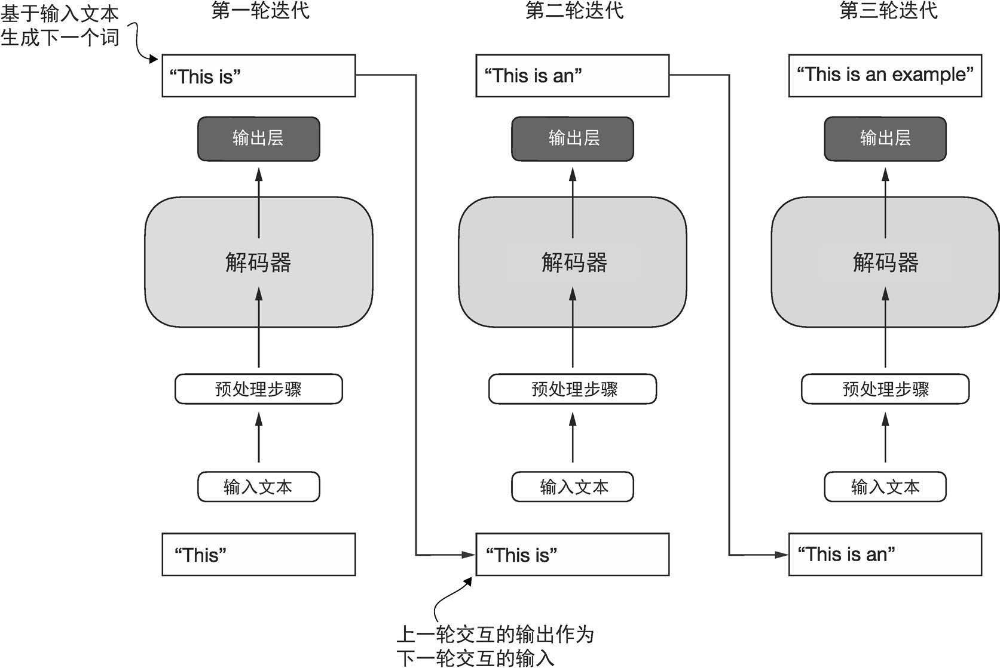

图8 GPT 模型的自回归生成过程。每一轮迭代中，上一轮交互的输出作为下一轮交互的输入，逐词生成文本

GPT-3 等架构的规模远超原始 Transformer：原始 Transformer 把编码器和解码器各重复了 6 次，而 GPT-3 总共有 **96 层** Transformer 和 **1750 亿**个参数。

模型能够完成未经明确训练的任务，这种能力称为**涌现**（emergence）。它并非模型在训练期间被明确教授所得，而是其广泛接触大量多语言数据和各种上下文的自然结果。即使没有经过专门的翻译任务训练，GPT 模型也能“学会”不同语言间的翻译模式并执行翻译任务——这种能力起初让研究人员颇为意外。

### 构建大语言模型

本书以 GPT 的核心原理为指导，分 3 个阶段逐步实现目标模型：

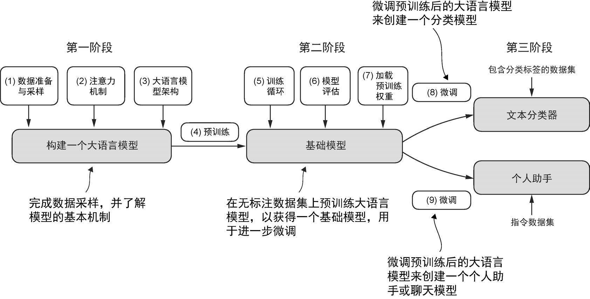

图9 构建大语言模型的 3 个主要阶段：实现模型架构和准备数据（第一阶段）、预训练大语言模型以获得基础模型（第二阶段）、微调基础模型以得到个人助手或文本分类器（第三阶段）

- **第一阶段**：学习数据预处理的基本流程，并实现大语言模型的核心组件——注意力机制；
- **第二阶段**：编写代码并预训练一个能够生成新文本的类 GPT 大语言模型，同时探讨评估大语言模型的基础知识；
- **第三阶段**：对预训练后的大语言模型进行微调，使其能够执行回答查询、文本分类等任务。

需要指出的是，从头开始预训练大语言模型是一项艰巨的任务，训练类 GPT 模型所需的计算成本可能高达数千到数百万美元。鉴于本书的目的是教学，因此将使用较小的数据集进行训练，同时也提供了加载公开可用模型参数的示例代码。

### 小结

- 大语言模型彻底革新了自然语言处理领域，引入了基于深度学习的新方法；
- 现代大语言模型的训练主要包含两个步骤：先在无标注文本上预训练（以下一个词为“标签”），再在更小规模、经过标注的数据集上微调；
- 大语言模型基于 Transformer 架构，核心组件是注意力机制；
- 原始 Transformer 由编码器（解析文本）和解码器（生成文本）两部分组成；GPT-3 和 ChatGPT 这类专注于生成和执行指令的模型只实现了解码器部分；
- 大型数据集是预训练的关键；尽管常规预训练任务只是预测下一个词，但模型展现出了能够完成分类、翻译或总结等任务的“涌现”特性；
- 预训练完成后的模型可作为基础模型，通过高效微调适应各类下游任务，并能在特定任务上超越通用大语言模型。

---

## 第 2 章　处理文本数据

### 理解词嵌入

视频、音频、文本，这些不同类型的输入，可以通过各个类型所对应的嵌入模型（embedding model）转化为嵌入向量（embedding vector），如图4所示。

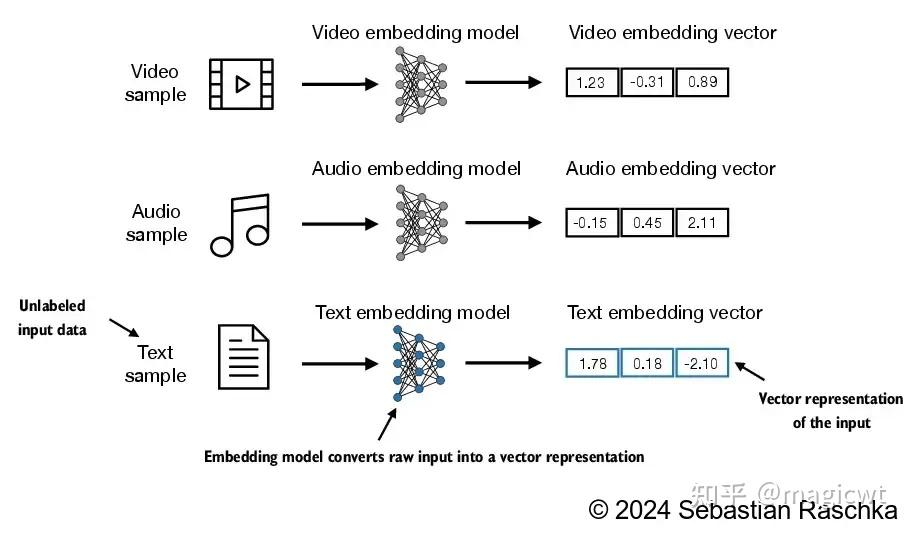

图10 不同类型的输入可以通过各个类型所对应的嵌入模型转化为嵌入向量

语义相似的文本的嵌入向量在向量空间中距离相近，如图5所示，eagle、duck、goose这三个文本语义相似，同属鸟类，因此它们的嵌入向量在向量空间中距离相近，在一个类簇中。

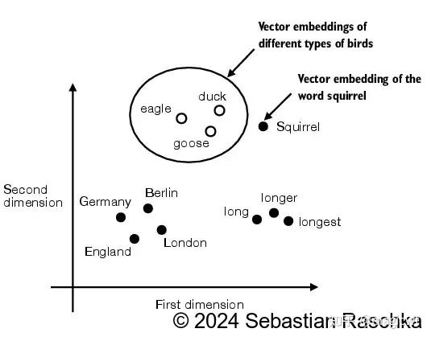

图11 语义相似的文本的嵌入向量在向量空间中距离相近

### 文本分词

对文本进行分词，划分为多个词元（Token），即将文本转化为词元序列。书中使用Edith Wharton的短篇小说——[《The Verdict》](https://en.wikisource.org/wiki/The_Verdict)作为预训练大语言模型的文本数据集。代码中也包含了该小说的全文，文件地址是“ch02/01_main-chapter-code/the-verdict.txt”。图6是一个示例，将“This is an example.”划分为“This”、“is”、“an”、“example”、“.”这些词元。另外，一般还会引入一些特殊的词元来增强对文本的表示，例如，可以使用“<|endoftext|>”来表示文本的末尾。

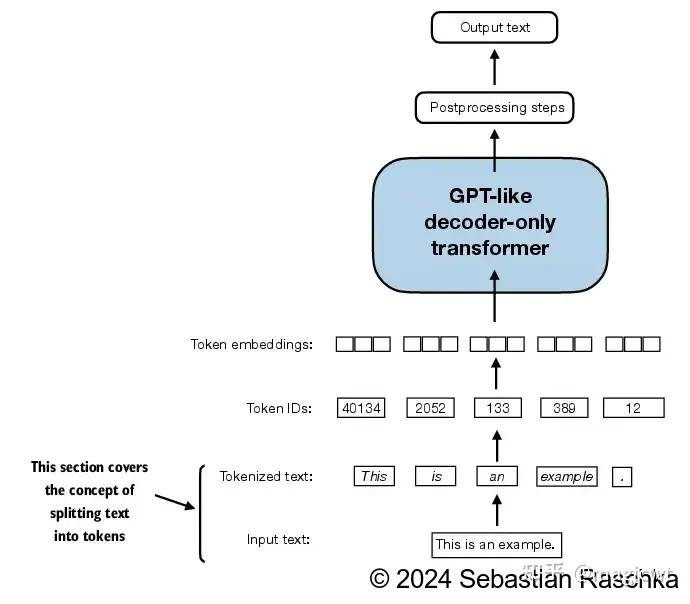

图12 文本划分为多个词元的示例

### 将词元转化为词元ID

使用词典存储所有的词元，词典中的每个词元均有对应的唯一ID。将文本转化为词元序列后，再通过查询词典，得到每个词元所对应的ID，将词元序列进一步转化为词元ID序列，如图7所示。

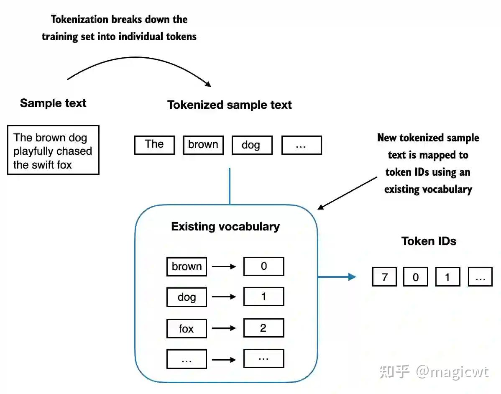

图13 将词元序列进一步转化为词元ID序列

### BPE

前序介绍中的分词方法基于空格，将文本划分为多个单词。GPT-2实际使用字节对编码（BPE）作为其分词器。该方法可以将词典中未包含的单词拆解为更小的子词单元甚至单个字符，从而有效处理词典外的单词。 例如，若GPT-2的词典中没有“unfamiliarword”这个词，则BPE可能会将这个词切分为“unfam”、“iliar”、“word” 这三个子词的组合或其他子词组合。图8是另一个例子，若GPT-2的词典中没有“Akwirw”这个词，则BPE将这个词切分为“Ak”、“w”、“ir”、“w”这四个子词的组合。

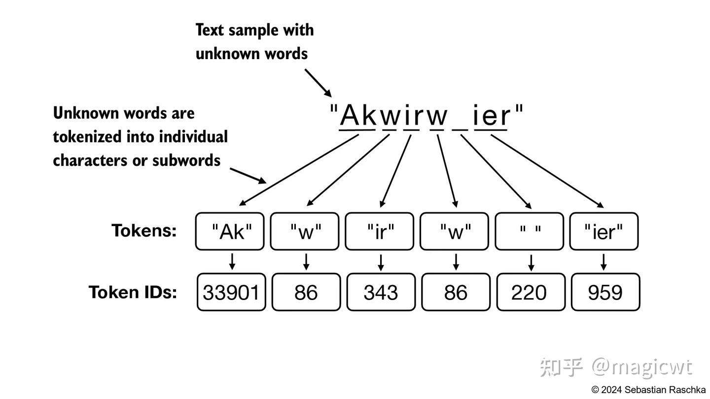

图14 BPE将词典中未包含的单词拆解为更小的子词单元甚至单个字符

原始BPE分词器代码可在OpenAI的GPT-2项目中找到，地址如下：[https://github.com/openai/gpt-2/blob/master/src/encoder.py](https://github.com/openai/gpt-2/blob/master/src/encoder.py)。书中采用OpenAI开源的tiktoken库实现的BPE分词器，该库通过Rust语言重写核心算法以提升计算性能。使用BPE分词器对测试文本进行分词，编码为词元ID序列，再解码词元ID序列，还原文本的代码如下所示：

```
import importlib
import tiktoken

# 初始化BPE分词器
tokenizer = tiktoken.get_encoding("gpt2")

# 测试文本
text = (
    "Hello, do you like tea? <|endoftext|> In the sunlit terraces"
    "of someunknownPlace."
)

# 编码
# 将文本编码为词元ID序列
integers = tokenizer.encode(text, allowed_special={"<|endoftext|>"})
print("将文本编码为词元ID序列: ", integers)

# 解码
# 将词元ID序列解码为文本
strings = tokenizer.decode(integers)
print("将词元ID序列解码为文本: ", strings)
```

代码执行结果如下所示：

```
将文本编码为词元ID序列:  [15496, 11, 466, 345, 588, 8887, 30, 220, 50256, 554, 262, 4252, 18250, 8812, 2114, 1659, 617, 34680, 27271, 13]
将词元ID序列解码为文本:  Hello, do you like tea? <|endoftext|> In the sunlit terracesof someunknownPlace.
```

使用BPE分词器对《The Verdict》进行分词，编码为词元ID序列的代码如下所示：

```
with open("the-verdict.txt", "r", encoding="utf-8") as f:
    raw_text = f.read()

enc_text = tokenizer.encode(raw_text)
print("小说词元ID序列长度: ", len(enc_text))
print("小说词元ID序列前100个词元: ", enc_text[:100])
print("小说词元ID序列后100个词元: ",enc_text[-100:])
```

代码执行结果如下所示：

```
小说词元ID序列长度:  5145
小说词元ID序列前100个词元:  [40, 367, 2885, 1464, 1807, 3619, 402, 271, 10899, 2138, 257, 7026, 15632, 438, 2016, 257, 922, 5891, 1576, 438, 568, 340, 373, 645, 1049, 5975, 284, 502, 284, 3285, 326, 11, 287, 262, 6001, 286, 465, 13476, 11, 339, 550, 5710, 465, 12036, 11, 6405, 257, 5527, 27075, 11, 290, 4920, 2241, 287, 257, 4489, 64, 319, 262, 34686, 41976, 13, 357, 10915, 314, 2138, 1807, 340, 561, 423, 587, 10598, 393, 28537, 2014, 198, 198, 1, 464, 6001, 286, 465, 13476, 1, 438, 5562, 373, 644, 262, 1466, 1444, 340, 13, 314, 460, 3285, 9074, 13, 46606, 536]
小说词元ID序列后100个词元:  [257, 1808, 314, 1234, 2063, 12, 1326, 3147, 1146, 438, 1, 44140, 757, 1701, 339, 30050, 503, 13, 366, 2215, 262, 530, 1517, 326, 6774, 502, 6609, 1474, 683, 318, 326, 314, 2993, 1576, 284, 2666, 572, 1701, 198, 198, 1544, 6204, 510, 290, 8104, 465, 1021, 319, 616, 8163, 351, 257, 6487, 13, 366, 10049, 262, 21296, 286, 340, 318, 326, 314, 4808, 321, 62, 991, 12036, 438, 20777, 41379, 293, 338, 1804, 340, 329, 502, 0, 383, 520, 5493, 82, 1302, 3436, 11, 290, 1645, 1752, 438, 4360, 612, 338, 645, 42393, 803, 674, 1611, 286, 1242, 526]
```

### 创建词元嵌入

进一步将词元ID序列转化为词元向量序列，该操作通过一个Embedding层完成，Embedding层就是一个可学习的权重矩阵，该矩阵的行数是词元词典的大小，该矩阵的列数是词元向量的维度。矩阵的每一行表示该行号所对应的词元ID的词元向量，例如词元ID为3的词元向量即矩阵的第4行（行号从0开始，第4行的行号是3）——[-0.4015, 0.9666, -1.1481]，如图9所示。

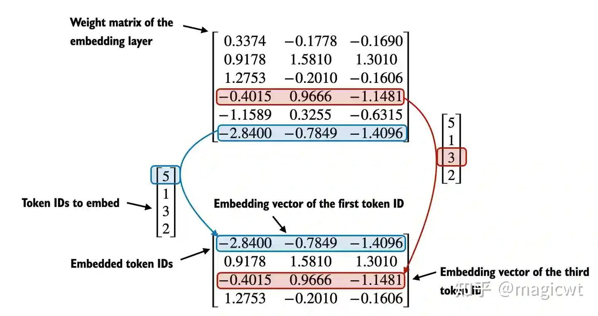

图15 词元ID为5的词元向量即矩阵的第6行，词元ID为3的词元向量即矩阵的第4行

定义Embedding层的代码如下所示，该Embedding层的行数为50257，即词典的大小为50257，该Embedding层的列数为256，即词元向量的维度为256：

```
vocab_size = 50257
output_dim = 256

token_embedding_layer = torch.nn.Embedding(vocab_size, output_dim)
```

### 编码位置信息

如果同一个词元在词元序列中出现多次，其在序列中不同的位置表达的语义可能有所不同，但通过上面的Embedding层后，同一个词元在词元序列中的不同位置均会转化为相同的词元向量，如图10所示。

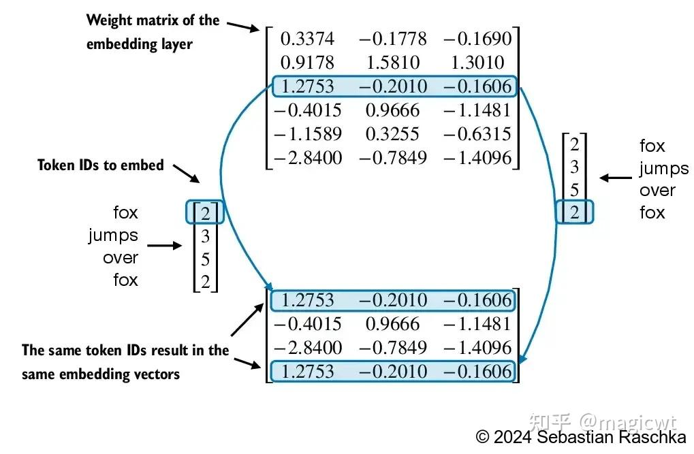

图16 同一个词元在词元ID序列中的不同位置均会转化为相同的词元向量

因此，对于词元序列中的每个词元，其在Embedding层输出的原始向量基础上，还会叠加位置向量，从而使得同一个词元在词元序列中的不同位置的向量有所不同，如图11所示。

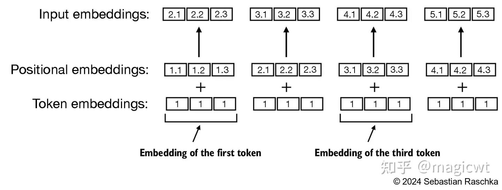

图17 叠加位置向量，从而使得同一个词元在词元序列中的不同位置的向量有所不同

## 第 3 章　编码注意力机制

### 长序列建模的问题

考虑翻译问题，由于源语言和目标语言的语法结构不同，无法简单地逐个单词进行翻译。生成翻译时，一些词语需要参考在原句中较早或较晚出现的词，如图12所示。为了处理这个问题，通常使用一个包含编码器和解码器两个子模块的深度神经网络。编码器首先读取和处理整个文本，解码器则负责生成翻译后的文本。

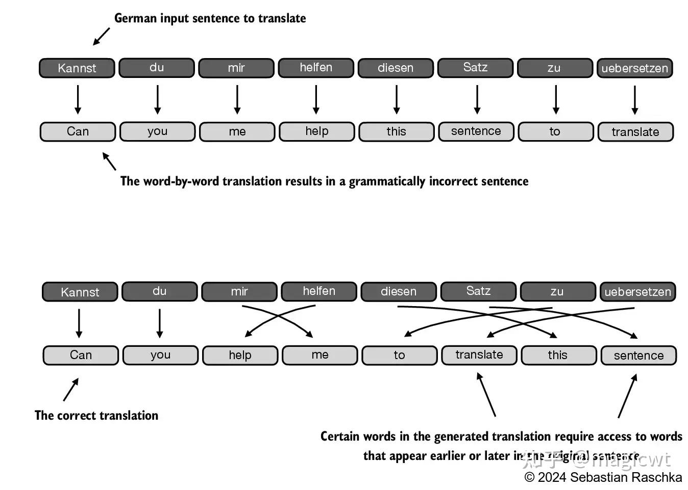

图18 生成翻译时，一些词语需要参考在原句中较早或较晚出现的词

在Transformer出现之前，循环神经网络（recurrent neural network，RNN）是语言翻译中最流行的编码器-解码器架构。

在RNN中，输入文本被传递给编码器以逐步处理。编码器在每一步都会更新其隐状态（隐藏层的内部值），试图在最终的隐状态中捕捉输入句子的全部含义，如图13所示。然后，解码器使用这个最终的隐状态开始逐字生成翻译后的句子。解码器同样在每一步更新其隐状态，该状态应包含为下一单词预测所需的上下文信息。

RNN的一个主要限制是，在解码阶段，RNN 无法直接访问编码器中的早期隐状态。因此，它只能依赖当前的隐状态，这个状态包含了所有相关信息。这可能导致上下文丢失，特别是在复杂句子中，依赖关系可能跨越较长的距离。

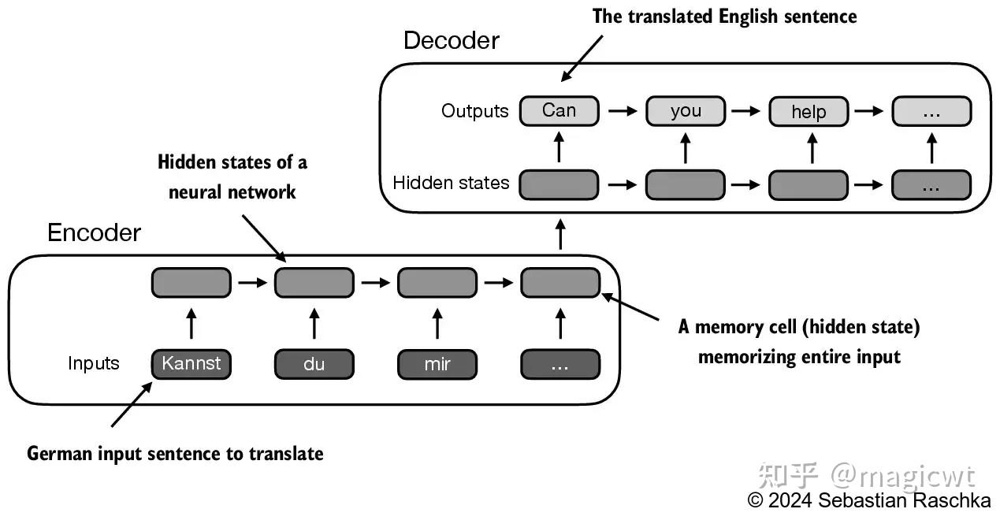

图19 使用RNN进行翻译的示例

自注意力是Transformer模型中的一种机制，它通过允许一个序列中的每个位置与同一序列中的其他所有位置进行交互并权衡其重要性，来计算出更高效的输入表示，从而解决RNN只能依赖当前隐状态的问题。

Transformer最早在[《Attention is all you need》](https://arxiv.org/abs/1706.03762)中被提出。《Attention Is All You Need》是Google于2017年发表的一篇经典论文，其开创性的设计了Transformer模型结构，对于序列问题，通过编码器输出隐向量序列，再通过解码器输出目标序列，模型引入了注意力机制，充分挖掘序列各节点之间的深度信息，并通过矩阵计算的并行化加速模型训练和推理性能。关于Transformer的详细介绍，可以阅读论文原文或笔者梳理的[《AIGC系列-Transformer论文阅读笔记》](https://zhuanlan.zhihu.com/p/619362648)。

### 通过自注意力机制关注输入的不同部分

首先实现一个不包含任何可训练权重的简化的自注意力机制变体，如图14所示。目标是在引入可训练权重之前，阐明自注意力中的一些关键概念。

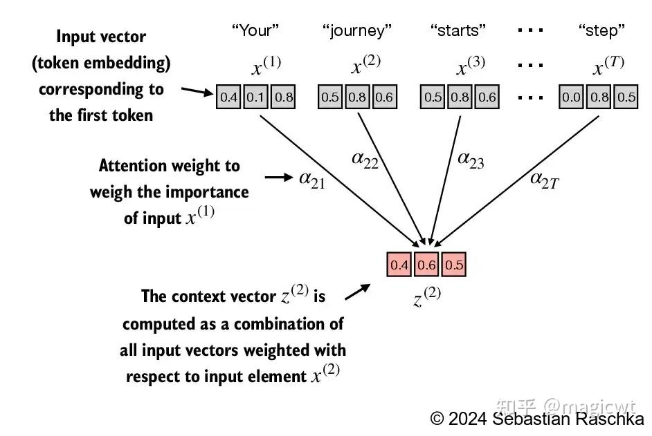

图20 不包含任何可训练权重的简化的自注意力机制变体

图14显示了一个输入序列，记为 $x$ ，它由 $T$ 个元素组成，分别表示为 $x^{(1)}$ 到 $x^{(T)}$ 。这个序列通常代表文本（如一个句子），并且该文本已经被转换为词元嵌入。

例如，考虑输入文本为“Your journey starts with one step.”。在这种情况下，文本序列中的每个元素（如第一个词元 $x^{(1)}$ ）都对应一个 $d$ 维的嵌入向量，该向量代表了一个特定的词元，比如“Your”。在图中，这些输入向量被表示为三维嵌入。

在自注意力机制中，我们的目标是为输入序列中的每个元素 $x^{(i)}$ 计算上下文向量 $z^{(i)}$ 。上下文向量（context vector）可以被理解为一种包含了序列中所有元素信息的嵌入向量。

为了说明这个概念，我们重点关注第二个输入元素 $x^{(2)}$ （对应于词元“journey”）的嵌入向量及其对应的上下文向量 $z^{(2)}$ ，如图14底部所示。这个增强的上下文向量 $z^{(2)}$ 是一个嵌入，包含了关于 $x^{(2)}$ 及其他所有输入元素（ $x^{(1)}$ 到 $x^{(T)}$ ）的信息。

上下文向量在自注意力机制中起着关键作用。它们的目的是通过结合序列中其他所有元素的信息，为输入序列（如一个句子）中的每个元素创建丰富表示，如图14所示。这在大语言模型中至关重要，因为这些模型需要理解句子中单词之间的关系和相关性。

图14中， $z^{(2)}$ 可表示为： $$z^{(2)}=\sum_{i=1}^T\alpha_{2i}\cdot x^{(i)}$$ 其中， $\alpha_{2i}$ 表示 $x^{(i)}$ 对 $x^{(T)}$ 的注意力权重。

而对于所有 $T$ 个元素的上下文向量： $$z=W\cdot x$$

其中， $`z=\begin{bmatrix}z^{(1)}\\z^{(2)}\\\cdots\\z^{(T)}\end{bmatrix}`$ ， $`W`$ 为注意力权重矩阵，第 $` i `$ 行第 $`j `$ 列为 $`\alpha_{ij}`$ ， $`x=\begin{bmatrix}x^{(1)}\\x^{(2)}\\\cdots\\x^{(T)}\end{bmatrix}`$ 。

### 实现带可训练权重的自注意力机制

而在Transformer中，注意力权重是可以学习的。通过引入3个可训练的参数矩阵 $`W_q`$ 、 $`W_k `$ 和 $`W_v `$ ，
将输入词元 $`x^{(i)}`$ 分别映射为查询向量 $`q^{(i)}`$ 、键向量 $`k^{(i)}`$ 和值向量 $`v^{(i)}`$ ： 

$`q=W_q\cdot x`$

$`k=W_k\cdot x`$

$`v=W_v\cdot x`$

其中， $`q=\begin{bmatrix}q^{(1)}\\q^{(2)}\\\cdots\\q^{(T)}\end{bmatrix}`$ ， $`k=\begin{bmatrix}k^{(1)}\\k^{(2)}\\\cdots\\k^{(T)}\end{bmatrix}`$ ， $`v=\begin{bmatrix}v^{(1)}\\v^{(2)}\\\cdots\\v^{(T)}\end{bmatrix}`$ 。

仍是以 $z^{(2)}$ 为例，如图15所示，先通过查询向量和键向量点积得到注意力得分，即 $$w_{2i}=q^{(2)}\cdot k^{(i)}$$再通过Softmax函数对注意力得分进行归一化得到注意力权重，注意这里在对注意力得分进行归一化之前会先除以维度的平方根进行缩放，避免梯度过小，从而提升训练性能，这一技巧源自Transformer的论文，也是缩放点积注意力中“缩放点积”的由来： $$\alpha_{2i}=\frac{e^{w_{2i}/\sqrt{d}}}{\sum_{j=1}^T{e^{w_{2j}/\sqrt{d}}}}$$对值向量按注意力权重进行加权求和得到上下文向量：

$$z^{(2)}=\sum_{i=1}^T{\alpha_{2i}\cdot x^{(i)}}$$

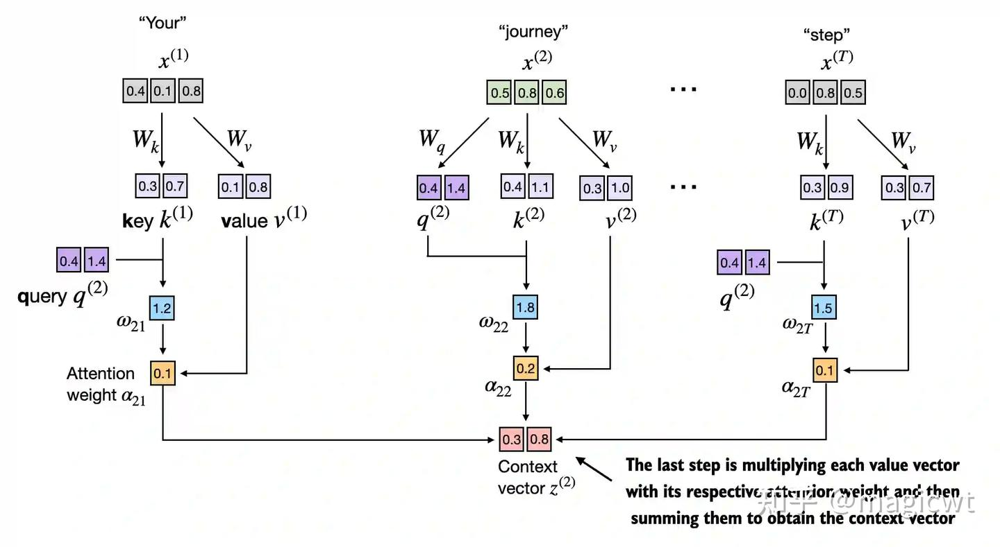

图21 实现带可训练权重的自注意力机制

带可训练权重的自注意力机制的代码如下所示：

```
import torch
import torch.nn as nn

# 自注意力实现（v1）
class SelfAttention_v1(nn.Module):

    def __init__(self, d_in, d_out):
        super().__init__()
        # 初始化查询参数矩阵
        self.W_query = nn.Parameter(torch.rand(d_in, d_out))
        # 初始化键参数矩阵
        self.W_key   = nn.Parameter(torch.rand(d_in, d_out))
        # 初始话值参数矩阵
        self.W_value = nn.Parameter(torch.rand(d_in, d_out))

    def forward(self, x):
        # 键向量
        keys = x @ self.W_key
        # 查询向量
        queries = x @ self.W_query
        # 值向量
        values = x @ self.W_value

        # 查询向量和键向量点积得到注意力得分
        attn_scores = queries @ keys.T # omega
        # 通过Softmax函数对注意力得分进行归一化得到注意力权重
        # 注意这里在对注意力得分进行归一化之前会先除以维度的平方根进行缩放，避免梯度过小，从而提升训练性能，这一技巧源自Transformer的论文，也是缩放点积注意力中“缩放点积”的由来
        attn_weights = torch.softmax(
            attn_scores / keys.shape[-1]**0.5, dim=-1
        )

        # 对值向量按注意力权重进行加权求和得到上下文向量
        context_vec = attn_weights @ values
        return context_vec

torch.manual_seed(123)
# 模拟文本“Your journey starts with one step”的词元向量序列
inputs = torch.tensor(
  [[0.43, 0.15, 0.89], # Your     (x^1)
   [0.55, 0.87, 0.66], # journey  (x^2)
   [0.57, 0.85, 0.64], # starts   (x^3)
   [0.22, 0.58, 0.33], # with     (x^4)
   [0.77, 0.25, 0.10], # one      (x^5)
   [0.05, 0.80, 0.55]] # step     (x^6)
)
# 词元向量维度为3
d_in = inputs.shape[1] # the input embedding size, d=3
# 上下文向量维度为2
d_out = 2 # the output embedding size, d=2
# 输出经过自注意力层后的上下文向量，长度和输入的词元向量序列长度一致，为6
sa_v1 = SelfAttention_v1(d_in, d_out)
print(sa_v1(inputs))
```

代码执行结果如下所示，输出经过自注意力层后的上下文向量，长度和输入的词元向量序列长度一致，为6，其中每一个为对应位置的输入词元的上下文向量，而每个上下文向量的维度为2。

```
tensor([[0.2996, 0.8053],
        [0.3061, 0.8210],
        [0.3058, 0.8203],
        [0.2948, 0.7939],
        [0.2927, 0.7891],
        [0.2990, 0.8040]], grad_fn=<MmBackward0>)
```

采用线性层替代参数矩阵，若线性层无偏置，则等价于参数矩阵。相比手动实现 nn.Parameter(torch.rand(...))，使用nn.Linear的一个重要优势是它提供了优化的权重初始化方案，从而有助于模型训练的稳定性和有效性。修改后的带可训练权重的自注意力机制的代码如下所示：

```
import torch
import torch.nn as nn

# 自注意力实现（v2）
class SelfAttention_v2(nn.Module):

    def __init__(self, d_in, d_out, qkv_bias=False):
        super().__init__()
        # 采用线性层替代参数矩阵，若线性层无偏置，则等价于参数矩阵
        self.W_query = nn.Linear(d_in, d_out, bias=qkv_bias)
        self.W_key   = nn.Linear(d_in, d_out, bias=qkv_bias)
        self.W_value = nn.Linear(d_in, d_out, bias=qkv_bias)

    def forward(self, x):
        keys = self.W_key(x)
        queries = self.W_query(x)
        values = self.W_value(x)

        attn_scores = queries @ keys.T
        attn_weights = torch.softmax(attn_scores / keys.shape[-1]**0.5, dim=-1)

        context_vec = attn_weights @ values
        return context_vec

torch.manual_seed(789)
# 模拟文本“Your journey starts with one step”的词元向量序列
inputs = torch.tensor(
    [[0.43, 0.15, 0.89], # Your     (x^1)
     [0.55, 0.87, 0.66], # journey  (x^2)
     [0.57, 0.85, 0.64], # starts   (x^3)
     [0.22, 0.58, 0.33], # with     (x^4)
     [0.77, 0.25, 0.10], # one      (x^5)
     [0.05, 0.80, 0.55]] # step     (x^6)
)
# 词元向量维度为3
d_in = inputs.shape[1] # the input embedding size, d=3
# 上下文向量维度为2
d_out = 2 # the output embedding size, d=2
# 输出经过自注意力层后的上下文向量，长度和输入的词元向量序列长度一致，为6
sa_v2 = SelfAttention_v2(d_in, d_out)
print(sa_v2(inputs))
```

代码执行结果如下所示，输出仍是经过自注意力层后的上下文向量，长度和输入的词元向量序列长度一致，为6：

```
tensor([[-0.0739,  0.0713],
        [-0.0748,  0.0703],
        [-0.0749,  0.0702],
        [-0.0760,  0.0685],
        [-0.0763,  0.0679],
        [-0.0754,  0.0693]], grad_fn=<MmBackward0>)
```

### 利用因果注意力隐藏未来词汇

改进自注意力机制，引入因果机制和多头机制。因果机制的作用是调整注意力机制，防止模型访问序列中未来的信息，这在语言建模等任务中尤为重要，因为每个词的预测只能依赖之前出现的词。

因果注意力（也称为掩码注意力）是一种特殊的自注意力形式。它限制模型在处理任何给定词元时，只能基于序列中的先前和当前输入来计算注意力分数，而标准的自注意力机制可以一次性访问整个输入序列。

通过修改标准自注意力机制来创建因果注意力机制，这是在后续章节中开发大语言模型的关键步骤。对于每个处理的词元，需要掩码当前词元之后的后续词元，如图16右侧所示，掩码对角线以上的注意力权重，并归一化未掩码的注意力权重，使得每一行的权重之和为 1。

图16左侧是未掩码的注意力权重示意，第 $i$ 行表示序列中各词元对第 $i$ 个词元的注意力权重，第 $ i $ 行第 $ j$ 列表示序列中第 $ j $ 个词元对第 $i $ 个词元的注意力权重，例如，第2行表示序列中各词元对第2个词元（journey）的注意力权重，分别是0.20、0.16、0.16、0.14、0.16、0.14。

图16右侧是掩码并在掩码后重新归一化的注意力权重示意，第2行表示的“journey”只可见其前面的“Your”和其自身，不可见其后面的“starts”、“with”、“one”、“step”，因此，序列中只有“Your”和“journey”对“journey”有注意力权重，分别是0.55和0.44。

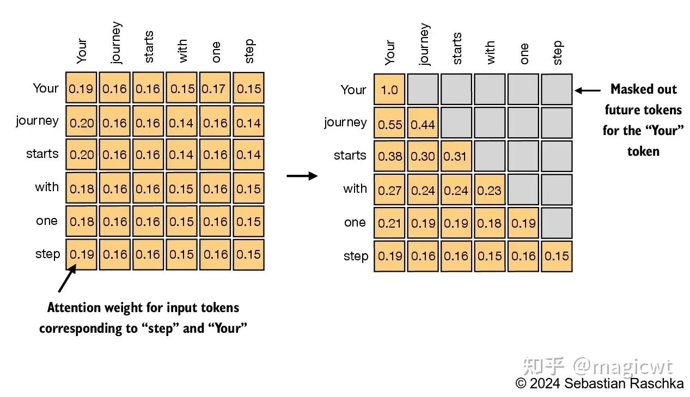

图22 对于每个处理的词元，需要掩码当前词元之后的后续词元

因果注意力中，注意力权重矩阵的右上角权重均为0，而注意力权重是通过Softmax函数对注意力得分进行归一化得到，而对于Softmax函数，若注意力得分为负无穷大，则其注意力权重趋近为0，因此，可以通过将自注意力的注意力得分矩阵的右上角全置为负无穷大来实现因果注意力。

dropout是深度学习中的一种技术，通过在训练过程中随机忽略一些隐藏层单元来有效地“丢弃”它们。这种方法有助于减少模型对特定隐藏层单元的依赖，从而避免过拟合。需要强调的是，dropout仅在训练期间使用，训练结束后会被取消。在Transformer架构中，通常会在两个特定时间点使用dropout：一是计算注意力权重之后，二是将这些权重应用于值向量之后。在计算注意力权重之后应用dropout掩码的示意如图17所示。

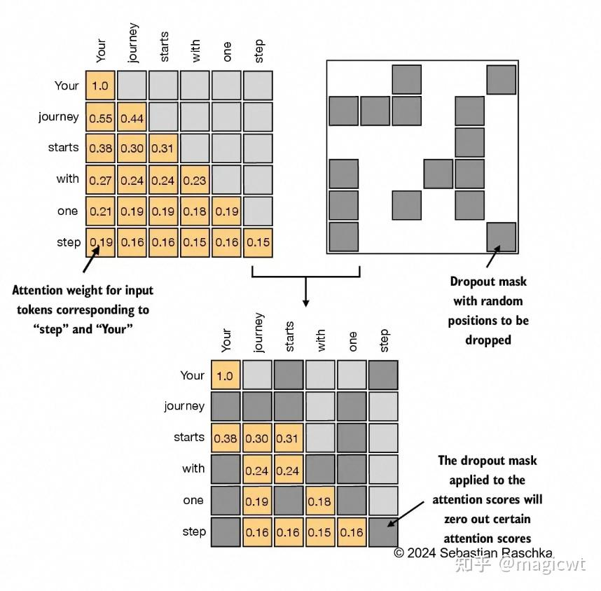

图23 在计算注意力权重之后应用dropout掩码的示意

带有dropout的因果注意力实现如下：

```
import torch
import torch.nn as nn

# 带掩码的因果注意力实现
class CausalAttention(nn.Module):

    def __init__(self, d_in, d_out, context_length,
                 dropout, qkv_bias=False):
        super().__init__()
        self.d_out = d_out
        self.W_query = nn.Linear(d_in, d_out, bias=qkv_bias)
        self.W_key   = nn.Linear(d_in, d_out, bias=qkv_bias)
        self.W_value = nn.Linear(d_in, d_out, bias=qkv_bias)
        self.dropout = nn.Dropout(dropout) # New
        self.register_buffer('mask', torch.triu(torch.ones(context_length, context_length), diagonal=1)) # New

    def forward(self, x):
        b, num_tokens, d_in = x.shape # New batch dimension b
        # For inputs where `num_tokens` exceeds `context_length`, this will result in errors
        # in the mask creation further below.
        # In practice, this is not a problem since the LLM (chapters 4-7) ensures that inputs
        # do not exceed `context_length` before reaching this forward method.
        keys = self.W_key(x)
        queries = self.W_query(x)
        values = self.W_value(x)

        attn_scores = queries @ keys.transpose(1, 2) # Changed transpose
        # 以上计算注意力得分和自注意力实现中的逻辑一致
        # 将注意力得分矩阵的右上角置为负无穷大
        attn_scores.masked_fill_(  # New, _ ops are in-place
            self.mask.bool()[:num_tokens, :num_tokens], -torch.inf)  # `:num_tokens` to account for cases where the number of tokens in the batch is smaller than the supported context_size
        # 计算注意力权重，因为注意力得分矩阵的右上角得分被置为负无穷大，所以通过Softmax函数得到的注意力权重矩阵的右上角权重趋近为0
        attn_weights = torch.softmax(
            attn_scores / keys.shape[-1]**0.5, dim=-1
        )
        print("因果注意力权重:\n", attn_weights)
        # 在对注意力权重进行dropout，随机选择一些注意力权重置为0
        attn_weights = self.dropout(attn_weights) # New
        print("dropout后的因果注意力权重:\n", attn_weights)
        # 对值向量按注意力权重进行加权求和得到上下文向量
        context_vec = attn_weights @ values
        return context_vec

torch.manual_seed(123)
# 模拟文本“Your journey starts with one step”的词元向量序列
inputs = torch.tensor(
    [[0.43, 0.15, 0.89], # Your     (x^1)
     [0.55, 0.87, 0.66], # journey  (x^2)
     [0.57, 0.85, 0.64], # starts   (x^3)
     [0.22, 0.58, 0.33], # with     (x^4)
     [0.77, 0.25, 0.10], # one      (x^5)
     [0.05, 0.80, 0.55]] # step     (x^6)
)
# 使用两个输入构成批次
batch = torch.stack((inputs, inputs), dim=0)
# 词元向量序列长度为6
context_length = batch.shape[1]
# 词元向量维度为3
d_in = inputs.shape[1] # the input embedding size, d=3
# 上下文向量维度为2
d_out = 2 # the output embedding size, d=2
# 输出经过因果注意力层后的上下文向量，有两个上下文向量序列，每个上下文向量序列的长度和输入的词元向量序列长度一致，为6
ca = CausalAttention(d_in, d_out, context_length, 0.0)
context_vecs = ca(batch)
print(context_vecs)
print("context_vecs.shape:", context_vecs.shape)
```

代码执行结果如下所示：

```
因果注意力权重:
 tensor([[[1.0000, 0.0000, 0.0000, 0.0000, 0.0000, 0.0000],
         [0.4833, 0.5167, 0.0000, 0.0000, 0.0000, 0.0000],
         [0.3190, 0.3408, 0.3402, 0.0000, 0.0000, 0.0000],
         [0.2445, 0.2545, 0.2542, 0.2468, 0.0000, 0.0000],
         [0.1994, 0.2060, 0.2058, 0.1935, 0.1953, 0.0000],
         [0.1624, 0.1709, 0.1706, 0.1654, 0.1625, 0.1682]],

        [[1.0000, 0.0000, 0.0000, 0.0000, 0.0000, 0.0000],
         [0.4833, 0.5167, 0.0000, 0.0000, 0.0000, 0.0000],
         [0.3190, 0.3408, 0.3402, 0.0000, 0.0000, 0.0000],
         [0.2445, 0.2545, 0.2542, 0.2468, 0.0000, 0.0000],
         [0.1994, 0.2060, 0.2058, 0.1935, 0.1953, 0.0000],
         [0.1624, 0.1709, 0.1706, 0.1654, 0.1625, 0.1682]]],
       grad_fn=<SoftmaxBackward0>)
dropout后的因果注意力权重:
 tensor([[[1.0000, 0.0000, 0.0000, 0.0000, 0.0000, 0.0000],
         [0.4833, 0.5167, 0.0000, 0.0000, 0.0000, 0.0000],
         [0.3190, 0.3408, 0.3402, 0.0000, 0.0000, 0.0000],
         [0.2445, 0.2545, 0.2542, 0.2468, 0.0000, 0.0000],
         [0.1994, 0.2060, 0.2058, 0.1935, 0.1953, 0.0000],
         [0.1624, 0.1709, 0.1706, 0.1654, 0.1625, 0.1682]],

        [[1.0000, 0.0000, 0.0000, 0.0000, 0.0000, 0.0000],
         [0.4833, 0.5167, 0.0000, 0.0000, 0.0000, 0.0000],
         [0.3190, 0.3408, 0.3402, 0.0000, 0.0000, 0.0000],
         [0.2445, 0.2545, 0.2542, 0.2468, 0.0000, 0.0000],
         [0.1994, 0.2060, 0.2058, 0.1935, 0.1953, 0.0000],
         [0.1624, 0.1709, 0.1706, 0.1654, 0.1625, 0.1682]]],
       grad_fn=<SoftmaxBackward0>)
tensor([[[-0.4519,  0.2216],
         [-0.5874,  0.0058],
         [-0.6300, -0.0632],
         [-0.5675, -0.0843],
         [-0.5526, -0.0981],
         [-0.5299, -0.1081]],

        [[-0.4519,  0.2216],
         [-0.5874,  0.0058],
         [-0.6300, -0.0632],
         [-0.5675, -0.0843],
         [-0.5526, -0.0981],
         [-0.5299, -0.1081]]], grad_fn=<UnsafeViewBackward0>)
context_vecs.shape: torch.Size([2, 6, 2])
```

### 将单头注意力扩展到多头注意力

“多头”这一术语指的是将注意力机制分成多个“头”，每个“头”独立工作。在这种情况下，单个因果注意力模块可以被看作单头注意力，因为它只有一组注意力权重按顺序处理输入。

将因果注意力扩展到多头注意力。首先，可以直观地通过堆叠多个CausalAttention模块来构建多头注意力模块。如图18所示，其中包含两个“头”。多头注意力模块包含两个堆叠在一起的单头注意力模块。因此，我们不是使用一个单一的矩阵 $W_v$ 来计算值矩阵，而是在一个有两个头的多头注意模块中，现在有两个值权重矩阵： $W_{v1} $ 和 $W_{v2}$ 。这同样适用于其他的权重矩阵，比如 $W_q$ 和 $W_k$ 。我们得到了两组上下文向量 $Z_1$ 和 $Z_2$ ，最终可以将它们合并成一个单一的上下文向量矩阵 $Z$ 。

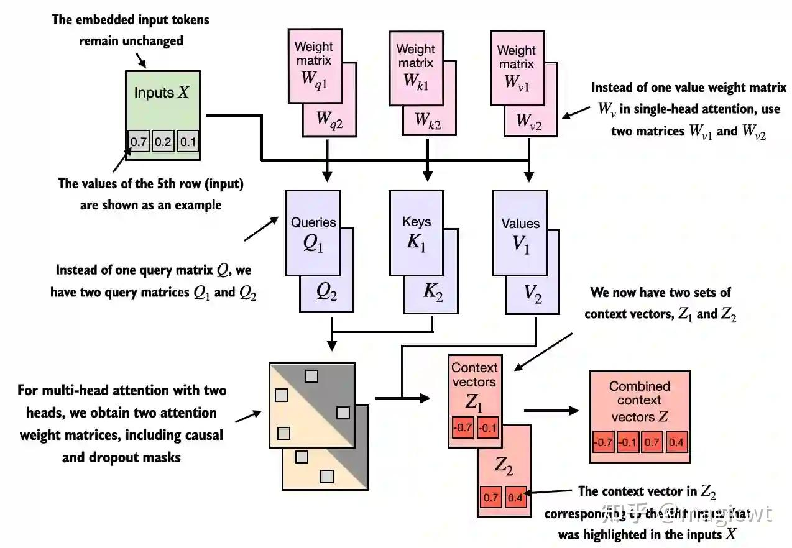

图24 通过堆叠多个CausalAttention模块来构建多头注意力模块

多头注意力的主要思想是多次（并行）运行注意力机制，每次使用学到的不同的线性投影——这些投影是通过将输入数据（比如注意力机制中的查询向量、键向量和值向量）乘以权重矩阵得到的。

多头注意力的一个简单的实现方式是初始化多个前面已实现的因果注意力层，将词元向量序列同时输入到多个因果注意力层中，得到多个上下文向量序列，再将多个上下文向量序列拼接在一起，得到最终的上下文向量序列。

另外一种多头注意力的实现，MultiHeadAttention类会将多头功能整合到一个类内。它通过重新调整投影后的查询张量、键张量和值张量的形状，将输入分为多个头，然后在计算注意力后合并这些头的结果。

多头注意力的两种实现的示意如图19所示。

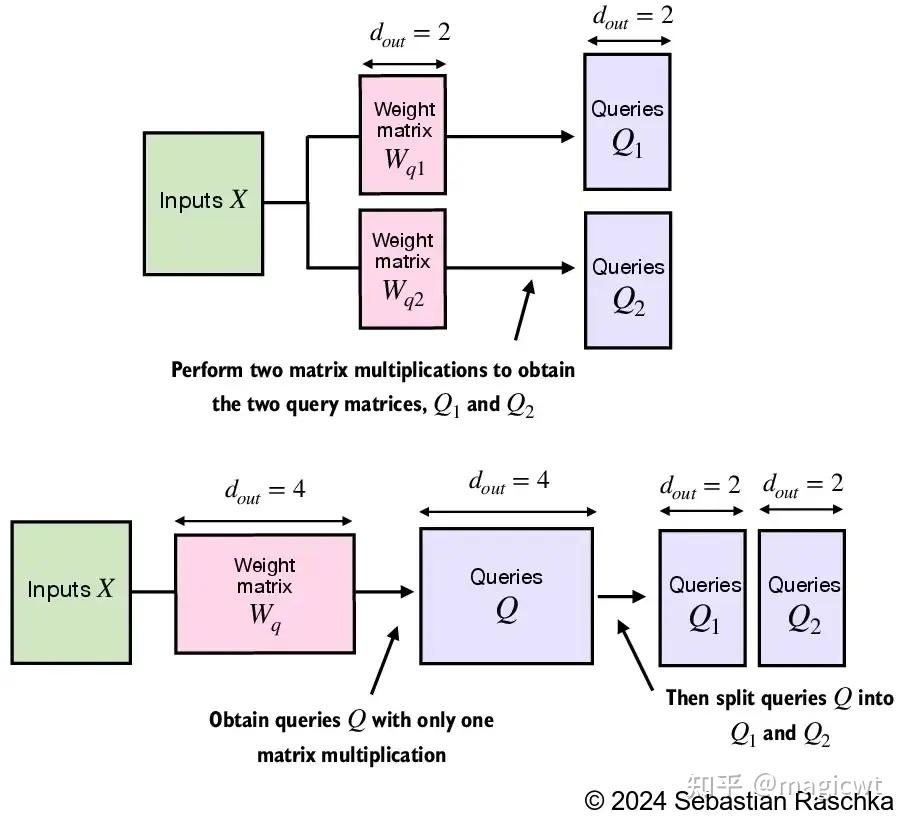

图25 多头注意力的两种实现的示意

多头注意力的第二种实现的代码如下所示：

```
import torch
import torch.nn as nn

# 多头注意力实现
class MultiHeadAttention(nn.Module):
    def __init__(self, d_in, d_out, context_length, dropout, num_heads, qkv_bias=False):
        super().__init__()
        assert (d_out % num_heads == 0), \
            "d_out must be divisible by num_heads"

        self.d_out = d_out
        self.num_heads = num_heads
        self.head_dim = d_out // num_heads # Reduce the projection dim to match desired output dim

        self.W_query = nn.Linear(d_in, d_out, bias=qkv_bias)
        self.W_key = nn.Linear(d_in, d_out, bias=qkv_bias)
        self.W_value = nn.Linear(d_in, d_out, bias=qkv_bias)
        self.out_proj = nn.Linear(d_out, d_out)  # Linear layer to combine head outputs
        self.dropout = nn.Dropout(dropout)
        self.register_buffer(
            "mask",
            torch.triu(torch.ones(context_length, context_length),
                       diagonal=1)
        )

    def forward(self, x):
        b, num_tokens, d_in = x.shape
        # As in `CausalAttention`, for inputs where `num_tokens` exceeds `context_length`,
        # this will result in errors in the mask creation further below.
        # In practice, this is not a problem since the LLM (chapters 4-7) ensures that inputs
        # do not exceed `context_length` before reaching this forwar

        keys = self.W_key(x) # Shape: (b, num_tokens, d_out)
        queries = self.W_query(x)
        values = self.W_value(x)

        # We implicitly split the matrix by adding a `num_heads` dimension
        # Unroll last dim: (b, num_tokens, d_out) -> (b, num_tokens, num_heads, head_dim)
        # 对键向量进行拆分，原键向量张量的维度是（批次数，词元序列长度，键向量维度），拆分后的键向量张量的维度是（批次数，词元序列长度，头数，每个头中的键向量维度）
        keys = keys.view(b, num_tokens, self.num_heads, self.head_dim)
        # 对值向量进行拆分，原值向量张量的维度是（批次数，词元序列长度，值向量维度），拆分后的值向量张量的维度是（批次数，词元序列长度，头数，每个头中的值向量维度）
        values = values.view(b, num_tokens, self.num_heads, self.head_dim)
        # 对查询向量进行拆分，原查询向量张量的维度是（批次数，词元序列长度，查询向量维度），拆分后的查询向量张量的维度是（批次数，词元序列长度，头数，每个头中的查询向量维度）
        queries = queries.view(b, num_tokens, self.num_heads, self.head_dim)

        # Transpose: (b, num_tokens, num_heads, head_dim) -> (b, num_heads, num_tokens, head_dim)
        # 交换键向量张量的维度，由（批次数，词元序列长度，头数，每个头中的键向量维度）调整为（批次数，头数，词元序列长度，每个头中的键向量维度）
        keys = keys.transpose(1, 2)
        # 交换查询向量张量的维度，由（批次数，词元序列长度，头数，每个头中的查询向量维度）调整为（批次数，头数，词元序列长度，每个头中的查询向量维度）
        queries = queries.transpose(1, 2)
        # 交换值向量张量的维度，由（批次数，词元序列长度，头数，每个头中的值向量维度）调整为（批次数，头数，词元序列长度，每个头中的值向量维度）
        values = values.transpose(1, 2)

        # 通过查询向量和键向量的点积计算注意力得分，注意力得分的张量维度是（批次数，头数，词元序列长度，词元序列长度）
        # Compute scaled dot-product attention (aka self-attention) with a causal mask
        attn_scores = queries @ keys.transpose(2, 3)  # Dot product for each head

        # Original mask truncated to the number of tokens and converted to boolean
        mask_bool = self.mask.bool()[:num_tokens, :num_tokens]

        # Use the mask to fill attention scores
        attn_scores.masked_fill_(mask_bool, -torch.inf)

        # 计算注意力权重，计算逻辑和因果注意力实现中的逻辑一致，并进行dropout，注意力权重的张量维度是（批次数，头数，词元序列长度，词元序列长度）
        attn_weights = torch.softmax(attn_scores / keys.shape[-1]**0.5, dim=-1)
        attn_weights = self.dropout(attn_weights)
        print("多头注意力权重:\n", attn_weights)

        # 根据注意力权重和值向量计算上下文向量，计算逻辑和因果注意力实现中的逻辑一致，上下文向量的张量维度是（批次数，头数，词元序列长度，每个头中的上下文向量维度）
        # 并交换上下文向量张量的维度，由（批次数，头数，词元序列长度，每个头中的上下文向量维度）调整为（批次数，词元序列长度，头数，每个头中的上下文向量维度）
        # Shape: (b, num_tokens, num_heads, head_dim)
        context_vec = (attn_weights @ values).transpose(1, 2)
        print("合并前的上下文向量:\n", context_vec)

        # 拼接各个头中的上下文向量，得到最终由多头注意力输出的上下文向量，最终上下文向量张量的维度是（批次数，词元序列长度，上下文向量维度）
        # Combine heads, where self.d_out = self.num_heads * self.head_dim
        context_vec = context_vec.contiguous().view(b, num_tokens, self.d_out)
        print("合并后的上下文向量:\n", context_vec)
        context_vec = self.out_proj(context_vec) # optional projection

        return context_vec

torch.manual_seed(123)
# 模拟文本“Your journey starts with one step”的词元向量序列
inputs = torch.tensor(
  [[0.43, 0.15, 0.89], # Your     (x^1)
   [0.55, 0.87, 0.66], # journey  (x^2)
   [0.57, 0.85, 0.64], # starts   (x^3)
   [0.22, 0.58, 0.33], # with     (x^4)
   [0.77, 0.25, 0.10], # one      (x^5)
   [0.05, 0.80, 0.55]] # step     (x^6)
)
# 使用两个输入构成批次
batch = torch.stack((inputs, inputs), dim=0)
# 词元向量序列长度为6
context_length = batch.shape[1]
# 词元向量维度为3
d_in = inputs.shape[1] # the input embedding size, d=3
# 上下文向量维度为2
d_out = 2 # the output embedding size, d=2
# 输出经过多头注意力层后的上下文向量，有两个上下文向量序列，每个上下文向量序列的长度和输入的词元向量序列长度一致，为6
mha = MultiHeadAttention(d_in, d_out, context_length, 0.0, num_heads=2)
context_vecs = mha(batch)
print(context_vecs)
print("context_vecs.shape:", context_vecs.shape)
```

代码执行结果如下所示：

```
多头注意力权重:
 tensor([[[[1.0000, 0.0000, 0.0000, 0.0000, 0.0000, 0.0000],
          [0.4776, 0.5224, 0.0000, 0.0000, 0.0000, 0.0000],
          [0.3140, 0.3434, 0.3426, 0.0000, 0.0000, 0.0000],
          [0.2458, 0.2559, 0.2556, 0.2427, 0.0000, 0.0000],
          [0.1967, 0.2090, 0.2087, 0.1929, 0.1927, 0.0000],
          [0.1649, 0.1726, 0.1724, 0.1625, 0.1624, 0.1653]],

         [[1.0000, 0.0000, 0.0000, 0.0000, 0.0000, 0.0000],
          [0.4988, 0.5012, 0.0000, 0.0000, 0.0000, 0.0000],
          [0.3325, 0.3338, 0.3337, 0.0000, 0.0000, 0.0000],
          [0.2463, 0.2505, 0.2504, 0.2528, 0.0000, 0.0000],
          [0.2025, 0.1995, 0.1996, 0.1978, 0.2007, 0.0000],
          [0.1625, 0.1667, 0.1666, 0.1691, 0.1650, 0.1702]]],

        [[[1.0000, 0.0000, 0.0000, 0.0000, 0.0000, 0.0000],
          [0.4776, 0.5224, 0.0000, 0.0000, 0.0000, 0.0000],
          [0.3140, 0.3434, 0.3426, 0.0000, 0.0000, 0.0000],
          [0.2458, 0.2559, 0.2556, 0.2427, 0.0000, 0.0000],
          [0.1967, 0.2090, 0.2087, 0.1929, 0.1927, 0.0000],
          [0.1649, 0.1726, 0.1724, 0.1625, 0.1624, 0.1653]],

         [[1.0000, 0.0000, 0.0000, 0.0000, 0.0000, 0.0000],
          [0.4988, 0.5012, 0.0000, 0.0000, 0.0000, 0.0000],
          [0.3325, 0.3338, 0.3337, 0.0000, 0.0000, 0.0000],
          [0.2463, 0.2505, 0.2504, 0.2528, 0.0000, 0.0000],
          [0.2025, 0.1995, 0.1996, 0.1978, 0.2007, 0.0000],
          [0.1625, 0.1667, 0.1666, 0.1691, 0.1650, 0.1702]]]],
       grad_fn=<SoftmaxBackward0>)
合并前的上下文向量:
 tensor([[[[-0.4519],
          [ 0.2216]],

         [[-0.5889],
          [ 0.0122]],

         [[-0.6313],
          [-0.0576]],

         [[-0.5685],
          [-0.0832]],

         [[-0.5541],
          [-0.0964]],

         [[-0.5311],
          [-0.1077]]],

        [[[-0.4519],
          [ 0.2216]],

         [[-0.5889],
          [ 0.0122]],

         [[-0.6313],
          [-0.0576]],

         [[-0.5685],
          [-0.0832]],

         [[-0.5541],
          [-0.0964]],

         [[-0.5311],
          [-0.1077]]]], grad_fn=<TransposeBackward0>)
合并后的上下文向量:
 tensor([[[-0.4519,  0.2216],
         [-0.5889,  0.0122],
         [-0.6313, -0.0576],
         [-0.5685, -0.0832],
         [-0.5541, -0.0964],
         [-0.5311, -0.1077]],

        [[-0.4519,  0.2216],
         [-0.5889,  0.0122],
         [-0.6313, -0.0576],
         [-0.5685, -0.0832],
         [-0.5541, -0.0964],
         [-0.5311, -0.1077]]], grad_fn=<ViewBackward0>)
tensor([[[0.3190, 0.4858],
         [0.2943, 0.3897],
         [0.2856, 0.3593],
         [0.2693, 0.3873],
         [0.2639, 0.3928],
         [0.2575, 0.4028]],

        [[0.3190, 0.4858],
         [0.2943, 0.3897],
         [0.2856, 0.3593],
         [0.2693, 0.3873],
         [0.2639, 0.3928],
         [0.2575, 0.4028]]], grad_fn=<ViewBackward0>)
context_vecs.shape: torch.Size([2, 6, 2])
```

## 第 4 章　从头实现 GPT 模型进行文本生成

### 使用层归一化进行归一化激活

通过使用层归一化，提高神经网络训练的稳定性和效率。层归一化的主要思想是调整神经网络层的激活（输出），使其均值为 0 且方差（单位方差）为 1。这种调整有助于加速权重的有效收敛，并确保训练过程的一致性和可靠性。

层归一化的代码如下所示：

```
import torch
import torch.nn as nn

class LayerNorm(nn.Module):
    def __init__(self, emb_dim):
        super().__init__()
        self.eps = 1e-5
        self.scale = nn.Parameter(torch.ones(emb_dim))
        self.shift = nn.Parameter(torch.zeros(emb_dim))

    def forward(self, x):
        mean = x.mean(dim=-1, keepdim=True)
        var = x.var(dim=-1, keepdim=True, unbiased=False)
        norm_x = (x - mean) / torch.sqrt(var + self.eps)
        return self.scale * norm_x + self.shift
```

层归一化的具体实现作用在输入张量`x`的最后一个维度上，该维度对应于嵌入维度(`emb_dim`)。变量`eps`是一个小常数，在归一化过程中会被加到方差上以防止除零错误。`scale`和`shift`是两个可训练的参数（与输入维度相同），如果在训练过程中发现调整它们可以改善模型的训练任务表现，那么大语言模型会自动进行调整。这使得模型能够学习适合其数据处理的最佳缩放和偏移。

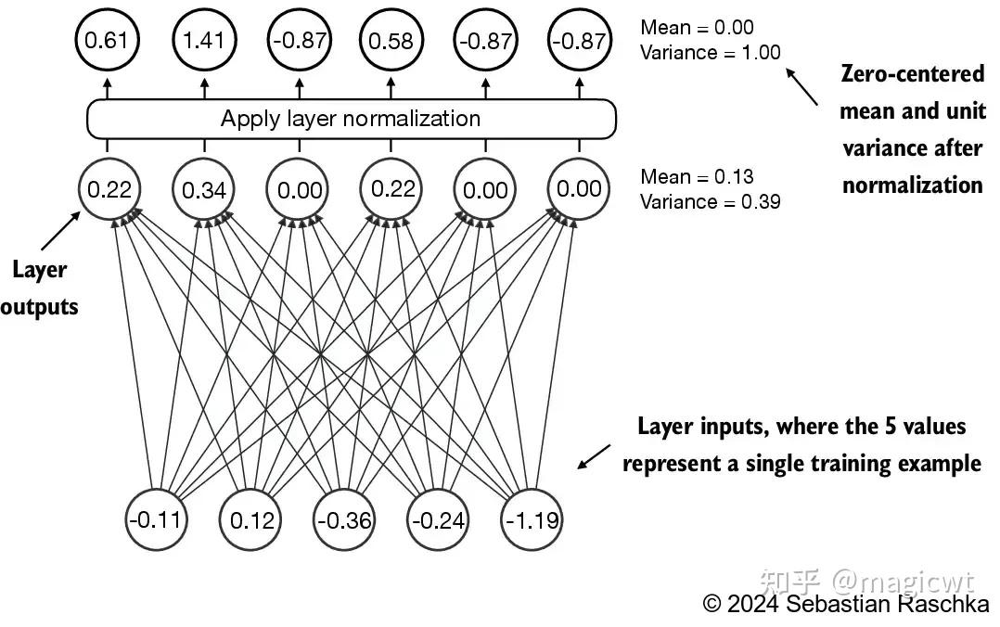

图26 层归一化是对单个样本的嵌入向量的各个值进行归一化

### 实现具有GELU激活函数的前馈神经网络

GELU和SwiGLU是更为复杂且平滑的激活函数，分别结合了高斯分布和Sigmoid门控线性单元。与较为简单的 ReLU激活函数相比，它们能够提升深度学习模型的性能。GELU激活函数可以通过多种方式实现，其精确的定义为： $$\text{GELU}(x)=x⋅Φ(x)$$其中， $Φ(x) $ 是标准高斯分布的累积分布函数。然而，在实际操作中，通常我们会使用一种计算量较小的近似实现（原始的 GPT-2 模型也是使用这种通过曲线拟合得到的近似方法进行训练的）：

$$\text{GELU}(x) \approx 0.5 \cdot x \cdot \left(1 + \tanh\left[\sqrt{\frac{2}{\pi}} \cdot \left(x + 0.044715 \cdot x^3\right)\right]\right)$$GELU和ReLU的函数曲线如图21所示，ReLU是一个分段线性函数，当输入为正数时直接输出输入值，否则输出 0。GELU则是一个平滑的非线性函数，它近似ReLU，但在几乎所有负值上都有非零梯度。

GELU的平滑特性可以在训练过程中带来更好的优化效果，因为它允许模型参数进行更细微的调整。相比之下，ReLU在零点处有一个尖锐的拐角，有时会使得优化过程更加困难，特别是在深度或复杂的网络结构中。此外，ReLU对负输入的输出为0，而GELU对负输入会输出一个小的非零值。这意味着在训练过程中，接收到负输入的神经元仍然可以参与学习，只是贡献程度不如正输入大。

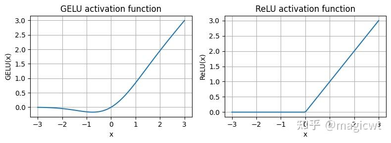

图27 GELU和ReLU的函数曲线

FeedForward模块是一个小型神经网络，由两个线性层和一个GELU激活函数组成，如图22所示。

第一个线性层的输入张量的维度是（批次数，词元序列长度，词元嵌入维度）（2，3，768），输出张量的维度（批次数，词元序列长度，词元嵌入维度）（2，3，3072），输入时词元嵌入维度是768，输出时词元嵌入维度是3072，增加至输入的4倍。

激活函数的输入张量的维度是（批次数，词元序列长度，词元嵌入维度）（2，3，3072），输出张量的维度是（批次数，词元序列长度，词元嵌入维度）（2，3，3072），输入和输出的维度无变化，但通过激活函数引入了非线性。

第二个线性层的输入张量的维度是（批次数，词元序列长度，词元嵌入维度）（2，3，3072），输出张量的维度（批次数，词元序列长度，词元嵌入维度）（2，3，768），输入时词元嵌入维度是3072，输出时词元嵌入维度是768，减少至输入的1/4。

整体看FeedForward模块，输入和输出张量的维度保持不变，但通过激活函数引入了非线性。FeedForward模块在提升模型学习和泛化能力方面非常关键。虽然该模块的输入和输出维度保持一致，但它通过第一个线性层将嵌入维度扩展到了更高的维度，如图22所示。扩展之后，应用非线性GELU激活函数，然后通过第二个线性变换将维度缩回原始大小。这种设计允许模型探索更丰富的表示空间。

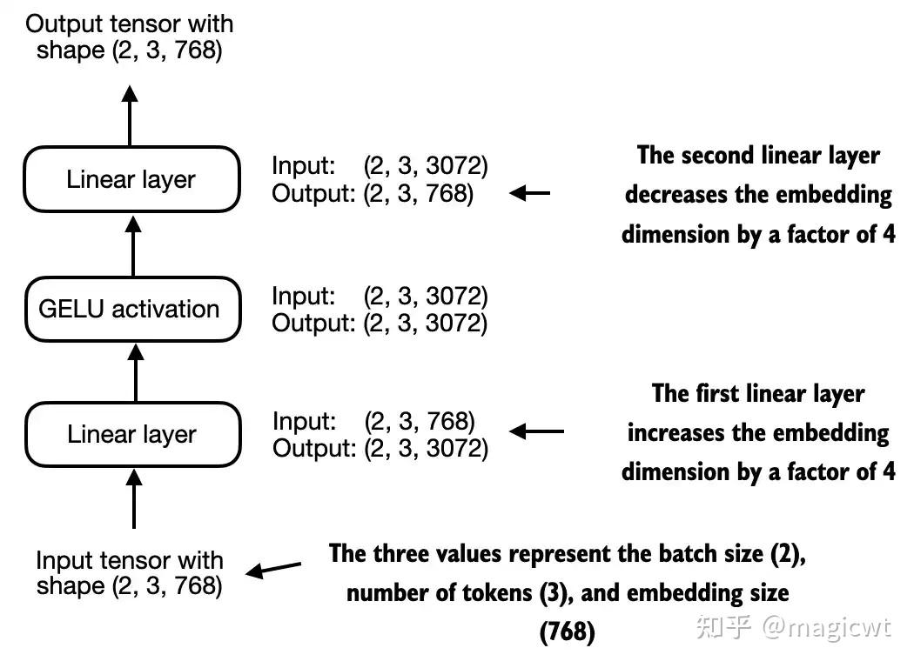

图28 FeedForward模块

FeedForward模块的代码如下所示：

```
import torch
import torch.nn as nn

class FeedForward(nn.Module):
    def __init__(self, cfg):
        super().__init__()
        self.layers = nn.Sequential(
            nn.Linear(cfg["emb_dim"], 4 * cfg["emb_dim"]),
            GELU(),
            nn.Linear(4 * cfg["emb_dim"], cfg["emb_dim"]),
        )

    def forward(self, x):
        return self.layers(x)
```

### 增加残差连接

这是通过将某一层的输入直接叠加到该层的输出中实现的，其能够解决网络层数过多时的梯度消失问题。

### 连接Transformer块中的注意力层和线性层

首先，安装llms_from_scratch，里面包含了书中实现的一些类和方法：

```
uv pip install llms_from_scratch
```

实现Transformer块，这是GPT和其他大语言模型架构的基本构建块。在参数量为1.24亿的GPT-2架构中，这个块被重复多次，它结合了之前提及的多个概念：多头注意力、层归一化、dropout、前馈层和GELU激活函数。

Transformer块的结构如图23所示。Transformer块的核心思想是，自注意力机制在多头注意力块中用于识别和分析输入序列中元素之间的关系。相比之下，前馈神经网络则在每个位置上对数据进行单独的修改。这种组合不仅提供了对输入更细致的理解和处理，而且提升了模型处理复杂数据模式的整体能力。

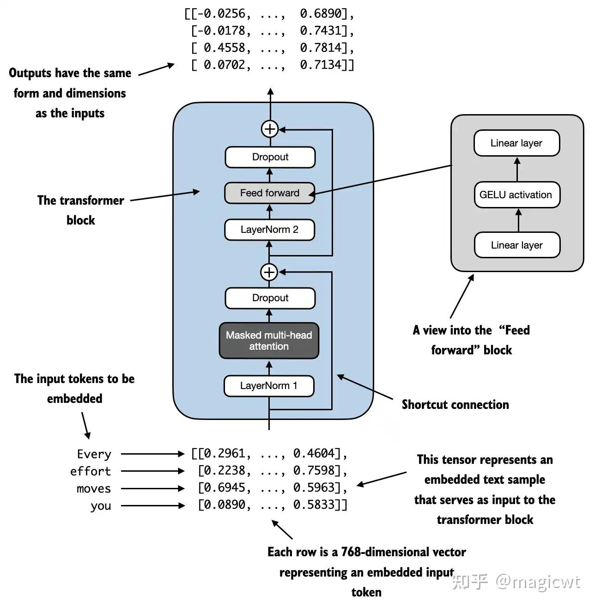

图29 Transformer块的结构

Transformer块的代码如下所示：

```
import torch
import torch.nn as nn
from llms_from_scratch.ch03 import MultiHeadAttention

class TransformerBlock(nn.Module):
    def __init__(self, cfg):
        super().__init__()
        # 使用MultiHeadAttention定义Transformer块中的多头注意力层
        self.att = MultiHeadAttention(
            d_in=cfg["emb_dim"],
            d_out=cfg["emb_dim"],
            context_length=cfg["context_length"],
            num_heads=cfg["n_heads"],
            dropout=cfg["drop_rate"],
            qkv_bias=cfg["qkv_bias"])
        # 使用FeedForward定义Transformer块中的前馈全连接网络层
        self.ff = FeedForward(cfg)
        # 使用LayerNorm定义Transformer块中的层归一化层
        self.norm1 = LayerNorm(cfg["emb_dim"])
        self.norm2 = LayerNorm(cfg["emb_dim"])
        self.drop_shortcut = nn.Dropout(cfg["drop_rate"])

    def forward(self, x):
        # Shortcut connection for attention block
        shortcut = x
        # 对Transformer块的输入进行层归一化
        x = self.norm1(x)
        # 将层归一化层的输出输入多头注意力层
        x = self.att(x)  # Shape [batch_size, num_tokens, emb_size]
        # 对多头注意力层的输出进行dropout
        x = self.drop_shortcut(x)
        # 将多头注意力层的输出（经过dropout后）与层归一化前的输入进行相加，实现残差连接
        x = x + shortcut  # Add the original input back

        # Shortcut connection for feed forward block
        shortcut = x
        # 将上一环节的输出进行层归一化
        x = self.norm2(x)
        # 将层归一化的输出输入前馈全连接网络层
        x = self.ff(x)
        # 对前馈全连接网络层的输出进行dropout
        x = self.drop_shortcut(x)
        # 将前馈全连接网络层的输出（经过dropout后）与层归一化前的输入进行相加，实现残差连接
        x = x + shortcut  # Add the original input back

        return x
```

### 实现GPT模型

Transformer块在GPT模型架构中被多次重复。在参数量为1.24亿的GPT-2模型中，Transformer块被重复使用12次，这可以通过`GPT_CONFIG_124M`字典中的`n_layers`字段进行指定。在最大规模的GPT-2模型（参数量为15.42亿）中，Transformer块被重复使用48次。

在Transformer块之前，增加词元序列的词元和位置的嵌入层，以及dropout层，在Transformer块之后，增加层归一化层和线性输出层，得到GPT模型，如图24所示。

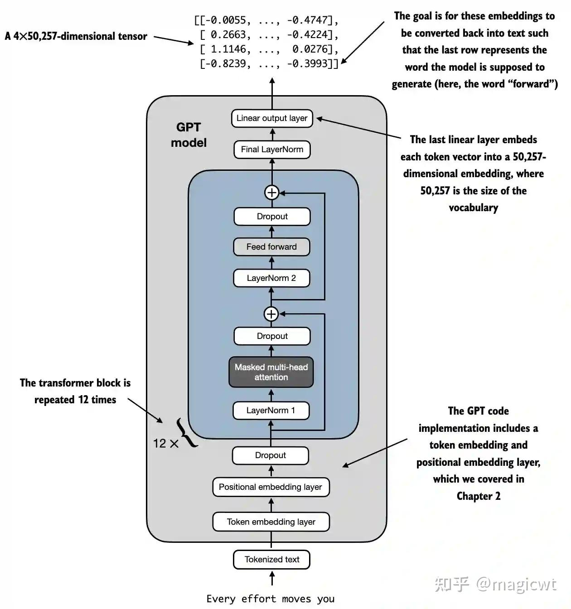

图30 GPT模型的结构

GPT模型的代码如下所示：

```
import torch
import torch.nn as nn

class GPTModel(nn.Module):
    def __init__(self, cfg):
        super().__init__()
        # 定义词元的嵌入层
        self.tok_emb = nn.Embedding(cfg["vocab_size"], cfg["emb_dim"])
        # 定义位置的嵌入层
        self.pos_emb = nn.Embedding(cfg["context_length"], cfg["emb_dim"])
        self.drop_emb = nn.Dropout(cfg["drop_rate"])
        # 定义连续的多个Transformer块
        self.trf_blocks = nn.Sequential(
            *[TransformerBlock(cfg) for _ in range(cfg["n_layers"])])
        # 定义层归一化层
        self.final_norm = LayerNorm(cfg["emb_dim"])
        # 定义线性输出层
        self.out_head = nn.Linear(
            cfg["emb_dim"], cfg["vocab_size"], bias=False
        )

    def forward(self, in_idx):
        batch_size, seq_len = in_idx.shape
        # 将词元通过词元嵌入层转化为词元嵌入向量
        tok_embeds = self.tok_emb(in_idx)
        # 将位置通过位置嵌入层转化为位置嵌入向量
        pos_embeds = self.pos_emb(torch.arange(seq_len, device=in_idx.device))
        # 将词元嵌入向量和位置嵌入向量相加得到最终的词元嵌入向量作为输入
        x = tok_embeds + pos_embeds  # Shape [batch_size, num_tokens, emb_size]
        # 将输入进行dropout
        x = self.drop_emb(x)
        # 将dropout的输出输入Transformer块
        x = self.trf_blocks(x)
        # 将Transformer块的输出进行层归一化
        x = self.final_norm(x)
        # 将层归一化的输出输入线性输出层
        logits = self.out_head(x)
        return logits
```

### 生成文本

大语言模型逐步生成文本的过程如图25所示，每次生成一个词元。从初始输入上下文（“Hello, I am”）开始，模型在每轮迭代中预测下一个词元，并将其添加到输入上下文中以进行下一轮预测。第一轮迭代添加了“a”，第二轮迭代添加了“model”，第三轮迭代添加了“ready”，逐步形成完整的句子。在第6次迭代时，模型生成了完整的句子“Hello, I am a model ready to help.”。

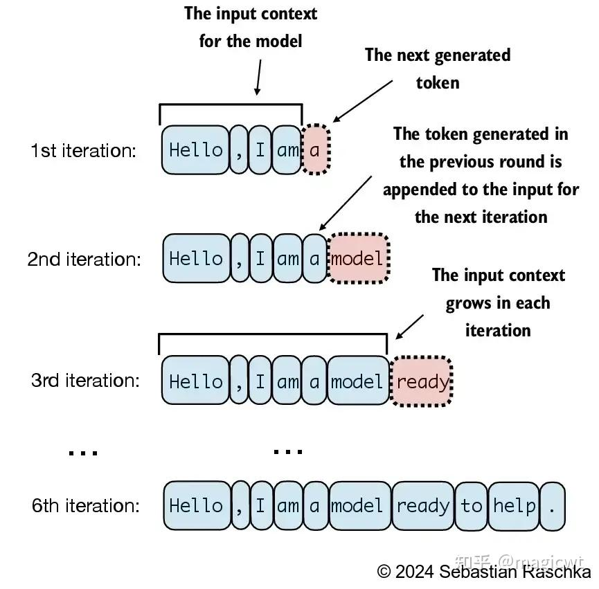

图31 大语言模型逐步生成文本的过程

图26说明了GPT模型如何在给定输入的情况下生成下一个词元。在每一步中，模型输出一个矩阵，其中的向量表示有可能的下一个词元。将与下一个词元对应的向量提取出来，该向量的维度与词典的大小一致，并通过Softmax函数将该向量转换为概率分布。在该向量中，找到概率分数最高值的索引，这个索引对应于词元ID。然后将这个词元ID解码为文本，生成序列中的下一个词元。最后，将这个词元附加到之前的输入中，形成新的输入序列，供下一次迭代使用。这个逐步的过程使得模型能够按顺序生成文本，从最初的输入上下文开始构建连贯的短语和句子。实际操作会多次重复这一过程，如图25所示，直至生成预定数量的词元。

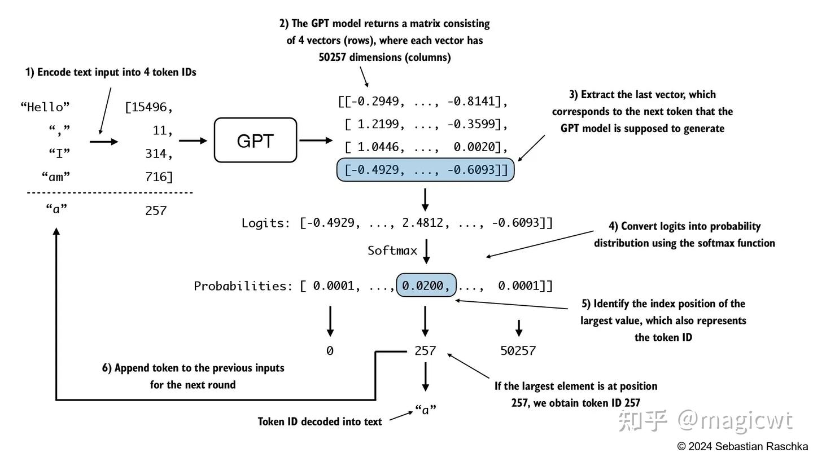

图32 GPT模型如何在给定输入的情况下生成下一个词元

文本生成的代码如下所示：

```
def generate_text_simple(model, idx, max_new_tokens, context_size):
    # idx is (batch, n_tokens) array of indices in the current context
    for _ in range(max_new_tokens):

        # Crop current context if it exceeds the supported context size
        # E.g., if LLM supports only 5 tokens, and the context size is 10
        # then only the last 5 tokens are used as context
        idx_cond = idx[:, -context_size:]

        # Get the predictions
        with torch.no_grad():
            logits = model(idx_cond)

        # Focus only on the last time step
        # (batch, n_tokens, vocab_size) becomes (batch, vocab_size)
        logits = logits[:, -1, :]

        # Apply softmax to get probabilities
        probas = torch.softmax(logits, dim=-1)  # (batch, vocab_size)

        # Get the idx of the vocab entry with the highest probability value
        idx_next = torch.argmax(probas, dim=-1, keepdim=True)  # (batch, 1)

        # Append sampled index to the running sequence
        idx = torch.cat((idx, idx_next), dim=1)  # (batch, n_tokens+1)

    return idx
```

## 第 5 章　在无标签数据上进行预训练

### 评估文本生成模型

对于上一节定义的GPT模型，如果不进行训练，直接基于一段文本“Every effort moves you”，由GPT模型预测后续的文本，代码如下所示：

```
import tiktoken
import torch

from llms_from_scratch.ch04 import generate_text_simple
from llms_from_scratch.ch04 import GPTModel

GPT_CONFIG_124M = {
    "vocab_size": 50257,   # Vocabulary size
    "context_length": 256, # Shortened context length (orig: 1024)
    "emb_dim": 768,        # Embedding dimension
    "n_heads": 12,         # Number of attention heads
    "n_layers": 12,        # Number of layers
    "drop_rate": 0.1,      # Dropout rate
    "qkv_bias": False      # Query-key-value bias
}

torch.manual_seed(123)
model = GPTModel(GPT_CONFIG_124M)
model.eval();  # Disable dropout during inference

def text_to_token_ids(text, tokenizer):
    encoded = tokenizer.encode(text, allowed_special={'<|endoftext|>'})
    encoded_tensor = torch.tensor(encoded).unsqueeze(0) # add batch dimension
    return encoded_tensor

def token_ids_to_text(token_ids, tokenizer):
    flat = token_ids.squeeze(0) # remove batch dimension
    return tokenizer.decode(flat.tolist())

start_context = "Every effort moves you"
tokenizer = tiktoken.get_encoding("gpt2")

token_ids = generate_text_simple(
    model=model,
    idx=text_to_token_ids(start_context, tokenizer),
    max_new_tokens=10,
    context_size=GPT_CONFIG_124M["context_length"]
)

print("Output text:\n", token_ids_to_text(token_ids, tokenizer))
```

由于尚未经过训练，模型还无法生成连贯的文本，执行结果如下所示：

```
Output text:
 Every effort moves you rentingetic wasn  refres RexMeCHicular stren
```

为了使得模型能够生成连贯的文本，需要使用训练样本集对模型进行训练，不断调整模型的参数，使得模型在训练样本集和评估样本集的损失函数值逐渐减少。

损失函数一般采用交叉熵损失。

在机器学习和深度学习中，交叉熵损失是一种常用的度量方式，用于衡量两个概率分布之间的差异——通常是标签（在这里是数据集中的词元）的真实分布和模型生成的预测分布（例如，由大语言模型生成的词元概率）之间的差异。

大预言模型的输出是下一个词元是词典中某个词元的概率，其交叉熵损失如下所示：

$$L_{CE}=-\sum_{i=1}^{n}{y_i\log{\hat{y_i}}}$$交叉熵损失中， $n$ 表示词典中词元的数量， $i$ 表示词典中的第 $ i $ 个词元， $ y_i $ 表示词典中的第 $ i $ 个词元是下一个词元的真实概率，若第 $ i $ 个词元就是真实的下一个词元，则 $ y_i=1 $ ，否则 $ y_i=0$ ， $ \hat{y}_i$ 表示词典中的第 $i $ 个词元是下一个词元的模型预测概率，若第 $ i$ 个词元就是真实的下一个词元，则 $\hat{y}_i $ 越接近1， $L_{CE}$ 越小。

### 训练大语言模型

将之前已介绍的短篇小说《The Verdict》作为数据集（其中大部分作为训练数据集，小部分作为验证数据集）对GPT模型进行预训练，代码如下所示：

```
# Copyright (c) Sebastian Raschka under Apache License 2.0 (see LICENSE.txt).
# Source for "Build a Large Language Model From Scratch"
#   - https://www.manning.com/books/build-a-large-language-model-from-scratch
# Code: https://github.com/rasbt/LLMs-from-scratch

import matplotlib.pyplot as plt
import os
import torch
import urllib.request
import tiktoken

from llms_from_scratch.ch02 import create_dataloader_v1
from llms_from_scratch.ch04 import GPTModel, generate_text_simple

def text_to_token_ids(text, tokenizer):
    """将词元转化词元id"""
    encoded = tokenizer.encode(text)
    encoded_tensor = torch.tensor(encoded).unsqueeze(0)  # add batch dimension
    return encoded_tensor

def token_ids_to_text(token_ids, tokenizer):
    """将词元id转化词元"""
    flat = token_ids.squeeze(0)  # remove batch dimension
    return tokenizer.decode(flat.tolist())

def calc_loss_batch(input_batch, target_batch, model, device):
    """计算每个批次模型预估概率和真实概率的交叉熵损失"""
    input_batch, target_batch = input_batch.to(device), target_batch.to(device)
    logits = model(input_batch)
    loss = torch.nn.functional.cross_entropy(logits.flatten(0, 1), target_batch.flatten())
    return loss

def calc_loss_loader(data_loader, model, device, num_batches=None):
    """对数据集中的多个批次，计算每个批次模型预估概率和真实概率的交叉熵损失，并计算每个批次交叉熵损失的平均值"""
    total_loss = 0.
    if len(data_loader) == 0:
        return float("nan")
    elif num_batches is None:
        num_batches = len(data_loader)
    else:
        num_batches = min(num_batches, len(data_loader))
    for i, (input_batch, target_batch) in enumerate(data_loader):
        if i < num_batches:
            loss = calc_loss_batch(input_batch, target_batch, model, device)
            total_loss += loss.item()
        else:
            break
    return total_loss / num_batches

def evaluate_model(model, train_loader, val_loader, device, eval_iter):
    """评估模型，计算模型在训练数据集和测试数据集的交叉熵损失"""
    model.eval()
    with torch.no_grad():
        train_loss = calc_loss_loader(train_loader, model, device, num_batches=eval_iter)
        val_loss = calc_loss_loader(val_loader, model, device, num_batches=eval_iter)
    model.train()
    return train_loss, val_loss

def generate_and_print_sample(model, tokenizer, device, start_context):
    """使用模型进行推理，基于已有文本，预测下一个词元，最多预测50个词元"""
    model.eval()
    context_size = model.pos_emb.weight.shape[0]
    encoded = text_to_token_ids(start_context, tokenizer).to(device)
    with torch.no_grad():
        token_ids = generate_text_simple(
            model=model, idx=encoded,
            max_new_tokens=50, context_size=context_size
        )
        decoded_text = token_ids_to_text(token_ids, tokenizer)
        print(decoded_text.replace("\n", " "))  # Compact print format
    model.train()

def train_model_simple(model, train_loader, val_loader, optimizer, device, num_epochs,
                       eval_freq, eval_iter, start_context, tokenizer):
    """对模型进行训练"""
    # Initialize lists to track losses and tokens seen
    train_losses, val_losses, track_tokens_seen = [], [], []
    tokens_seen = 0
    global_step = -1

    # Main training loop
    for epoch in range(num_epochs):
        # 对训练数据集重复多次
        model.train()  # Set model to training mode

        for input_batch, target_batch in train_loader:
            # 对训练数据集的每个批次
            optimizer.zero_grad()  # Reset loss gradients from previous batch iteration
            # 计算交叉熵损失
            loss = calc_loss_batch(input_batch, target_batch, model, device)
            # 计算梯度
            loss.backward()  # Calculate loss gradients
            # 反向传播，根据梯度更新模型参数
            optimizer.step()  # Update model weights using loss gradients
            tokens_seen += input_batch.numel()
            global_step += 1

            # Optional evaluation step
            if global_step % eval_freq == 0:
                train_loss, val_loss = evaluate_model(
                    model, train_loader, val_loader, device, eval_iter)
                train_losses.append(train_loss)
                val_losses.append(val_loss)
                track_tokens_seen.append(tokens_seen)
                print(f"Ep {epoch+1} (Step {global_step:06d}): "
                      f"Train loss {train_loss:.3f}, Val loss {val_loss:.3f}")

        # 遍历一次训练数据集后，使用模型进行推理
        # Print a sample text after each epoch
        generate_and_print_sample(
            model, tokenizer, device, start_context
        )

    return train_losses, val_losses, track_tokens_seen

def plot_losses(epochs_seen, tokens_seen, train_losses, val_losses):
    """绘制训练过程中的损失变化曲线"""
    fig, ax1 = plt.subplots()

    # Plot training and validation loss against epochs
    ax1.plot(epochs_seen, train_losses, label="Training loss")
    ax1.plot(epochs_seen, val_losses, linestyle="-.", label="Validation loss")
    ax1.set_xlabel("Epochs")
    ax1.set_ylabel("Loss")
    ax1.legend(loc="upper right")

    # Create a second x-axis for tokens seen
    ax2 = ax1.twiny()  # Create a second x-axis that shares the same y-axis
    ax2.plot(tokens_seen, train_losses, alpha=0)  # Invisible plot for aligning ticks
    ax2.set_xlabel("Tokens seen")

    fig.tight_layout()  # Adjust layout to make room
    # plt.show()

def main(gpt_config, settings):
    """定义模型训练主流程"""
    torch.manual_seed(123)
    device = torch.device("cuda" if torch.cuda.is_available() else "cpu")

    ##############################
    # 下载数据集，即之前已介绍的短篇小说《The Verdict》
    # Download data if necessary
    ##############################

    file_path = "the-verdict.txt"
    url = "https://raw.githubusercontent.com/rasbt/LLMs-from-scratch/main/ch02/01_main-chapter-code/the-verdict.txt"

    if not os.path.exists(file_path):
        with urllib.request.urlopen(url) as response:
            text_data = response.read().decode('utf-8')
        with open(file_path, "w", encoding="utf-8") as file:
            file.write(text_data)
    else:
        with open(file_path, "r", encoding="utf-8") as file:
            text_data = file.read()

    ##############################
    # 初始化模型，即之前已定义的GPTModel
    # Initialize model
    ##############################

    model = GPTModel(gpt_config)
    model.to(device)  # no assignment model = model.to(device) necessary for nn.Module classes
    optimizer = torch.optim.AdamW(
        model.parameters(), lr=settings["learning_rate"], weight_decay=settings["weight_decay"]
    )

    ##############################
    # 将数据集划分为训练数据集和评估数据集
    # Set up dataloaders
    ##############################

    # Train/validation ratio
    train_ratio = 0.90
    split_idx = int(train_ratio * len(text_data))

    train_loader = create_dataloader_v1(
        text_data[:split_idx],
        batch_size=settings["batch_size"],
        max_length=gpt_config["context_length"],
        stride=gpt_config["context_length"],
        drop_last=True,
        shuffle=True,
        num_workers=0
    )

    val_loader = create_dataloader_v1(
        text_data[split_idx:],
        batch_size=settings["batch_size"],
        max_length=gpt_config["context_length"],
        stride=gpt_config["context_length"],
        drop_last=False,
        shuffle=False,
        num_workers=0
    )

    ##############################
    # 训练模型
    # Train model
    ##############################

    tokenizer = tiktoken.get_encoding("gpt2")

    train_losses, val_losses, tokens_seen = train_model_simple(
        model, train_loader, val_loader, optimizer, device,
        num_epochs=settings["num_epochs"], eval_freq=5, eval_iter=5,
        start_context="Every effort moves you", tokenizer=tokenizer
    )

    return train_losses, val_losses, tokens_seen, model

if __name__ == "__main__":

    # 模型和训练的超参数
    #
    # 模型的超参数
    # 词典大小：50257
    # 上下文长度：256
    # 嵌入向量维度：768
    # 头数：12
    # 层数：12
    #
    # 训练的超参数
    # 学习率：0.0005
    # 数据集重复次数：10
    # 批次大小：2
    GPT_CONFIG_124M = {
        "vocab_size": 50257,    # Vocabulary size
        "context_length": 256,  # Shortened context length (orig: 1024)
        "emb_dim": 768,         # Embedding dimension
        "n_heads": 12,          # Number of attention heads
        "n_layers": 12,         # Number of layers
        "drop_rate": 0.1,       # Dropout rate
        "qkv_bias": False       # Query-key-value bias
    }

    OTHER_SETTINGS = {
        "learning_rate": 0.0004,
        "num_epochs": 10,
        "batch_size": 2,
        "weight_decay": 0.1
    }

    ###########################
    # 执行模型训练主流程
    # Initiate training
    ###########################

    train_losses, val_losses, tokens_seen, model = main(GPT_CONFIG_124M, OTHER_SETTINGS)

    ###########################
    # After training
    ###########################

    # 绘制训练过程中的损失变化曲线
    # Plot results
    epochs_tensor = torch.linspace(0, OTHER_SETTINGS["num_epochs"], len(train_losses))
    plot_losses(epochs_tensor, tokens_seen, train_losses, val_losses)
    plt.savefig("loss.pdf")

    # 保存并加载模型
    # Save and load model
    torch.save(model.state_dict(), "model.pth")
    model = GPTModel(GPT_CONFIG_124M)
    model.load_state_dict(torch.load("model.pth", weights_only=True))
```

训练过程中的损失变化曲线如图27所示，训练集损失和验证集损失整体趋势是逐渐减小。在训练开始阶段，训练集损失和验证集损失急剧下降，这表明模型正在学习。然而，在第二轮之后，训练集损失继续下降，验证集损失则停滞不前。这表明模型仍在学习，但在第二轮之后开始对训练集过拟合。这种记忆现象其实是可以预料到的，因为我们使用了一个非常小的训练数据集，并且对模型进行了多轮训练。通常，在更大的数据集上训练模型时，只训练一轮是很常见的做法。

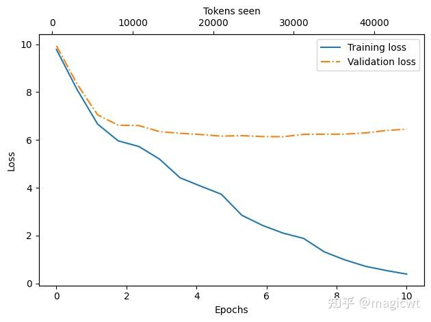

图33 训练过程中的损失变化曲线

训练过程中，每遍历一次训练数据集后，使用模型进行推理，输出的结果如下所示：

```
Ep 1 (Step 000000): Train loss 9.781, Val loss 9.933
Ep 1 (Step 000005): Train loss 8.111, Val loss 8.339
Every effort moves you,,,,,,,,,,,,.
Ep 2 (Step 000010): Train loss 6.661, Val loss 7.048
Ep 2 (Step 000015): Train loss 5.961, Val loss 6.616
Every effort moves you, and, and, and, and, and, and, and, and, and, and, and, and, and, and, and, and, and, and, and, and, and, and,, and, and,
Ep 3 (Step 000020): Train loss 5.726, Val loss 6.600
Ep 3 (Step 000025): Train loss 5.201, Val loss 6.348
Every effort moves you, and I had been.
Ep 4 (Step 000030): Train loss 4.417, Val loss 6.278
Ep 4 (Step 000035): Train loss 4.069, Val loss 6.226
Every effort moves you know the                          "I he had the donkey and I had the and I had the donkey and down the room, I had
Ep 5 (Step 000040): Train loss 3.732, Val loss 6.160
Every effort moves you know it was not that the picture--I had the fact by the last I had been--his, and in the            "Oh, and he said, and down the room, and in
Ep 6 (Step 000045): Train loss 2.850, Val loss 6.179
Ep 6 (Step 000050): Train loss 2.427, Val loss 6.141
Every effort moves you know," was one of the picture. The--I had a little of a little: "Yes, and in fact, and in the picture was, and I had been at my elbow and as his pictures, and down the room, I had
Ep 7 (Step 000055): Train loss 2.104, Val loss 6.134
Ep 7 (Step 000060): Train loss 1.882, Val loss 6.233
Every effort moves you know," was one of the picture for nothing--I told Mrs.  "I was no--as! The women had been, in the moment--as Jack himself, as once one had been the donkey, and were, and in his
Ep 8 (Step 000065): Train loss 1.320, Val loss 6.238
Ep 8 (Step 000070): Train loss 0.985, Val loss 6.242
Every effort moves you know," was one of the axioms he had been the tips of a self-confident moustache, I felt to see a smile behind his close grayish beard--as if he had the donkey. "strongest," as his
Ep 9 (Step 000075): Train loss 0.717, Val loss 6.293
Ep 9 (Step 000080): Train loss 0.541, Val loss 6.393
Every effort moves you?"  "Yes--quite insensible to the irony. She wanted him vindicated--and by me!"  He laughed again, and threw back the window-curtains, I had the donkey. "There were days when I
Ep 10 (Step 000085): Train loss 0.391, Val loss 6.452
Every effort moves you know," was one of the axioms he laid down across the Sevres and silver of an exquisitely appointed luncheon-table, when, on a later day, I had again run over from Monte Carlo; and Mrs. Gis
```

在开始阶段，模型只能在起始上下文后添加逗号（Every effort moves you,,,,,,,,,,,,）或重复单词and。在训练结束时，它已经可以生成语法正确的文本。

### 控制随机性的解码策略

大语言模型的输出是下一个词元是词典中某个词元的概率，经过预训练后，模型已经比较能够准确预测下一个词元，即模型对于正确词元的概率预测值一般最大，将同一个文本多次输入模型，则模型每次均选择概率预测值最大的词元，从而输出相同的文本，但实际我们在使用各类大语言模型时，一般将同一个文本多次输入模型，会得到不同的输出。大语言模型如何在保证一定准确性的同时，实现多样化的输出呢“

在之前的`generate_text_simple`函数中，我们总是使用`torch.argmax`（也称为贪婪解码）来采样具有最高概率的词元作为下一个词元，代码如下所示：

```
torch.argmax(probas, dim=-1, keepdim=True)
```

为了生成更多样化的文本，可以用一个从概率分布（这里是大语言模型在预测下一个词元时为词典中每个词元生成的概率分数）中采样的函数来取代`argmax`。具体可以使用PyTorch中的`multinomial`函数替换`argmax`来实现这个概率采样过程，代码如下所示：

```
next_token_id = torch.multinomial(probas, num_samples=1).item()
```

通过一个被称为温度缩放的概念，可以进一步控制分布和选择过程。温度缩放指的是将`logits`除以一个大于0的数，即`temperature`，然后在对缩放后的`logits`（即`scaled_logits`）通过Softmax函数得到词典中各个词元的概率，代码如下所示：

```
def softmax_with_temperature(logits, temperature):
    scaled_logits = logits / temperature
    return torch.softmax(scaled_logits, dim=0)
```

温度大于1会导致词元概率更加均匀分布，温度小于1则会导致更加自信（更尖锐或更陡峭）的分布。

应用比较小的温度（例如0.1）会导致更集中的分布，使得`multinomial`函数几乎100%选择最可能的词元（这里是forward），接近于`argmax`函数的行为。相反地，应用比较大的温度（例如5）会导致更均匀的分布，使得其他词元更容易被选中。这可以为生成的文本增加更多变化，但也更容易生成无意义的文本。

温度缩放对概率分布的影响如下图所示。同一个输入“Every effort moves you”，温度取 0.1 时“forward”的概率被放大到接近 1；取 5 时各个词元的概率被拉平，其他词元也有了被选中的机会。

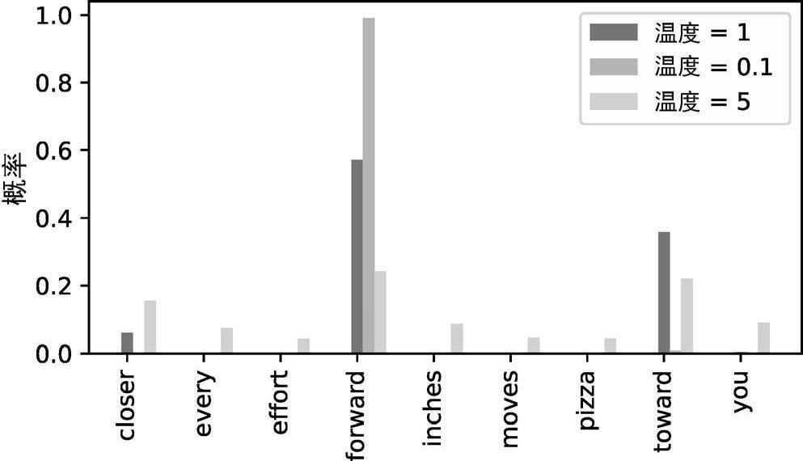

图34 不同温度下各候选词元的概率分布。温度 = 0.1 时分布更尖锐（几乎总选 forward），温度 = 5 时分布更均匀

还有一种常用的做法是 **Top-k 采样**：只保留概率最高的 k 个词元，把其余词元的 logits 置为负无穷，再做 Softmax 并采样。这样既能避免选到概率极低的词元，又能保留一定的随机性。

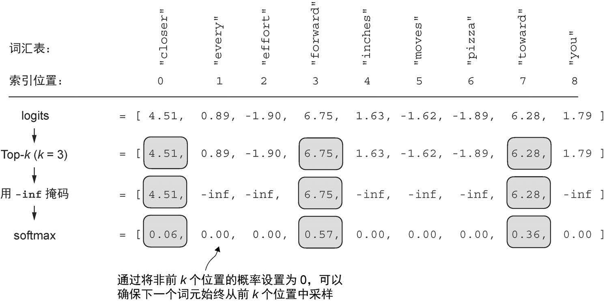

图35 Top-k 采样的计算过程（k = 3）：先从 logits 中挑出前 k 个最大值，把非前 k 个位置置为 -inf，再经过 Softmax 得到概率分布，确保下一个词元始终从前 k 个位置中采样

使用更偏随机性的解码策略生成文本的代码如下所示：

```
import torch
import tiktoken

from llms_from_scratch.ch04 import GPTModel, generate_text_simple

def text_to_token_ids(text, tokenizer):
    """将词元转化词元id"""
    encoded = tokenizer.encode(text)
    encoded_tensor = torch.tensor(encoded).unsqueeze(0)  # add batch dimension
    return encoded_tensor

def token_ids_to_text(token_ids, tokenizer):
    """将词元id转化词元"""
    flat = token_ids.squeeze(0)  # remove batch dimension
    return tokenizer.decode(flat.tolist())

def generate(model, idx, max_new_tokens, context_size, temperature=0.0, top_k=None, eos_id=None):

    # For-loop is the same as before: Get logits, and only focus on last time step
    for _ in range(max_new_tokens):
        idx_cond = idx[:, -context_size:]
        with torch.no_grad():
            logits = model(idx_cond)
        logits = logits[:, -1, :]

        # New: Filter logits with top_k sampling
        if top_k is not None:
            # Keep only top_k values
            top_logits, _ = torch.topk(logits, top_k)
            min_val = top_logits[:, -1]
            logits = torch.where(logits < min_val, torch.tensor(float("-inf")).to(logits.device), logits)

        # New: Apply temperature scaling
        if temperature > 0.0:
            logits = logits / temperature

            # Apply softmax to get probabilities
            probs = torch.softmax(logits, dim=-1)  # (batch_size, context_len)

            # Sample from the distribution
            idx_next = torch.multinomial(probs, num_samples=1)  # (batch_size, 1)

        # Otherwise same as before: get idx of the vocab entry with the highest logits value
        else:
            idx_next = torch.argmax(logits, dim=-1, keepdim=True)  # (batch_size, 1)

        if idx_next == eos_id:  # Stop generating early if end-of-sequence token is encountered and eos_id is specified
            break

        # Same as before: append sampled index to the running sequence
        idx = torch.cat((idx, idx_next), dim=1)  # (batch_size, num_tokens+1)

    return idx

if __name__ == "__main__":

    # 模型和训练的超参数
    #
    # 模型的超参数
    # 词典大小：50257
    # 上下文长度：256
    # 嵌入向量维度：768
    # 头数：12
    # 层数：12
    GPT_CONFIG_124M = {
        "vocab_size": 50257,    # Vocabulary size
        "context_length": 256,  # Shortened context length (orig: 1024)
        "emb_dim": 768,         # Embedding dimension
        "n_heads": 12,          # Number of attention heads
        "n_layers": 12,         # Number of layers
        "drop_rate": 0.1,       # Dropout rate
        "qkv_bias": False       # Query-key-value bias
    }

    model = GPTModel(GPT_CONFIG_124M)
    model.load_state_dict(torch.load("model.pth", weights_only=True))
    model.to("cpu")
    model.eval()

    tokenizer = tiktoken.get_encoding("gpt2")

    torch.manual_seed(123)

    token_ids = generate(
        model=model,
        idx=text_to_token_ids("Every effort moves you", tokenizer),
        max_new_tokens=15,
        context_size=GPT_CONFIG_124M["context_length"],
        temperature=1.4,
        top_k=25
    )

    print("Output text:\n", token_ids_to_text(token_ids, tokenizer))
```

代码执行结果如下所示：

```
Every effort moves you stand to work on surprise, a one of us had gone with random-
```

### 补充：加载 OpenAI 的预训练权重

上面所有实验用的都是最小的 GPT-2（1.24 亿参数）。原书 5.4~5.5 节还介绍了如何保存/加载模型权重，以及如何**从 OpenAI 加载公开的预训练权重**——这样就能跳过昂贵的预训练阶段，直接进入微调。

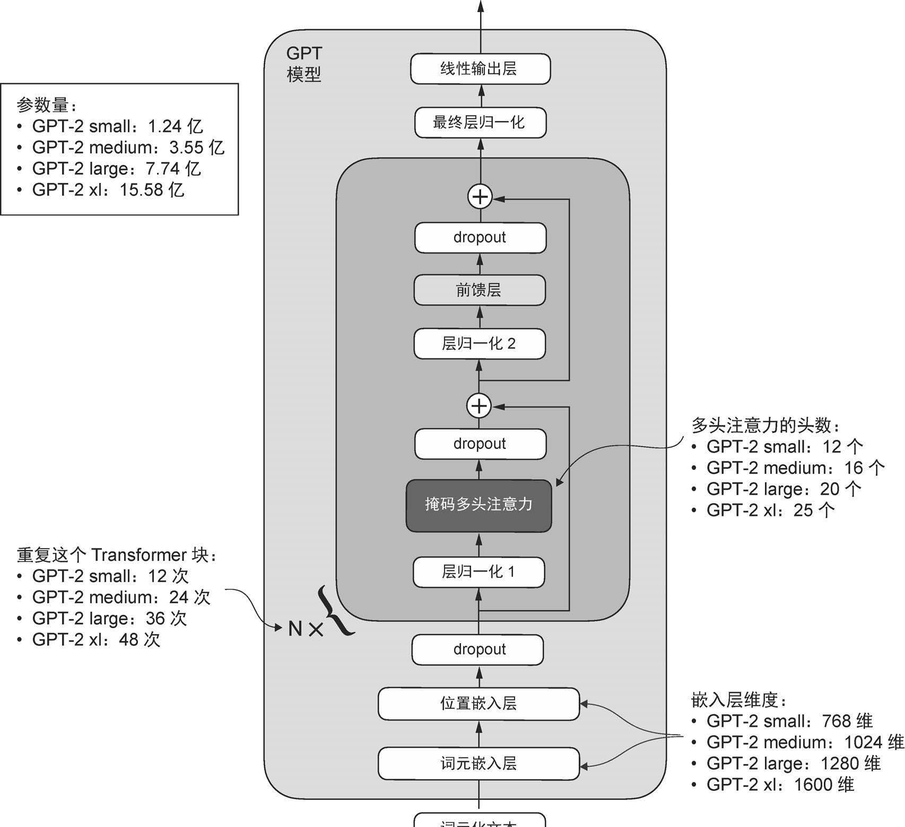

图36 不同规模的 GPT-2 模型。整体架构完全相同，只是嵌入层维度、多头注意力的头数、Transformer 块的数量按比例放大：GPT-2 small 是 12 层 / 768 维 / 12 头、medium 是 24 层 / 1024 维 / 16 头、large 是 36 层 / 1280 维 / 20 头、xl 是 48 层 / 1600 维 / 25 头

加载权重由 `gpt_download.py` 中的 `download_and_load_gpt2` 配合 `load_weights_into_gpt` 完成，核心工作是把 OpenAI 的权重名（`wte`、`wpe`、`attn/c_attn`、`mlp/c_fc` 等）映射到本书 `GPTModel` 的层名，并处理**权重共享**——把 `wte` 同时赋给 `tok_emb` 和 `out_head`。第 6 章和第 7 章的微调，都是从这里加载好预训练权重开始的。

《从零构建大模型》通过上述的介绍，手把手带领读者在个人消费级的电脑上实现了一个简单的大语言模型的预训练。后续的介绍，还包括如何加载OpenAI公开的GPT-2的模型参数，并在此基础上进行模型微调。

大语言模型经过这几年的飞速发展，已在上述介绍的基本模型结构的基础上，进一步在强化学习微调、混合专家网络、训练框架加速等多个方面不断深入，不断取得效果和性能的突破。但通过《从零构建大模型》的介绍，读者可以了解大语言模型的基本原理，对大语言模型有一个初步但全面的了解。

---

## 第 6 章　针对分类的微调

预训练完成后，模型具备的是通用的文本补全能力。要让它完成具体任务，就需要微调。微调大语言模型最常用的两种方式是**分类微调**和**指令微调**。本章聚焦分类微调，具体任务是把文本消息判定为“垃圾消息”或“非垃圾消息”。

### 不同类型的微调

分类微调（classification fine-tuning）指的是模型被训练来识别一组**预先定义好的类别标签**。经过分类微调的模型只能预测它在训练过程中见过的类别：它可以判断某条内容是“垃圾消息”还是“非垃圾消息”，但不能对输入文本做其他分析或说明。

指令微调（instruction fine-tuning）则是用“指令−答案”对训练模型，让模型理解和执行自然语言提示词中描述的任务。两者对比如下。

| 对比项 | 分类微调 | 指令微调 |
|---|---|---|
| 输出层 | 替换为类别数个输出节点 | 保持词汇表大小的输出 |
| 输入形式 | 直接输入文本，不需要额外指令 | 指令 + 输入 |
| 能力范围 | 只能输出训练时见过的类别 | 能执行更广泛的任务 |
| 数据与算力 | 需求较少 | 需求更大 |

也就是说，分类微调得到的是**高度专业化的模型**，而指令微调得到的是**通用性更强的模型**。一般来说，开发一个专业化的模型比开发一个在多种任务上都表现良好的通用模型要简单。

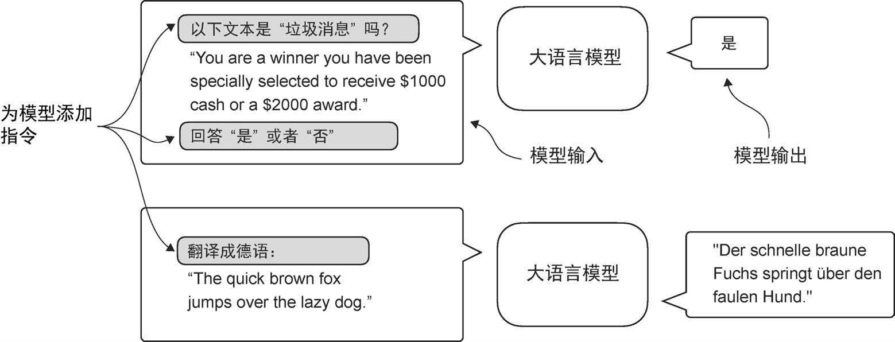

图37 两种指令微调场景。上半部分是判断给定文本是否为垃圾消息，下半部分是模型被指示将英语句子翻译成德语

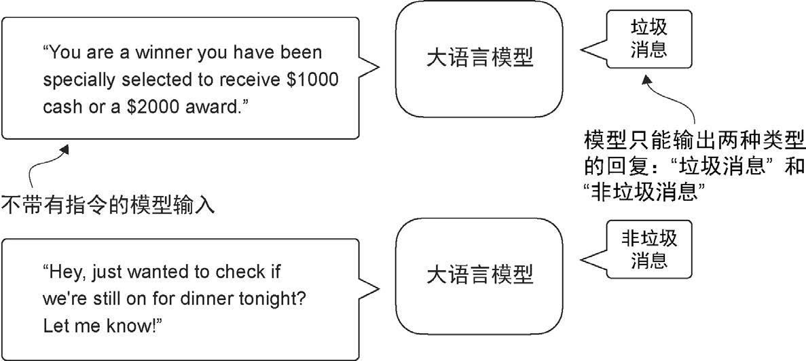

图38 使用大语言模型的文本分类场景。经过垃圾消息数据分类微调的模型在输入时不需要提供额外的指令，但它只能回复“垃圾消息”或“非垃圾消息”

### 准备数据集

本章使用的数据集是 UCI 的 SMS Spam Collection，包含 5572 条短信及其标签。下载、解压并读入 pandas 的代码如下：

```
import urllib.request
import zipfile
import os
from pathlib import Path
import pandas as pd

url = "https://archive.ics.uci.edu/static/public/228/sms+spam+collection.zip"
zip_path = "sms_spam_collection.zip"
extracted_path = "sms_spam_collection"
data_file_path = Path(extracted_path) / "SMSSpamCollection.tsv"

def download_and_unzip_spam_data(url, zip_path, extracted_path, data_file_path):
    if data_file_path.exists():
        print(f"{data_file_path} already exists. Skipping download and extraction.")
        return
    with urllib.request.urlopen(url) as response:
        with open(zip_path, "wb") as out_file:
            out_file.write(response.read())
    with zipfile.ZipFile(zip_path, "r") as zip_ref:
        zip_ref.extractall(extracted_path)
    original_file_path = Path(extracted_path) / "SMSSpamCollection"
    os.rename(original_file_path, data_file_path)

download_and_unzip_spam_data(url, zip_path, extracted_path, data_file_path)

df = pd.read_csv(data_file_path, sep="\t", header=None, names=["Label", "Text"])
print(df)
```

代码执行结果如下所示：

```
        Label                                               Text
0         ham  Go until jurong point, crazy.. Available only ...
1         ham                      Ok lar... Joking wif u oni...
2        spam  Free entry in 2 a wkly comp to win FA Cup fina...
3         ham  U dun say so early hor... U c already then say...
4         ham  Nah I don't think he goes to usf, he lives aro...
...       ...                                                ...
5571      ham                          Rofl. Its true to its name

[5572 rows x 2 columns]
```

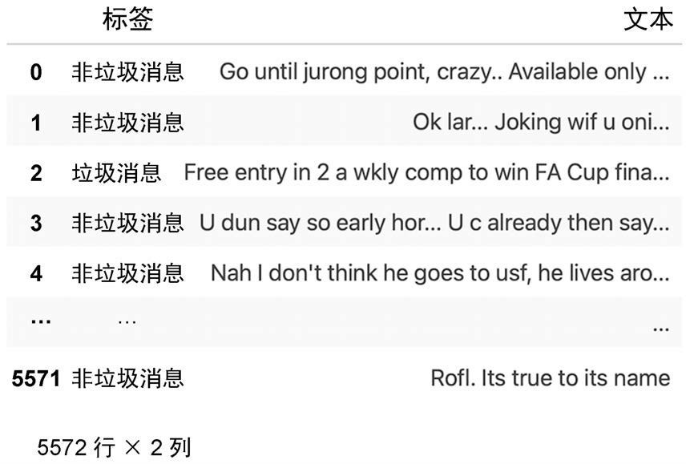

图39 SMSSpamCollection 数据集在 pandas DataFrame 中的预览，包含类别标签和相应的文本消息，共 5572 行

查看类别标签的分布：

```
print(df["Label"].value_counts())
```

代码执行结果如下所示，可以看到“非垃圾消息”（ham）远多于“垃圾消息”（spam）：

```
Label
ham     4825
spam     747
Name: count, dtype: int64
```

类别严重不平衡。处理不平衡数据的方法有很多，这里为了简化并加快微调速度，采用**下采样**的方式，让每个类别都只保留 747 条：

```
def create_balanced_dataset(df):
    # 统计“垃圾消息”的样本数量
    num_spam = df[df["Label"] == "spam"].shape[0]
    # 随机采样“非垃圾消息”，使其数量与“垃圾消息”一致
    ham_subset = df[df["Label"] == "ham"].sample(num_spam, random_state=123)
    # 将“垃圾消息”与采样后的“非垃圾消息”组合，构成平衡数据集
    balanced_df = pd.concat([ham_subset, df[df["Label"] == "spam"]])
    return balanced_df

balanced_df = create_balanced_dataset(df)
print(balanced_df["Label"].value_counts())
```

代码执行结果如下所示：

```
Label
ham     747
spam    747
Name: count, dtype: int64
```

接着把字符串标签映射为整数标签，这一步和把文本转换为词元 ID 的思路一致，只是这里只有 0 和 1 两个“词元”：

```
balanced_df["Label"] = balanced_df["Label"].map({"ham": 0, "spam": 1})
```

然后把数据集按 **70% 训练、10% 验证、20% 测试** 的比例划分，这三个比例在机器学习中很常见：

```
def random_split(df, train_frac, validation_frac):
    # 打乱整个 DataFrame
    df = df.sample(frac=1, random_state=123).reset_index(drop=True)
    # 计算拆分索引
    train_end = int(len(df) * train_frac)
    validation_end = train_end + int(len(df) * validation_frac)
    # 拆分 DataFrame
    train_df = df[:train_end]
    validation_df = df[train_end:validation_end]
    test_df = df[validation_end:]   # 剩余部分隐含为 0.2
    return train_df, validation_df, test_df

train_df, validation_df, test_df = random_split(balanced_df, 0.7, 0.1)
train_df.to_csv("train.csv", index=None)
validation_df.to_csv("validation.csv", index=None)
test_df.to_csv("test.csv", index=None)
```

### 创建数据加载器

垃圾消息数据集中每条消息长度不同，要组成批次，有两种方案：一是把所有消息**截断**到最短长度，二是把所有消息**填充**到最长长度。前者计算开销更小，但如果短消息远小于平均长度，可能造成信息丢失；后者能保留全部内容，因此本章采用填充方案。

填充词元使用 `<|endoftext|>`，其词元 ID 为 50256：

```
import tiktoken
tokenizer = tiktoken.get_encoding("gpt2")
print(tokenizer.encode("<|endoftext|>", allowed_special={"<|endoftext|>"}))
```

代码执行结果如下所示：

```
[50256]
```

据此实现 PyTorch 数据集类 `SpamDataset`，它负责找出最长序列、对文本分词，并把所有序列填充到同一长度：

```
import torch
from torch.utils.data import Dataset

class SpamDataset(Dataset):
    def __init__(self, csv_file, tokenizer, max_length=None, pad_token_id=50256):
        self.data = pd.read_csv(csv_file)
        # 文本分词
        self.encoded_texts = [tokenizer.encode(text) for text in self.data["Text"]]

        if max_length is None:
            self.max_length = self._longest_encoded_length()
        else:
            self.max_length = max_length
            # 如果序列长度超过 max_length，则进行截断
            self.encoded_texts = [t[:self.max_length] for t in self.encoded_texts]

        # 填充到最长序列的长度
        self.encoded_texts = [
            t + [pad_token_id] * (self.max_length - len(t))
            for t in self.encoded_texts
        ]

    def __getitem__(self, index):
        encoded = self.encoded_texts[index]
        label = self.data.iloc[index]["Label"]
        return (
            torch.tensor(encoded, dtype=torch.long),
            torch.tensor(label, dtype=torch.long)
        )

    def __len__(self):
        return len(self.data)

    def _longest_encoded_length(self):
        max_length = 0
        for encoded_text in self.encoded_texts:
            if len(encoded_text) > max_length:
                max_length = len(encoded_text)
        return max_length

train_dataset = SpamDataset(csv_file="train.csv", max_length=None, tokenizer=tokenizer)
print(train_dataset.max_length)
```

代码执行结果如下所示，最长序列为 120 个词元，这是短信的常见长度：

```
120
```

验证集和测试集则填充到与训练集相同的长度，超过该长度的样本会被截断：

```
val_dataset = SpamDataset(csv_file="validation.csv",
    max_length=train_dataset.max_length, tokenizer=tokenizer)
test_dataset = SpamDataset(csv_file="test.csv",
    max_length=train_dataset.max_length, tokenizer=tokenizer)
```

用批次大小 8 创建数据加载器：

```
from torch.utils.data import DataLoader

num_workers = 0   # 确保与大多数计算机的兼容性
batch_size = 8
torch.manual_seed(123)

train_loader = DataLoader(dataset=train_dataset, batch_size=batch_size,
    shuffle=True, num_workers=num_workers, drop_last=True)
val_loader = DataLoader(dataset=val_dataset, batch_size=batch_size,
    num_workers=num_workers, drop_last=False)
test_loader = DataLoader(dataset=test_dataset, batch_size=batch_size,
    num_workers=num_workers, drop_last=False)

for input_batch, target_batch in train_loader:
    pass
print("Input batch dimensions:", input_batch.shape)
print("Label batch dimensions", target_batch.shape)
```

代码执行结果如下所示，每个批次包含 8 条长度为 120 的样本及对应标签：

```
Input batch dimensions: torch.Size([8, 120])
Label batch dimensions torch.Size([8])
```

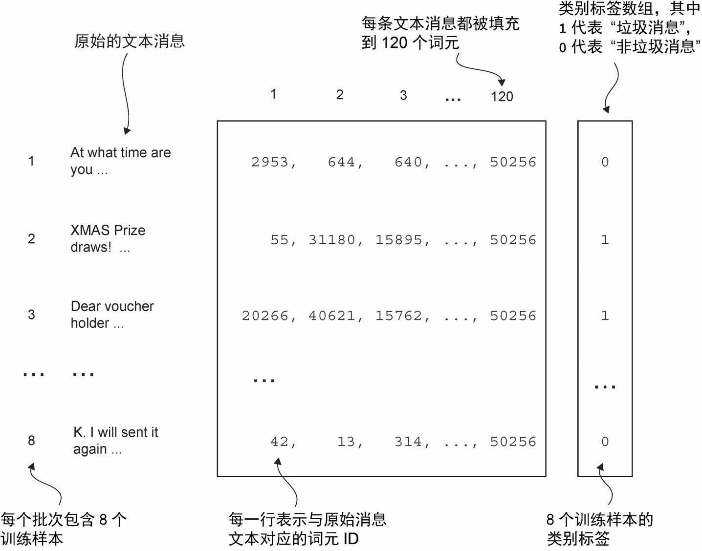

图40 一个包含 8 条文本消息的训练批次，每条消息由 120 个词元 ID 组成，右侧是与之对应的类别标签（0 表示“非垃圾消息”，1 表示“垃圾消息”）

打印各数据集包含的批次数：

```
print(f"{len(train_loader)} training batches")
print(f"{len(val_loader)} validation batches")
print(f"{len(test_loader)} test batches")
```

代码执行结果如下所示：

```
130 training batches
19 validation batches
38 test batches
```

### 初始化带有预训练权重的模型

模型配置与预训练阶段一致，这里选用最小的 GPT-2 small（1.24 亿参数）：

```
CHOOSE_MODEL = "gpt2-small (124M)"
INPUT_PROMPT = "Every effort moves"

BASE_CONFIG = {
    "vocab_size": 50257,     # 词汇表大小
    "context_length": 1024,  # 上下文长度
    "drop_rate": 0.0,        # dropout 率
    "qkv_bias": True         # 查询-键-值偏置
}
model_configs = {
    "gpt2-small (124M)":  {"emb_dim": 768,  "n_layers": 12, "n_heads": 12},
    "gpt2-medium (355M)": {"emb_dim": 1024, "n_layers": 24, "n_heads": 16},
    "gpt2-large (774M)":  {"emb_dim": 1280, "n_layers": 36, "n_heads": 20},
    "gpt2-xl (1558M)":    {"emb_dim": 1600, "n_layers": 48, "n_heads": 25},
}
BASE_CONFIG.update(model_configs[CHOOSE_MODEL])
```

加载 OpenAI 公开的预训练权重：

```
from gpt_download import download_and_load_gpt2
from chapter05 import GPTModel, load_weights_into_gpt

model_size = CHOOSE_MODEL.split(" ")[-1].lstrip("(").rstrip(")")
settings, params = download_and_load_gpt2(model_size=model_size, models_dir="gpt2")

model = GPTModel(BASE_CONFIG)
load_weights_into_gpt(model, params)
model.eval()
```

先用文本生成验证权重是否正确加载：

```
from chapter04 import generate_text_simple
from chapter05 import text_to_token_ids, token_ids_to_text

text_1 = "Every effort moves you"
token_ids = generate_text_simple(
    model=model,
    idx=text_to_token_ids(text_1, tokenizer),
    max_new_tokens=15,
    context_size=BASE_CONFIG["context_length"]
)
print(token_ids_to_text(token_ids, tokenizer))
```

代码执行结果如下所示，模型生成了连贯的文本，说明权重加载正确：

```
Every effort moves you forward.
The first step is to understand the importance of your work
```

不过，如果直接让预训练模型做分类，它是做不到的：

```
text_2 = (
    "Is the following text 'spam'? Answer with 'yes' or 'no':"
    " 'You are a winner you have been specially"
    " selected to receive $1000 cash or a $2000 award.'"
)
token_ids = generate_text_simple(
    model=model,
    idx=text_to_token_ids(text_2, tokenizer),
    max_new_tokens=23,
    context_size=BASE_CONFIG["context_length"]
)
print(token_ids_to_text(token_ids, tokenizer))
```

代码执行结果如下所示，模型只是在重复输入，并没有回答问题，这是因为它只经过了预训练，缺乏指令微调：

```
Is the following text 'spam'? Answer with 'yes' or 'no': 'You are a winner
you have been specially selected to receive $1000 cash
or a $2000 award.'
The following text 'spam'? Answer with 'yes' or 'no': 'You are a winner
```

### 添加分类头

要让模型做分类，需要把原本映射到 50257 个词汇的输出层，替换成一个映射到 2 个类别的输出层。先打印模型结构确认输出层的名字：

```
print(model)
```

代码执行结果（节选）如下所示，可以看到最后一层是 `out_head`：

```
GPTModel(
  (tok_emb): Embedding(50257, 768)
  (pos_emb): Embedding(1024, 768)
  (drop_emb): Dropout(p=0.0, inplace=False)
  (trf_blocks): Sequential(
    ...
  )
  (final_norm): LayerNorm()
  (out_head): Linear(in_features=768, out_features=50257, bias=False)
)
```

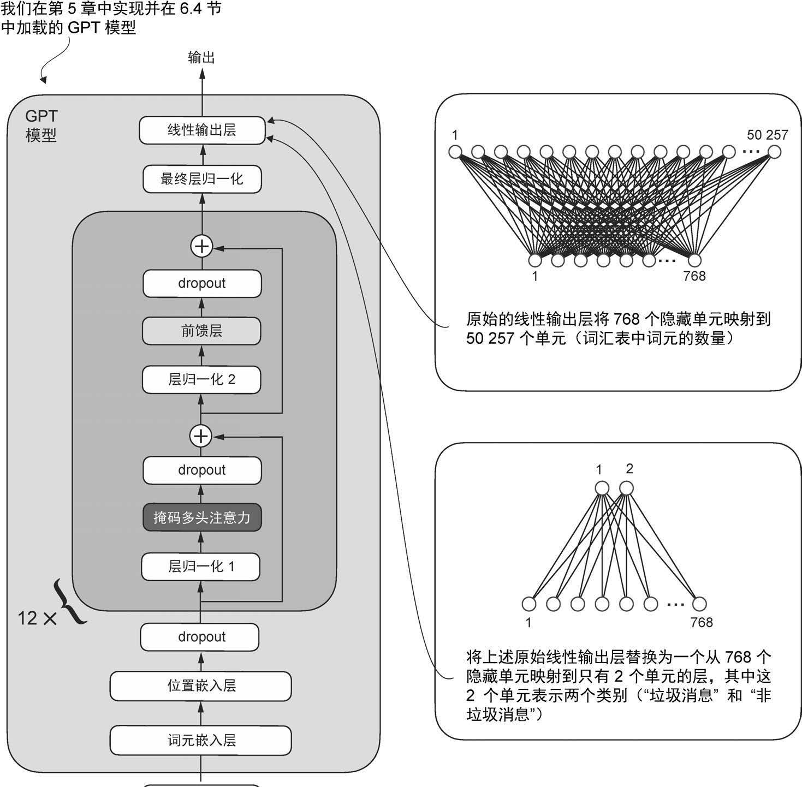

图41 通过调整架构使 GPT 模型适应垃圾消息分类任务：原来的线性输出层把 768 个隐藏单元映射到 50257 个词元，现在替换为把 768 个隐藏单元映射到 2 个类别的新输出层

替换前先冻结全部参数，让模型只有部分层参与训练：

```
for param in model.parameters():
    param.requires_grad = False

torch.manual_seed(123)
num_classes = 2
model.out_head = torch.nn.Linear(
    in_features=BASE_CONFIG["emb_dim"],
    out_features=num_classes
)
```

这里使用 `BASE_CONFIG["emb_dim"]` 而不是硬编码 768，因此同一段代码也能用在更大的 GPT-2 变体上。新加的 `out_head` 的 `requires_grad` 默认为 `True`，也就是说它是唯一会被更新的层。

不过，仅训练输出层还不够。神经网络的**较低层通常捕捉基础的语言结构和语义**，适用于广泛的任务；**最后几层更侧重细微的语言模式和特定任务的特征**。因此额外把最后一个 Transformer 块和最终的层归一化模块也设为可训练：

```
for param in model.trf_blocks[-1].parameters():
    param.requires_grad = True
for param in model.final_norm.parameters():
    param.requires_grad = True
```

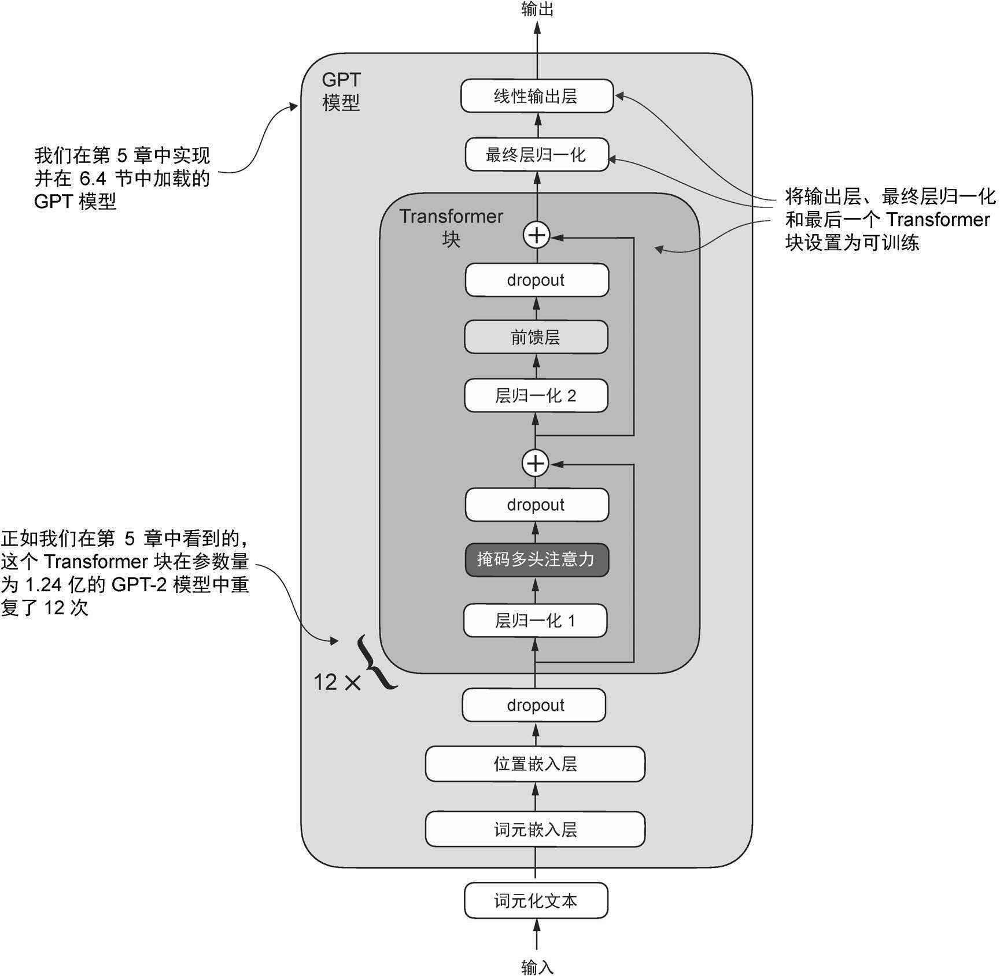

图42 GPT 模型包含 12 个重复的 Transformer 块。除了输出层，最后还额外把最终层归一化和最后一个 Transformer 块设置为可训练，其余 11 个块和嵌入层保持不可训练

此时把文本输入模型，输出的维度已经从 `[1, 4, 50257]` 变成 `[1, 4, 2]`：

```
inputs = tokenizer.encode("Do you have time")
inputs = torch.tensor(inputs).unsqueeze(0)
print("Inputs:", inputs)
print("Inputs dimensions:", inputs.shape)

with torch.no_grad():
    outputs = model(inputs)
print("Outputs:\n", outputs)
print("Outputs dimensions:", outputs.shape)
```

代码执行结果如下所示：

```
Inputs: tensor([[5211,  345,  423,  640]])
Inputs dimensions: torch.Size([1, 4])
Outputs:
 tensor([[[-1.5854,  0.9904],
          [-3.7235,  7.4548],
          [-2.2661,  6.6049],
          [-3.5983,  3.9902]]])
Outputs dimensions: torch.Size([1, 4, 2])
```

注意，我们并不需要全部 4 行输出，**只关注最后一个词元对应的那一行**：

```
print("Last output token:", outputs[:, -1, :])
```

代码执行结果如下所示：

```
Last output token: tensor([[-3.5983,  3.9902]])
```

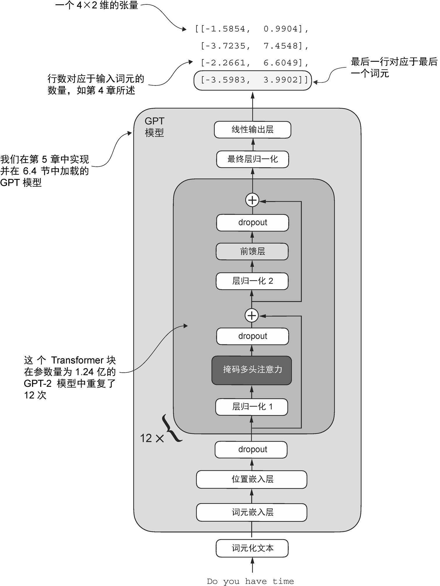

图43 带有 4 个词元示例输入和输出的 GPT 模型。修改后的输出张量只有两列，做垃圾消息分类时只关注对应最后一个词元的最后一行

为什么只取最后一个词元？因为因果注意力掩码限制每个词元只能关注自己和之前的位置，因此**序列中最后一个词元累积了最多的信息**，它是唯一一个能访问前面所有词元的词元。

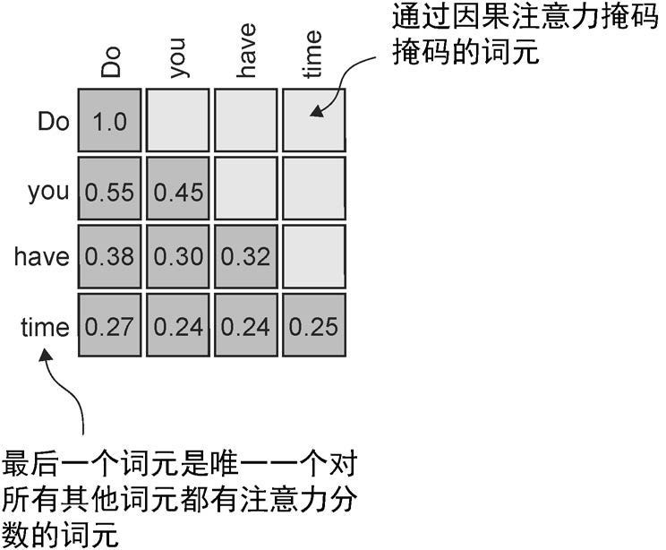

图44 因果注意力机制，空白单元格表示被掩码的位置。单元格中的值是注意力分数，最后一个词元“time”是唯一一个对所有其他词元都有注意力分数的词元

### 计算分类损失和准确率

把模型输出转换为类别标签的方式，与之前把输出转换为下一个词元的词元 ID 是一样的：先 softmax 得到概率，再取概率最高者的索引。区别只是这里处理的是 2 维输出而不是 50257 维：

```
probas = torch.softmax(outputs[:, -1, :], dim=-1)
label = torch.argmax(probas)
print("Class label:", label.item())
```

代码执行结果如下所示，模型把这条消息预测为“垃圾消息”：

```
1
```

由于最大的输出值直接对应最高的概率，softmax 这一步其实可以省略：

```
logits = outputs[:, -1, :]
label = torch.argmax(logits)
print("Class label:", label.item())
```

据此可以定义计算分类准确率的函数：

```
def calc_accuracy_loader(data_loader, model, device, num_batches=None):
    model.eval()
    correct_predictions, num_examples = 0, 0

    if num_batches is None:
        num_batches = len(data_loader)
    else:
        num_batches = min(num_batches, len(data_loader))
    for i, (input_batch, target_batch) in enumerate(data_loader):
        if i < num_batches:
            input_batch = input_batch.to(device)
            target_batch = target_batch.to(device)

            with torch.no_grad():
                # 最后一个输出词元的 logits
                logits = model(input_batch)[:, -1, :]
            predicted_labels = torch.argmax(logits, dim=-1)

            num_examples += predicted_labels.shape[0]
            correct_predictions += (predicted_labels == target_batch).sum().item()
        else:
            break
    return correct_predictions / num_examples
```

为提高效率，这里只取 10 个批次来估算准确率：

```
device = torch.device("cuda" if torch.cuda.is_available() else "cpu")
model.to(device)

torch.manual_seed(123)
train_accuracy = calc_accuracy_loader(train_loader, model, device, num_batches=10)
val_accuracy = calc_accuracy_loader(val_loader, model, device, num_batches=10)
test_accuracy = calc_accuracy_loader(test_loader, model, device, num_batches=10)

print(f"Training accuracy: {train_accuracy*100:.2f}%")
print(f"Validation accuracy: {val_accuracy*100:.2f}%")
print(f"Test accuracy: {test_accuracy*100:.2f}%")
```

代码执行结果如下所示，准确率接近随机猜测（二分类为 50%），说明模型还没有学到分类能力：

```
Training accuracy: 46.25%
Validation accuracy: 45.00%
Test accuracy: 48.75%
```

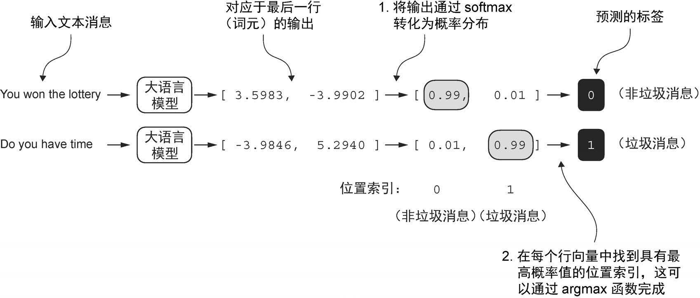

图45 对应于最后一个词元的模型输出被转换为每个输入文本的概率分数，通过查找最高概率分数的索引位置获得类别标签。由于模型尚未训练，因此它错误地预测了垃圾消息标签

由于分类准确率不可微，训练时用**交叉熵损失**作为替代来最大化准确率。相比预训练，这里唯一的调整是只关注最后一个词元：

```
def calc_loss_batch(input_batch, target_batch, model, device):
    input_batch = input_batch.to(device)
    target_batch = target_batch.to(device)
    logits = model(input_batch)[:, -1, :]   # 只取最后一个输出词元的 logits
    loss = torch.nn.functional.cross_entropy(logits, target_batch)
    return loss

def calc_loss_loader(data_loader, model, device, num_batches=None):
    total_loss = 0.
    if len(data_loader) == 0:
        return float("nan")
    elif num_batches is None:
        num_batches = len(data_loader)
    else:
        num_batches = min(num_batches, len(data_loader))
    for i, (input_batch, target_batch) in enumerate(data_loader):
        if i < num_batches:
            loss = calc_loss_batch(input_batch, target_batch, model, device)
            total_loss += loss.item()
        else:
            break
    return total_loss / num_batches
```

计算微调前的初始损失：

```
with torch.no_grad():
    train_loss = calc_loss_loader(train_loader, model, device, num_batches=5)
    val_loss = calc_loss_loader(val_loader, model, device, num_batches=5)
    test_loss = calc_loss_loader(test_loader, model, device, num_batches=5)
print(f"Training loss: {train_loss:.3f}")
print(f"Validation loss: {val_loss:.3f}")
print(f"Test loss: {test_loss:.3f}")
```

代码执行结果如下所示：

```
Training loss: 2.453
Validation loss: 2.583
Test loss: 2.322
```

### 在有监督数据上微调模型

训练循环与预训练基本相同，区别是不再打印生成的文本样本，而是每轮结束后计算分类准确率。下图展示了 PyTorch 中训练深度神经网络的典型循环：

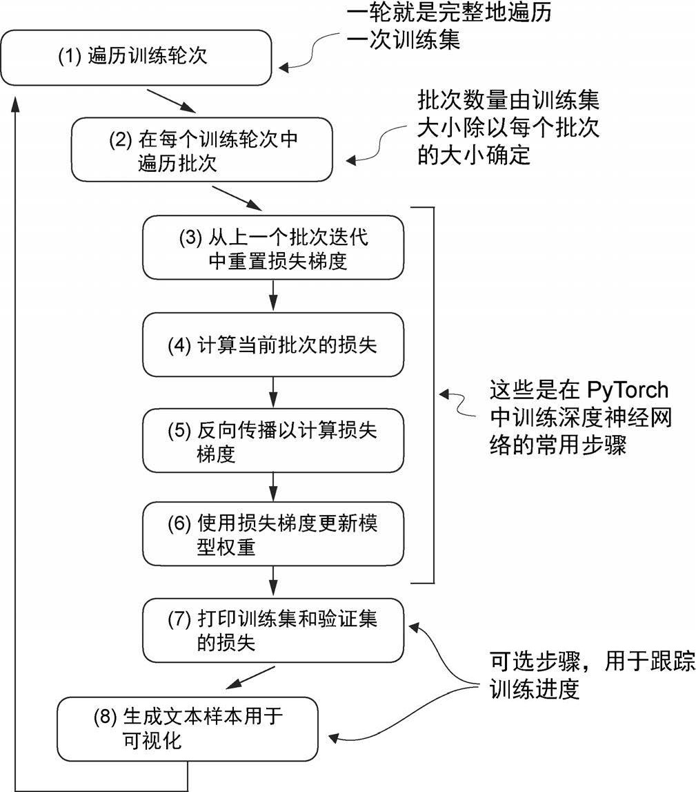

图46 在 PyTorch 中训练深度神经网络的典型训练循环：(1) 遍历训练轮次；(2) 在每个训练轮次中遍历批次；(3) 从上一次批次迭代中重置损失梯度；(4) 计算当前批次的损失；(5) 反向传播以计算损失梯度；(6) 使用损失梯度更新模型权重；(7) 打印训练集和验证集损失

```
def train_classifier_simple(model, train_loader, val_loader, optimizer, device,
                            num_epochs, eval_freq, eval_iter):
    train_losses, val_losses, train_accs, val_accs = [], [], [], []
    examples_seen, global_step = 0, -1

    for epoch in range(num_epochs):
        model.train()
        for input_batch, target_batch in train_loader:
            optimizer.zero_grad()   # 重置上一次批次迭代的损失梯度
            loss = calc_loss_batch(input_batch, target_batch, model, device)
            loss.backward()         # 计算损失梯度
            optimizer.step()        # 使用损失梯度更新模型权重
            examples_seen += input_batch.shape[0]   # 新设置：跟踪样本而不是词元
            global_step += 1

            if global_step % eval_freq == 0:        # 可选的评估步骤
                train_loss, val_loss = evaluate_model(
                    model, train_loader, val_loader, device, eval_iter)
                train_losses.append(train_loss)
                val_losses.append(val_loss)
                print(f"Ep {epoch+1} (Step {global_step:06d}): "
                      f"Train loss {train_loss:.3f}, Val loss {val_loss:.3f}")

        # 每轮训练后计算准确率
        train_accuracy = calc_accuracy_loader(
            train_loader, model, device, num_batches=eval_iter)
        val_accuracy = calc_accuracy_loader(
            val_loader, model, device, num_batches=eval_iter)
        print(f"Training accuracy: {train_accuracy*100:.2f}% | ", end="")
        print(f"Validation accuracy: {val_accuracy*100:.2f}%")
        train_accs.append(train_accuracy)
        val_accs.append(val_accuracy)

    return train_losses, val_losses, train_accs, val_accs, examples_seen
```

开始微调，优化器使用 AdamW，学习率 5e-5，训练 5 轮：

```
import time

start_time = time.time()
torch.manual_seed(123)
optimizer = torch.optim.AdamW(model.parameters(), lr=5e-5, weight_decay=0.1)
num_epochs = 5

train_losses, val_losses, train_accs, val_accs, examples_seen = \
    train_classifier_simple(
        model, train_loader, val_loader, optimizer, device,
        num_epochs=num_epochs, eval_freq=50, eval_iter=5
    )

end_time = time.time()
execution_time_minutes = (end_time - start_time) / 60
print(f"Training completed in {execution_time_minutes:.2f} minutes.")
```

代码执行结果如下所示，准确率从 70% 一路提升到 97.5%：

```
Ep 1 (Step 000000): Train loss 2.153, Val loss 2.392
Ep 1 (Step 000050): Train loss 0.617, Val loss 0.637
Ep 1 (Step 000100): Train loss 0.523, Val loss 0.557
Training accuracy: 70.00% | Validation accuracy: 72.50%
Ep 2 (Step 000150): Train loss 0.561, Val loss 0.489
Ep 2 (Step 000200): Train loss 0.419, Val loss 0.397
Ep 2 (Step 000250): Train loss 0.409, Val loss 0.353
Training accuracy: 82.50% | Validation accuracy: 85.00%
Ep 3 (Step 000300): Train loss 0.333, Val loss 0.320
Ep 3 (Step 000350): Train loss 0.340, Val loss 0.306
Training accuracy: 90.00% | Validation accuracy: 90.00%
Ep 4 (Step 000400): Train loss 0.136, Val loss 0.200
Ep 4 (Step 000450): Train loss 0.153, Val loss 0.132
Ep 4 (Step 000500): Train loss 0.222, Val loss 0.137
Training accuracy: 100.00% | Validation accuracy: 97.50%
Ep 5 (Step 000550): Train loss 0.207, Val loss 0.143
Ep 5 (Step 000600): Train loss 0.083, Val loss 0.074
Training accuracy: 100.00% | Validation accuracy: 97.50%
Training completed in 5.65 minutes.
```

在 M3 MacBook Air 上训练约需 6 分钟，在 V100 或 A100 显卡上不到半分钟。把损失曲线画出来观察收敛情况：

```
import matplotlib.pyplot as plt

def plot_values(epochs_seen, examples_seen, train_values, val_values, label="loss"):
    fig, ax1 = plt.subplots(figsize=(5, 3))
    ax1.plot(epochs_seen, train_values, label=f"Training {label}")
    ax1.plot(epochs_seen, val_values, linestyle="-.", label=f"Validation {label}")
    ax1.set_xlabel("Epochs")
    ax1.set_ylabel(label.capitalize())
    ax1.legend()

    ax2 = ax1.twiny()                        # 为所见样本创建第二个 x 轴
    ax2.plot(examples_seen, train_values, alpha=0)   # 不可见的图形，用于对齐刻度
    ax2.set_xlabel("Examples seen")

    fig.tight_layout()                       # 调整布局以腾出空间
    plt.savefig(f"{label}-plot.pdf")
    plt.show()

epochs_tensor = torch.linspace(0, num_epochs, len(train_losses))
examples_seen_tensor = torch.linspace(0, examples_seen, len(train_losses))
plot_values(epochs_tensor, examples_seen_tensor, train_losses, val_losses)
```

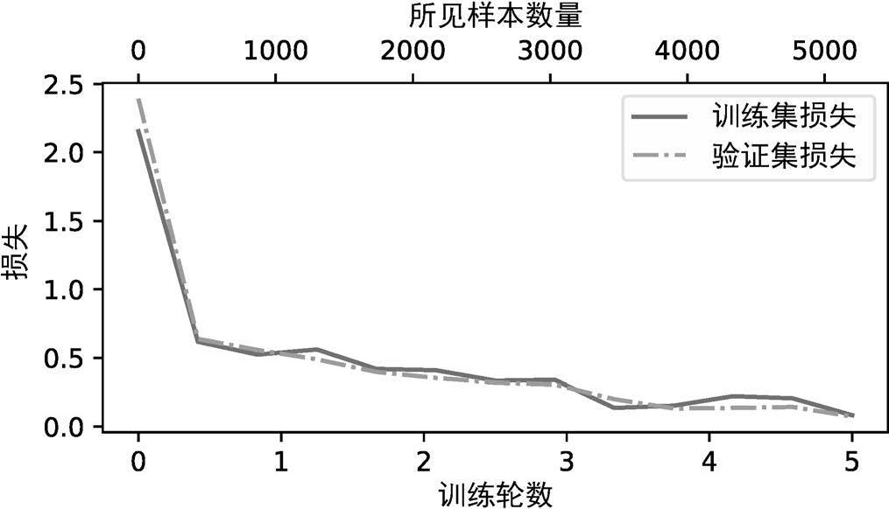

图47 模型在 5 轮内的训练集损失和验证集损失曲线。两条曲线在第一轮急剧下降并逐渐趋于稳定，训练集损失与验证集损失之间没有明显差距，说明几乎没有过拟合

用同样的函数绘制准确率曲线：

```
epochs_tensor = torch.linspace(0, num_epochs, len(train_accs))
examples_seen_tensor = torch.linspace(0, examples_seen, len(train_accs))
plot_values(epochs_tensor, examples_seen_tensor, train_accs, val_accs, label="accuracy")
```

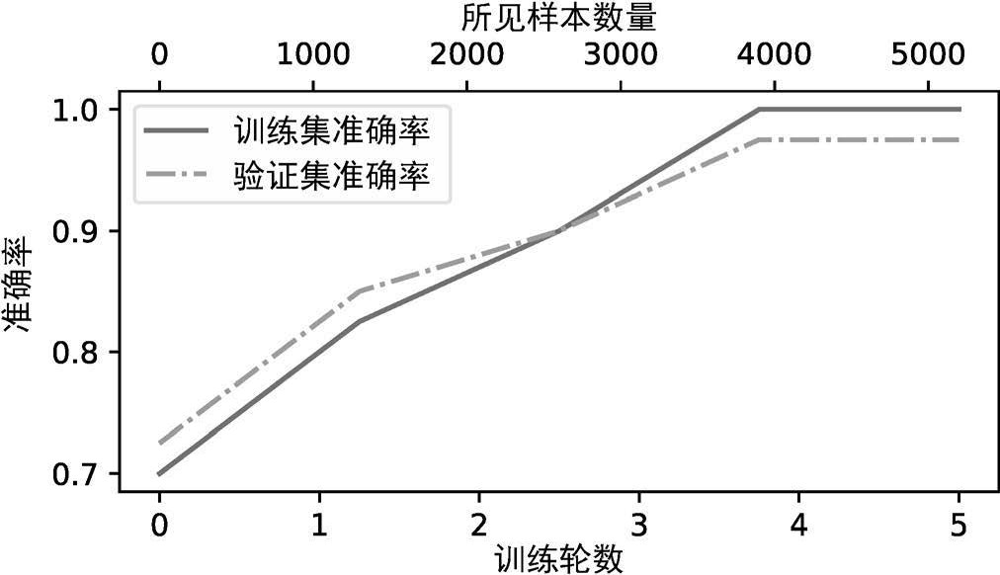

图48 训练集准确率和验证集准确率在前几轮显著上升后趋于平稳，两条线始终靠得很近，同样说明没有过拟合

最后在完整数据集上评估：

```
train_accuracy = calc_accuracy_loader(train_loader, model, device)
val_accuracy = calc_accuracy_loader(val_loader, model, device)
test_accuracy = calc_accuracy_loader(test_loader, model, device)
print(f"Training accuracy: {train_accuracy*100:.2f}%")
print(f"Validation accuracy: {val_accuracy*100:.2f}%")
print(f"Test accuracy: {test_accuracy*100:.2f}%")
```

代码执行结果如下所示：

```
Training accuracy: 97.21%
Validation accuracy: 97.32%
Test accuracy: 95.67%
```

训练集与测试集的准确率非常接近，说明过拟合很轻微。验证集准确率通常略高于测试集，因为在开发过程中往往会依据验证集来调整超参数，这可能导致模型在测试集上并不完全适用。

### 使用大语言模型作为垃圾消息分类器

微调完成后就可以用它来分类新消息了。`classify_review` 函数的数据预处理步骤与 `SpamDataset` 类似：

```
def classify_review(text, model, tokenizer, device, max_length=None, pad_token_id=50256):
    model.eval()

    # 准备模型的输入数据
    input_ids = tokenizer.encode(text)
    supported_context_length = model.pos_emb.weight.shape[1]

    # 截断过长的序列
    input_ids = input_ids[:min(max_length, supported_context_length)]

    # 填充序列至最长序列长度
    input_ids += [pad_token_id] * (max_length - len(input_ids))

    input_tensor = torch.tensor(input_ids, device=device).unsqueeze(0)  # 添加批次维度

    with torch.no_grad():   # 推理时不需要计算梯度
        logits = model(input_tensor)[:, -1, :]
    predicted_label = torch.argmax(logits, dim=-1).item()

    return "spam" if predicted_label == 1 else "not spam"
```

在示例文本上测试：

```
text_1 = ("You are a winner you have been specially"
          " selected to receive $1000 cash or a $2000 award.")
print(classify_review(text_1, model, tokenizer, device,
                      max_length=train_dataset.max_length))

text_2 = ("Hey, just wanted to check if we're still on"
          " for dinner tonight? Let me know!")
print(classify_review(text_2, model, tokenizer, device,
                      max_length=train_dataset.max_length))
```

代码执行结果如下所示，两条消息都被正确分类：

```
spam
not spam
```

最后保存模型，便于以后直接复用：

```
torch.save(model.state_dict(), "review_classifier.pth")
```

### 小结

- 微调大语言模型有不同策略，包括分类微调和指令微调；
- 分类微调通过添加一个小型分类层来替换大语言模型的输出层，输出节点数与类别数一致；
- 与预训练预测下一个词元不同，分类微调训练模型输出正确的类别标签；
- 分类模型的评估使用分类准确率（正确预测的比例）；
- 分类微调使用与预训练相同的交叉熵损失函数，只是只针对最后一个输出词元计算损失。

---

## 第 7 章　通过微调遵循人类指令

第 6 章把模型微调成了专用分类器。本章实现另一种微调——**指令微调**（也叫有监督指令微调），让模型能够遵循人类指令并生成合理回复。这是开发聊天机器人、个人助手等对话类应用时最常用的技术。

### 指令微调介绍

预训练后的大语言模型能做文本补全：给定任意片段，模型能续写句子或段落。但它在执行特定指令时往往表现不佳，比如“纠正这段文字的语法”或“把这段话变成被动语态”。指令微调就是用一个“指令−回复”对的数据集来训练模型，让它在看到指令时给出恰当的回复。

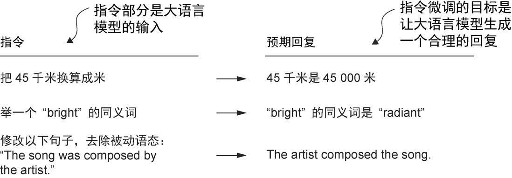

图49 一些由大语言模型处理以生成预期回复的指令示例。左侧是指令，右侧是预期回复

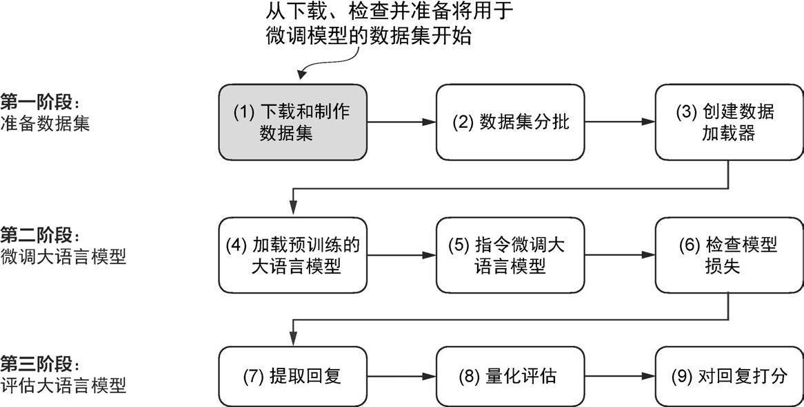

图50 对大语言模型进行指令微调的三阶段过程：第一阶段涉及准备数据集，第二阶段专注于模型配置和微调，第三阶段涵盖模型性能的评估

### 为有监督指令微调准备数据集

本章使用的数据集包含 1100 个指令-回复对，保存在一个仅 204 KB 的 JSON 文件中：

```
import json
import os
import urllib

def download_and_load_file(file_path, url):
    if not os.path.exists(file_path):     # 如果数据集早已下载就跳过
        with urllib.request.urlopen(url) as response:
            text_data = response.read().decode("utf-8")
        with open(file_path, "w", encoding="utf-8") as file:
            file.write(text_data)
    else:
        with open(file_path, "r", encoding="utf-8") as file:
            text_data = file.read()
    with open(file_path, "r") as file:
        data = json.load(file)
    return data

file_path = "instruction-data.json"
url = ("https://raw.githubusercontent.com/rasbt/LLMs-from-scratch"
       "/main/ch07/01_main-chapter-code/instruction-data.json")

data = download_and_load_file(file_path, url)
print("Number of entries:", len(data))
print("Example entry:\n", data[50])
print("Another example entry:\n", data[999])
```

代码执行结果如下所示，每个样本是一个包含 `instruction`、`input`、`output` 三个键的字典，`input` 偶尔为空：

```
Number of entries: 1100
Example entry:
 {'instruction': 'Identify the correct spelling of the following word.',
  'input': 'Ocassion', 'output': "The correct spelling is 'Occasion.'"}
Another example entry:
 {'instruction': "What is an antonym of 'complicated'?",
  'input': '', 'output': "An antonym of 'complicated' is 'simple'."}
```

把样本制作成适用于大语言模型的格式，通常称为**提示词风格**。本章采用 **Alpaca 风格**，它用 `### Instruction:`、`### Input:`、`### Response:` 分节，是最流行的提示词风格之一：

```
def format_input(entry):
    instruction_text = (
        f"Below is an instruction that describes a task. "
        f"Write a response that appropriately completes the request."
        f"\n\n### Instruction:\n{entry['instruction']}"
    )
    # 如果 input 为空，则跳过 ### Input: 小节
    input_text = f"\n\n### Input:\n{entry['input']}" if entry["input"] else ""
    return instruction_text + input_text

model_input = format_input(data[50])
desired_response = f"\n\n### Response:\n{data[50]['output']}"
print(model_input + desired_response)
```

代码执行结果如下所示：

```
Below is an instruction that describes a task. Write a response that
appropriately completes the request.

### Instruction:
Identify the correct spelling of the following word.

### Input:
Ocassion

### Response:
The correct spelling is 'Occasion.'
```

数据集按 **85% 训练、5% 验证、10% 测试** 划分：

```
train_portion = int(len(data) * 0.85)   # 使用 85% 的数据作为训练集
test_portion = int(len(data) * 0.1)     # 使用 10% 的数据作为测试集
val_portion = len(data) - train_portion - test_portion   # 剩下的 5% 作为验证集

train_data = data[:train_portion]
test_data = data[train_portion:train_portion + test_portion]
val_data = data[train_portion + test_portion:]

print("Training set length:", len(train_data))
print("Validation set length:", len(val_data))
print("Test set length:", len(test_data))
```

代码执行结果如下所示：

```
Training set length: 935
Validation set length: 55
Test set length: 110
```

### 将数据组织成训练批次

指令微调的批次处理比分类微调复杂，需要自定义聚合函数。整个过程包含 5 个子步骤：(2.1) 应用提示词模板；(2.2) 分词；(2.3) 添加填充词元；(2.4) 创建目标词元 ID；(2.5) 在损失函数中用 -100 掩码填充词元。

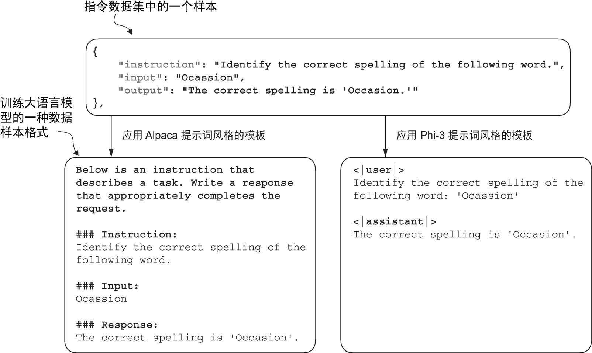

图51 大语言模型指令微调中不同提示词风格的比较。Alpaca 风格（左）为指令、输入和回复定义了不同小节，形式更结构化；Phi-3 风格（右）更简单，主要借助特殊词元 `<|user|>` 和 `<|assistant|>`

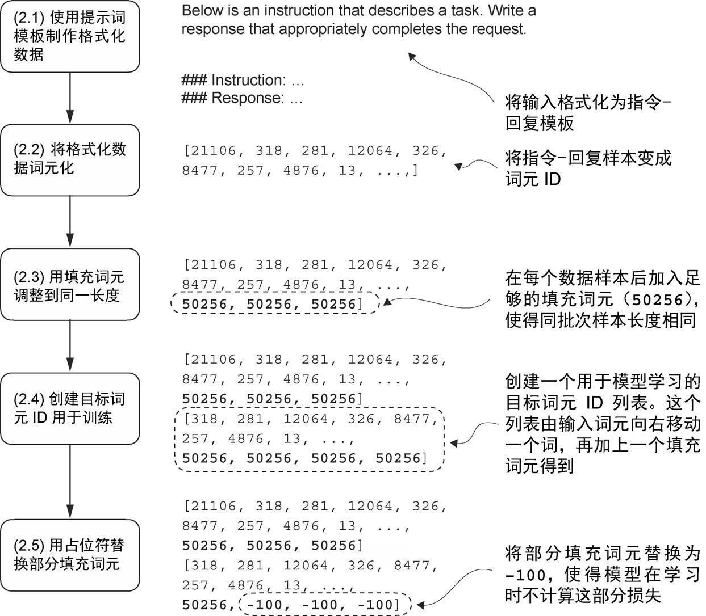

图52 批处理过程包含 5 个子步骤：(2.1) 使用提示词模板制作格式化数据；(2.2) 将格式化数据词元化；(2.3) 用填充词元调整到同一长度；(2.4) 创建目标词元 ID 用于训练；(2.5) 用占位符替换部分填充词元

第一步和第二步由 `InstructionDataset` 类完成，它在构造时就把所有样本格式化和预分词：

```
import torch
from torch.utils.data import Dataset

class InstructionDataset(Dataset):
    def __init__(self, data, tokenizer):
        self.data = data
        self.encoded_texts = []
        for entry in data:
            instruction_plus_input = format_input(entry)
            response_text = f"\n\n### Response:\n{entry['output']}"
            full_text = instruction_plus_input + response_text
            self.encoded_texts.append(tokenizer.encode(full_text))   # 预分词文本

    def __getitem__(self, index):
        return self.encoded_texts[index]

    def __len__(self):
        return len(self.data)
```

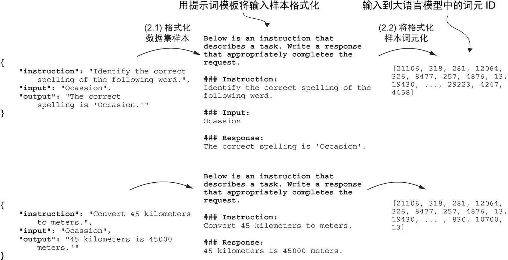

图53 批处理过程的前两个步骤：用提示词模板格式化数据集样本 (2.1)；将格式化样本词元化 (2.2)，生成模型能够处理的词元 ID 序列

第三步是填充。这里采用一个更精细的做法：**每个批次只填充到该批次内最长序列的长度**，不同批次的长度可以不同，从而减少不必要的填充：

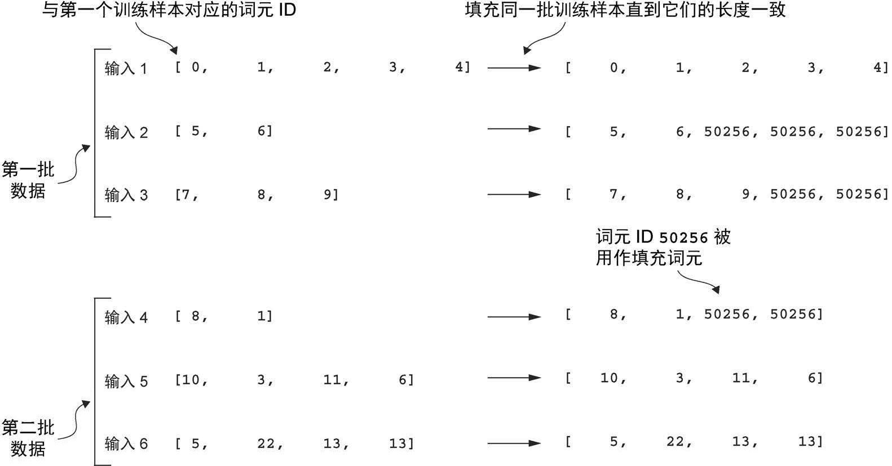

图54 使用词元 ID 50256 对批次中的训练样本进行填充，确保每个批次内长度一致，但每个批次的总长度可以不同

第四步是创建目标词元 ID。与预训练时一样，目标词元 ID 与输入词元 ID 一一对应，但**向左移动一个位置**：

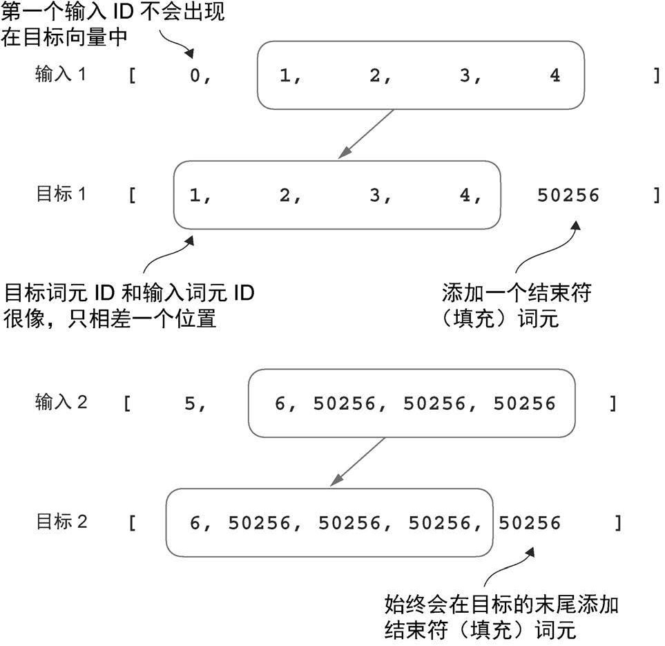

图55 输入词元与目标词元之间的对应关系。对每个输入序列而言，先将其向左移动一个词元的位置，忽略输入序列的第一个词元，最后在尾部加入结束符词元，即可得到对应的目标序列

第五步是用 `-100` 掩码填充词元。完整的自定义聚合函数如下：

```
def custom_collate_fn(batch, pad_token_id=50256, ignore_index=-100,
                      allowed_max_length=None, device="cpu"):
    # 找到批次中最长的序列
    batch_max_length = max(len(item) + 1 for item in batch)
    inputs_lst, targets_lst = [], []

    for item in batch:
        new_item = item.copy()
        new_item += [pad_token_id]
        # 填充并准备输入
        padded = new_item + [pad_token_id] * (batch_max_length - len(new_item))
        inputs = torch.tensor(padded[:-1])    # 截断输入的最后一个词元
        targets = torch.tensor(padded[1:])    # 向左移动一个位置得到目标

        # 把目标序列中除第一个填充词元外的所有填充词元都替换为 ignore_index
        mask = targets == pad_token_id
        indices = torch.nonzero(mask).squeeze()
        if indices.numel() > 1:
            targets[indices[1:]] = ignore_index

        # 可选地截断至最大序列长度
        if allowed_max_length is not None:
            inputs = inputs[:allowed_max_length]
            targets = targets[:allowed_max_length]

        inputs_lst.append(inputs)
        targets_lst.append(targets)

    inputs_tensor = torch.stack(inputs_lst).to(device)
    targets_tensor = torch.stack(targets_lst).to(device)
    return inputs_tensor, targets_tensor
```

用 3 个不同长度的输入测试这个聚合函数：

```
inputs_1 = [0, 1, 2, 3, 4]
inputs_2 = [5, 6]
inputs_3 = [7, 8, 9]
batch = (inputs_1, inputs_2, inputs_3)
inputs, targets = custom_collate_fn(batch)
print(inputs)
print(targets)
```

代码执行结果如下所示，第一个张量代表输入，第二个张量代表目标：

```
tensor([[    0,     1,     2,     3,     4],
        [    5,     6, 50256, 50256, 50256],
        [    7,     8,     9, 50256, 50256]])
tensor([[    1,     2,     3,     4, 50256],
        [    6, 50256,  -100,  -100,  -100],
        [    8,     9, 50256,  -100,  -100]])
```

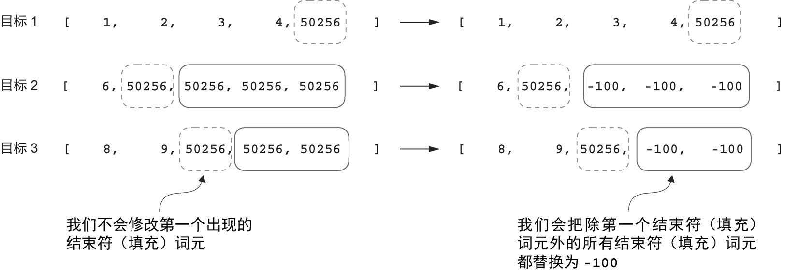

图56 准备训练数据时目标批次的词元替换过程：将每个目标序列中除第一个结束符（填充）词元外的所有结束符（填充）词元替换为占位符值 -100，同时保留第一个结束符（填充）词元

这里有个关键细节值得解释清楚：**为什么是 -100？** 先看交叉熵损失的计算方式：

```
logits_1 = torch.tensor([[-1.0, 1.0],
                         [-0.5, 1.5]])
targets_1 = torch.tensor([0, 1])
loss_1 = torch.nn.functional.cross_entropy(logits_1, targets_1)
print(loss_1)
```

代码执行结果如下所示：

```
tensor(1.1269)
```

增加一个额外词元会影响损失计算：

```
logits_2 = torch.tensor([[-1.0, 1.0],
                         [-0.5, 1.5],
                         [-0.5, 1.5]])
targets_2 = torch.tensor([0, 1, 1])
loss_2 = torch.nn.functional.cross_entropy(logits_2, targets_2)
print(loss_2)
```

代码执行结果如下所示：

```
tensor(0.7936)
```

但如果把第三个目标词元替换为 -100：

```
targets_3 = torch.tensor([0, 1, -100])
loss_3 = torch.nn.functional.cross_entropy(logits_2, targets_3)
print(loss_3)
print("loss_1 == loss_3:", loss_1 == loss_3)
```

代码执行结果如下所示，损失值与只有两个词元时完全相同：

```
tensor(1.1269)
loss_1 == loss_3: tensor(True)
```

原因在于 PyTorch 交叉熵函数的默认设置就是 `cross_entropy(..., ignore_index=-100)`，**它会忽略标记为 -100 的目标**。我们正是利用这一点来忽略那些为了让批次等长而添加的额外填充词元。同时要注意，目标中要**保留第一个结束符词元 50256**，因为它有助于模型学会何时生成结束符、在适当的时候结束回复。

顺带说明，实践中通常还会考虑掩码与指令相关的目标词元，让损失只针对生成的回复计算，从而使训练更专注于生成准确的回复。不过研究者对是否需要掩码仍有分歧，Shi 等人在 2024 年的论文《Instruction Tuning With Loss Over Instructions》中指出不掩码指令可以提升性能，本章也采用不掩码的做法。

### 创建指令数据集的数据加载器

把 `custom_collate_fn` 的 `device` 和 `allowed_max_length` 预先绑定好，再传给数据加载器：

```
from functools import partial

device = torch.device("cuda" if torch.cuda.is_available() else "cpu")
# 取消注释下面两行就可以在 Apple Silicon 芯片上使用 GPU
# if torch.backends.mps.is_available():
#     device = torch.device("mps")

customized_collate_fn = partial(custom_collate_fn, device=device,
                                allowed_max_length=1024)

from torch.utils.data import DataLoader

num_workers = 0
batch_size = 8
torch.manual_seed(123)

train_dataset = InstructionDataset(train_data, tokenizer)
train_loader = DataLoader(train_dataset, batch_size=batch_size,
    collate_fn=customized_collate_fn, shuffle=True,
    drop_last=True, num_workers=num_workers)

val_dataset = InstructionDataset(val_data, tokenizer)
val_loader = DataLoader(val_dataset, batch_size=batch_size,
    collate_fn=customized_collate_fn, shuffle=False,
    drop_last=False, num_workers=num_workers)

test_dataset = InstructionDataset(test_data, tokenizer)
test_loader = DataLoader(test_dataset, batch_size=batch_size,
    collate_fn=customized_collate_fn, shuffle=False,
    drop_last=False, num_workers=num_workers)
```

查看输入批次和目标批次的维度：

```
print("Train loader:")
for inputs, targets in train_loader:
    print(inputs.shape, targets.shape)
```

代码执行结果（节选）如下所示，不同批次的长度确实不一样，这正是自定义聚合函数的作用：

```
Train loader:
torch.Size([8, 61]) torch.Size([8, 61])
torch.Size([8, 76]) torch.Size([8, 76])
torch.Size([8, 73]) torch.Size([8, 73])
...
torch.Size([8, 69]) torch.Size([8, 69])
```

### 加载预训练的大语言模型

指令微调这次改用**中等规模的 GPT-2（3.55 亿参数）**，因为 1.24 亿参数的模型容量过于有限，难以通过指令微调获得令人满意的效果——较小的模型缺乏学习高质量指令遵循任务所需的复杂模式和细微行为的能力。注意下载该模型约需 1.42 GB 存储空间，是最小 GPT 模型所需空间的 3 倍。

```
from gpt_download import download_and_load_gpt2
from chapter04 import GPTModel
from chapter05 import load_weights_into_gpt

BASE_CONFIG = {
    "vocab_size": 50257,     # 词汇表大小
    "context_length": 1024,  # 上下文长度
    "drop_rate": 0.0,        # dropout 率
    "qkv_bias": True         # 查询-键-值偏置
}

model_configs = {
    "gpt2-small (124M)":  {"emb_dim": 768,  "n_layers": 12, "n_heads": 12},
    "gpt2-medium (355M)": {"emb_dim": 1024, "n_layers": 24, "n_heads": 16},
    "gpt2-large (774M)":  {"emb_dim": 1280, "n_layers": 36, "n_heads": 20},
    "gpt2-xl (1558M)":    {"emb_dim": 1600, "n_layers": 48, "n_heads": 25},
}

CHOOSE_MODEL = "gpt2-medium (355M)"
BASE_CONFIG.update(model_configs[CHOOSE_MODEL])

model_size = CHOOSE_MODEL.split(" ")[-1].lstrip("(").rstrip(")")
settings, params = download_and_load_gpt2(model_size=model_size, models_dir="gpt2")

model = GPTModel(BASE_CONFIG)
load_weights_into_gpt(model, params)
model.eval()
```

### 在指令数据上微调大语言模型

微调流程与第 6 章类似，但目标是生成文本而非分类，因此损失函数回到对**全部词元**计算交叉熵。训练循环与第 5 章的 `train_model_simple` 几乎一致，只需把数据加载器换成指令数据集的加载器。微调完成后，把测试集的模型回复保存下来：

```
# 抽取并保存模型回复
from tqdm import tqdm

for i, entry in tqdm(enumerate(test_data), total=len(test_data)):
    input_text = format_input(entry)
    token_ids = generate(
        model=model,
        idx=text_to_token_ids(input_text, tokenizer).to(device),
        max_new_tokens=256,
        context_size=BASE_CONFIG["context_length"],
        eos_id=50256
    )
    generated_text = token_ids_to_text(token_ids, tokenizer)
    # 只保留 ### Response: 之后的内容
    response_text = generated_text[len(input_text):].replace("### Response:", "").strip()
    test_data[i]["model_response"] = response_text

with open("instruction-data-with-response.json", "w") as file:
    json.dump(test_data, file, indent=4)
```

### 评估微调后的大语言模型

指令微调的评估比较困难，因为“回复好不好”很难用自动指标衡量。一种实用做法是**用另一个更强的模型当裁判**：把测试集的模型回复交给 Ollama 运行的 Llama 3，让它按 1~100 分打分。相关代码在 `ollama_evaluate.py` 中。

如果要在有限资源下自己评估，也可以先用较小的测试集抽样人工检查，或者用 BLEU、ROUGE 等指标做粗筛——但要注意这些指标只能反映表面相似度，不能反映回答质量。

### 小结

- 指令微调使用“指令−回复”对训练模型，让它遵循指令；
- 数据集要格式化成统一的提示词风格（本章用 Alpaca 风格）；
- 指令微调的批次处理需要自定义聚合函数，核心是**按批次填充**并用 **-100** 掩码填充词元；
- 指令微调建议使用参数量更大的模型（本章用 3.55 亿参数的 GPT-2 medium）；
- 评估指令微调模型通常需要借助另一个大语言模型作为裁判。

---

## 附录 A　PyTorch 简介

本附录是阅读正文前的必要准备，用来补齐 PyTorch 的基础知识。对应代码在 `appendix-A/01_main-chapter-code/code-part1.ipynb` 和 `code-part2.ipynb`。如果你对 PyTorch 还不熟悉，建议先完整过一遍这个附录。

### 理解张量

张量（tensor）是 PyTorch 中最基本的数据结构。按维度从低到高，可以这样理解：

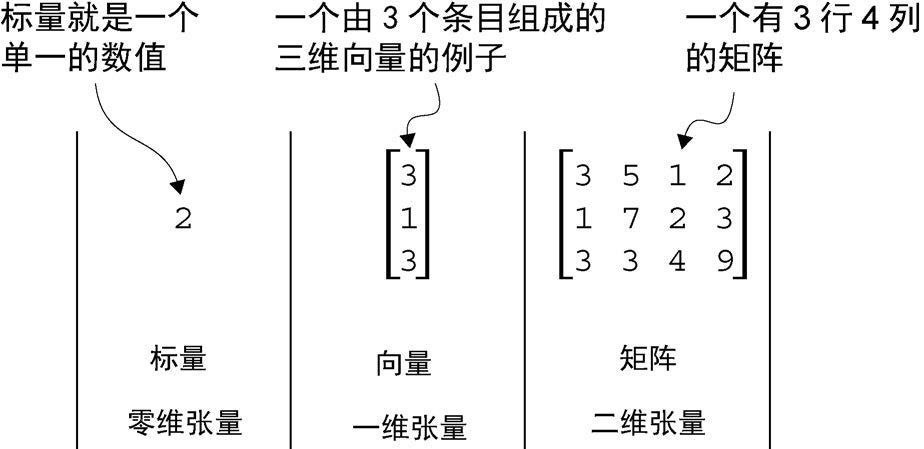

图57 标量就是一个单一的数值（零维张量）；一个由 3 个条目组成的是向量（一维张量）；有 3 行 4 列的是矩阵（二维张量）

正文中用到的所有数据——词元 ID 序列、嵌入向量、注意力权重、模型参数——本质上都是张量。第 2 章的 `torch.tensor(encoded_text)`、第 4 章的 `tok_emb.weight`（形状 `[50257, 768]`），都是张量。

### 将模型视为计算图

PyTorch 把神经网络的计算过程表示为一张**计算图**，这带来两个好处：一是可以自动求导，二是可以清晰地看到数据与参数如何流动。

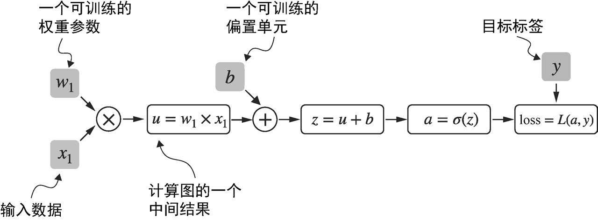

图58 计算图示例：输入数据 $x_1$ 与可训练的权重参数 $w_1$ 相乘，加上可训练的偏置单元 $b$ 得到中间结果，再经过激活函数得到 $a$，最后与目标标签 $y$ 一起计算出损失

### 轻松实现自动微分

有了计算图，PyTorch 就能**自动微分**（autograd）。这正是正文中反复出现的这三行的原理：

```
loss = calc_loss_batch(input_batch, target_batch, model, device)
loss.backward()          # 自动计算所有参数的梯度，存入 param.grad
optimizer.step()         # 用梯度更新参数
```

`loss.backward()` 之所以不需要我们手写求导公式，就是因为 PyTorch 沿着计算图反向自动计算了梯度。附录 D 中那个 `find_highest_gradient` 函数，扫描的就是 `.backward()` 之后各参数的 `.grad` 属性。

### 实现多层神经网络

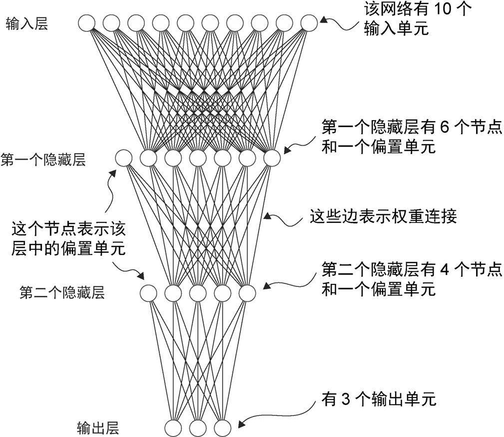

图59 一个多层神经网络的结构：10 个输入单元，两个隐藏层分别有 6 个和 4 个节点（各带一个偏置单元），最后是 3 个输出单元。图中每条边都表示一个权重连接

理解这个结构后再看第 4 章的 `FeedForward` 模块就很清楚了——它就是“线性层 → 激活函数 → 线性层”的堆叠，只不过在 Transformer 里中间维度扩展到了 4 倍（768 → 3072）。

### 设置高效的数据加载器

正文里每个章节都要构造 `Dataset` 和 `DataLoader`。如果数据加载成为瓶颈，模型就会在等待数据时闲置。

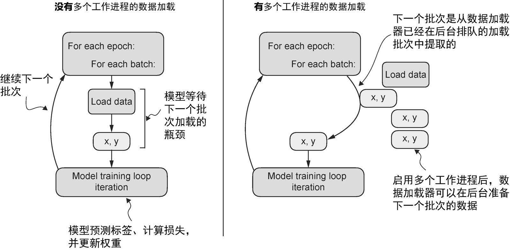

图60 数据加载的两种方式对比。左侧是单个工作进程：模型需要等待下一个批次加载完成；右侧是多个工作进程：数据加载器可以在后台预先准备好下一个批次，避免模型空等

这就是 `DataLoader` 里 `num_workers` 参数的意义。正文为了兼容大多数计算机把它设为 0，如果你的操作系统支持 Python 进程并行，可以适当调大。

### 典型训练循环、保存加载与 GPU 加速

本附录其余内容包括：

- **典型的训练循环**：与第 5 章的 `train_model_simple` 结构一致；
- **保存和加载模型**：`torch.save(model.state_dict(), ...)` 与 `model.load_state_dict(...)`，注意 `state_dict` 只含参数张量、不含模型架构；
- **使用 GPU 优化训练性能**：在 GPU 设备上运行 PyTorch、单个 GPU 训练、使用多个 GPU 训练（`DDP-script.py` 展示了分布式数据并行）。

## 附录 B　参考文献和延伸阅读

按章节（第 1~7 章 + 附录 A）列出了参考文献，是进一步深入学习的索引。前面正文里提到的“更多信息请参见附录 B”，指的就是这里。

## 附录 C　练习的解决方案

汇总了第 2~7 章和附录 A 的全部习题解答。书中的练习数量不少，建议动手做完再对照。

## 附录 D　为训练循环添加更多细节和优化功能

本附录对第 5 章至第 7 章的训练函数做改进，引入 **学习率预热**、**余弦衰减**、**梯度裁剪** 三项技术，它们共同作用有助于稳定大语言模型的训练。

### 学习率预热

学习率预热的作用是稳定训练过程：把学习率从一个非常低的初始值（`initial_lr`）逐步提升到用户设定的最大值（`peak_lr`）。训练开始时使用较小的权重更新，可以降低模型遭遇大幅度、不稳定更新的风险。预热步数通常设置为总步数的 0.1% 到 20%。

```
total_steps = len(train_loader) * n_epochs
warmup_steps = int(0.2 * total_steps)   # 20% 预热
lr_increment = (peak_lr - initial_lr) / warmup_steps

if global_step < warmup_steps:
    lr = initial_lr + global_step * lr_increment
else:
    lr = peak_lr

for param_group in optimizer.param_groups:
    param_group["lr"] = lr
track_lrs.append(optimizer.param_groups[0]["lr"])
```

这里假设训练 15 轮、初始学习率 0.0001、峰值学习率 0.01，`warmup_steps` 计算得到 27，意味着在前 27 个训练步骤中把学习率从 0.0001 逐步提高到 0.01。

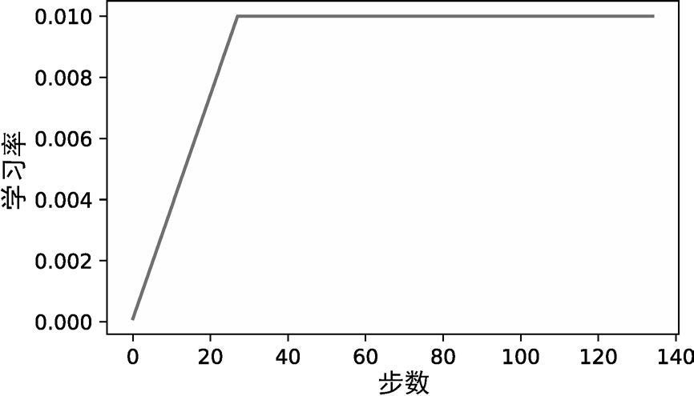

图61 学习率预热在前 27 步线性增加学习率，在第 27 步抵达顶点值 0.010，然后在剩余时间内保持不变

### 余弦衰减

余弦衰减在预热阶段之后按余弦曲线调节学习率，通常会降低到接近零，模拟半个余弦周期的轨迹。学习率逐渐降低可以减缓权重更新的速度，降低训练过程中越过损失最小值的风险，确保后期训练的稳定性。

```
import math

min_lr = 0.1 * initial_lr
progress = (global_step - warmup_steps) / (total_training_steps - warmup_steps)
lr = min_lr + (peak_lr - min_lr) * 0.5 * (1 + math.cos(math.pi * progress))
```

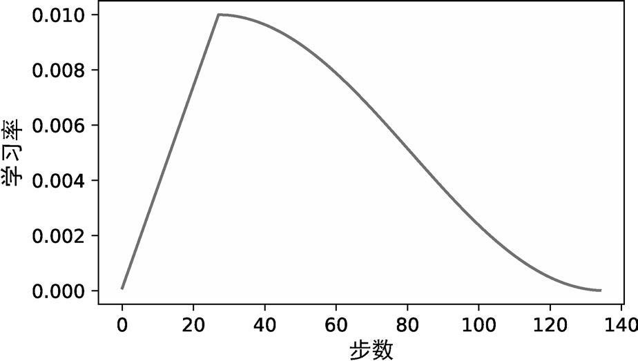

图62 在最初的 27 步线性预热之后紧接着余弦衰减，学习率在半个余弦周期内逐渐降低，直到训练结束时达到最小值

### 梯度裁剪

梯度裁剪通过设定阈值，把超过阈值的梯度缩放到预定的最大值，确保反向传播过程中对模型参数的更新保持在可控范围内。这里的“范数”指的是梯度的 **L2 范数**（欧几里得范数）：

$$\|v\|_2 = \sqrt{v_1^2 + v_2^2 + \cdots + v_n^2}$$

以梯度矩阵 $G = \begin{bmatrix} 1 & 2 \\ 3 & 4 \end{bmatrix}$ 为例，其 L2 范数为：

$$\|G\|_2 = \sqrt{1^2 + 2^2 + 3^2 + 4^2} = \sqrt{30} \approx 5.48$$

若最大范数限制为 1，则缩放因子为 $1/5.48$，调整后的梯度矩阵 $G' = G / 5.48$。

```
def find_highest_gradient(model):
    max_grad = None
    for param in model.parameters():
        if param.grad is not None:
            grad_values = param.grad.data.flatten()
            max_grad_param = grad_values.max()
            if max_grad is None or max_grad_param > max_grad:
                max_grad = max_grad_param
    return max_grad

loss.backward()
print(find_highest_gradient(model))                        # tensor(0.0411)

torch.nn.utils.clip_grad_norm_(model.parameters(), max_norm=1.0)
print(find_highest_gradient(model))                        # tensor(0.0185)
```

代码执行结果如下所示，应用最大范数为 1 的梯度裁剪后，最大的梯度值明显减小：

```
tensor(0.0411)
tensor(0.0185)
```

### 修改的训练函数

把三项技术合并进训练函数后，关键片段如下：

```
peak_lr = optimizer.param_groups[0]["lr"]              # 从优化器检索初始学习率作为峰值
total_training_steps = len(train_loader) * n_epochs    # 计算所有迭代步数
lr_increment = (peak_lr - initial_lr) / warmup_steps   # 计算预热阶段的学习率增量

for epoch in range(n_epochs):
    model.train()
    for input_batch, target_batch in train_loader:
        optimizer.zero_grad()
        global_step += 1

        # 根据当前阶段调整学习率（预热或余弦衰减）
        if global_step < warmup_steps:
            lr = initial_lr + global_step * lr_increment
        else:
            progress = ((global_step - warmup_steps) /
                        (total_training_steps - warmup_steps))
            lr = min_lr + (peak_lr - min_lr) * 0.5 * (1 + math.cos(math.pi * progress))
        for param_group in optimizer.param_groups:
            param_group["lr"] = lr
        track_lrs.append(lr)

        loss = calc_loss_batch(input_batch, target_batch, model, device)
        loss.backward()

        # 在预热阶段后使用梯度裁剪来避免梯度爆炸
        if global_step > warmup_steps:
            torch.nn.utils.clip_grad_norm_(model.parameters(), max_norm=1.0)

        optimizer.step()
        ...
```

由于数据集非常小且被多次迭代，模型训练几轮后就会开始过拟合，但可以确认这个函数能有效降低训练集损失。作者建议在更大的文本数据集上对比这个函数与 `train_model_simple` 的效果。

## 附录 E　使用 LoRA 进行参数高效微调

LoRA（低秩自适应，Low-Rank Adaptation）是应用最广泛的**参数高效微调**技术之一。本附录基于第 6 章的垃圾消息分类示例展开，但 LoRA 同样适用于第 7 章的指令微调。

### LoRA 简介

常规微调中，权重更新为：

$$W_{updated} = W + \Delta W$$

LoRA 的核心思想是不直接学习 $\Delta W$，而是用两个小得多的矩阵近似它：

$$W_{updated} = W + \Delta W \approx W + A \cdot B$$

其中 $A$ 和 $B$ 是两个比 $W$ 小得多的矩阵，$r$ 是内部维度（rank），是一个可调超参数。“低秩”指的就是把模型调整限制在总权重参数空间的较小维度子空间里，从而有效捕获训练过程中对权重变化影响最大的方向。

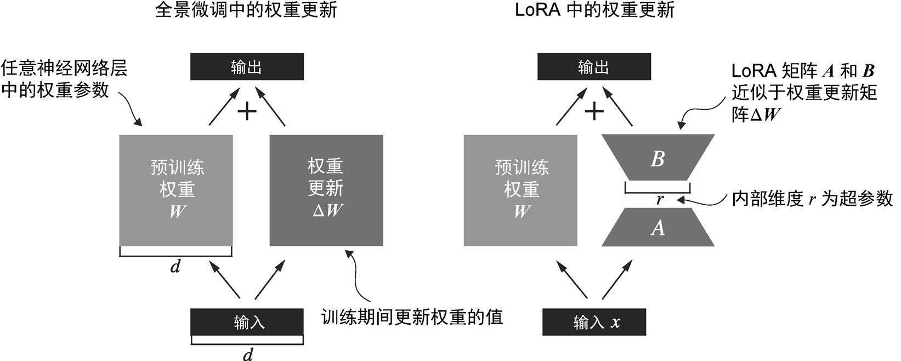

图63 权重更新方法对比：全量微调直接用 $\Delta W$ 更新预训练权重矩阵 $W$（左）；LoRA 用两个较小的矩阵 $A$ 和 $B$ 近似 $\Delta W$，把矩阵乘积 $AB$ 加到 $W$ 上，$r$ 是内部维度（右）

利用矩阵乘法的分配律，还可以把原始权重与更新分开计算：

$$x \cdot (W + \Delta W) = x \cdot W + x \cdot \Delta W$$

$$x \cdot (W + AB) = x \cdot W + x \cdot AB$$

把 LoRA 权重矩阵与原始模型权重分开，这一点在实践中非常有用：它允许**预训练模型权重保持不变**，在使用模型时动态地应用 LoRA 矩阵。这样一来，为每个特定客户或应用做定制时，只需保存较小的 LoRA 矩阵，无须存储多个完整版本的大语言模型，降低了存储需求并提高了可扩展性。

### 实现 LoRA 层

```
import math

class LoRALayer(torch.nn.Module):
    def __init__(self, in_dim, out_dim, rank, alpha):
        super().__init__()
        self.A = torch.nn.Parameter(torch.empty(in_dim, rank))
        torch.nn.init.kaiming_uniform_(self.A, a=math.sqrt(5))   # 与 PyTorch 线性层相同的初始化
        self.B = torch.nn.Parameter(torch.zeros(rank, out_dim))
        self.alpha = alpha

    def forward(self, x):
        x = self.alpha * (x @ self.A @ self.B)
        return x
```

`rank` 控制矩阵 $A$ 和 $B$ 的内部维度，决定了 LoRA 引入的额外参数量，在适应性和效率之间建立平衡。`alpha` 是低秩自适应输出的缩放因子，决定适应层的输出对原始层输出的影响程度。

接下来创建一个替换线性层的 `LinearWithLoRA`，把 LoRA 集成进模型：

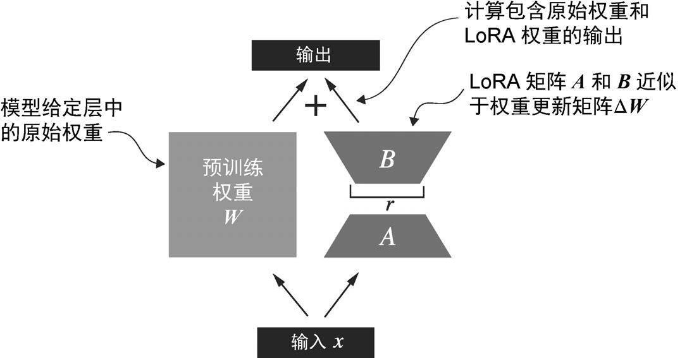

图64 LoRA 集成到模型层中的过程：层的原始预训练权重 $W$ 与来自 LoRA 矩阵 $A$ 和 $B$ 的输出相结合，最终输出由使用 LoRA 权重调整后的层输出与原始输出相加得到

```
class LinearWithLoRA(torch.nn.Module):
    def __init__(self, linear, rank, alpha):
        super().__init__()
        self.linear = linear
        self.lora = LoRALayer(linear.in_features, linear.out_features, rank, alpha)

    def forward(self, x):
        return self.linear(x) + self.lora(x)
```

注意 `B` 被初始化为零值，因此矩阵 $A$ 和 $B$ 的乘积是零矩阵，这保证了训练开始时**不改变原始权重**。

再写一个函数，递归地把模型中所有 `Linear` 层替换为 `LinearWithLoRA`：

```
def replace_linear_with_lora(model, rank, alpha):
    for name, module in model.named_children():
        if isinstance(module, torch.nn.Linear):
            # 使用 LinearWithLoRA 层替换 Linear 层
            setattr(model, name, LinearWithLoRA(module, rank, alpha))
        else:
            # 递归地使用相同的函数处理子模块
            replace_linear_with_lora(module, rank, alpha)
```

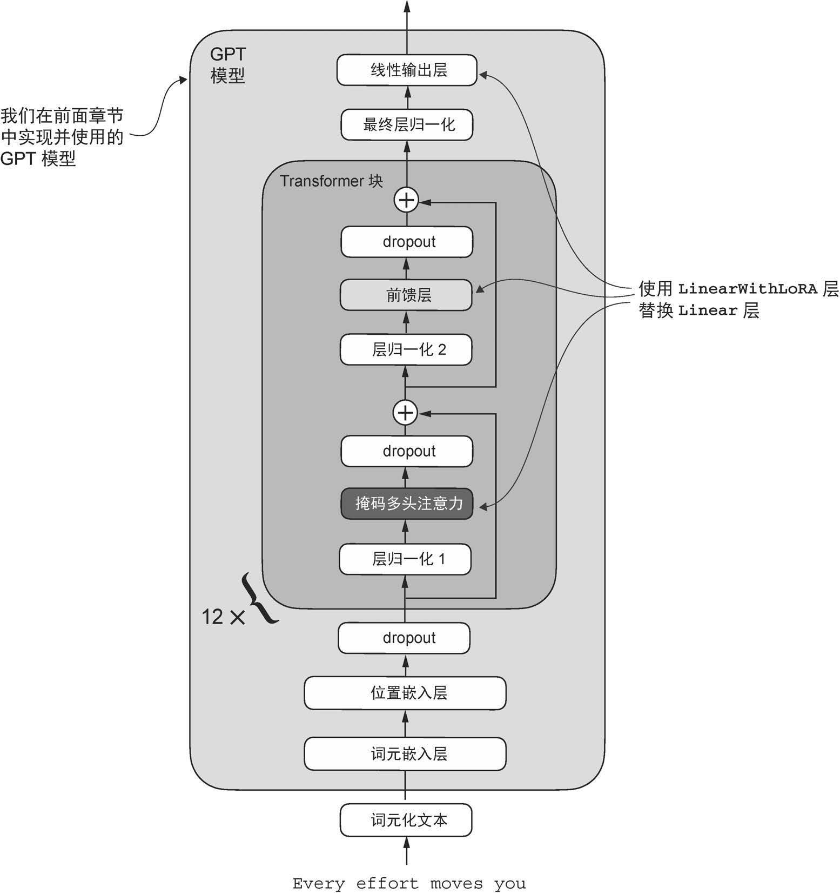

图65 GPT 模型的架构，突出显示了把 Linear 层升级为 LinearWithLoRA 层以进行参数高效微调的部分

### 参数量对比

替换前先冻结原始模型的全部参数，然后统计可训练参数量：

```
total_params = sum(p.numel() for p in model.parameters() if p.requires_grad)
print(f"Total trainable parameters before: {total_params:,}")

for param in model.parameters():
    param.requires_grad = False

total_params = sum(p.numel() for p in model.parameters() if p.requires_grad)
print(f"Total trainable parameters after: {total_params:,}")

replace_linear_with_lora(model, rank=16, alpha=16)

total_params = sum(p.numel() for p in model.parameters() if p.requires_grad)
print(f"Total trainable LoRA parameters: {total_params:,}")
```

代码执行结果如下所示，使用 LoRA 后把可训练参数从 1.24 亿减少到约 267 万，**只有原来的 1/50**：

```
Total trainable parameters before: 124,441,346
Total trainable parameters after: 0
Total trainable LoRA parameters: 2,666,528
```

`rank` 和 `alpha` 都设为 16 是不错的默认选择。通常把 `alpha` 设为 `rank` 的一半、两倍或相等；增大 `rank` 会增加可训练参数量。

微调前后的初始准确率与第 6 章完全相同（都是 46.25% / 45.00% / 48.75%），因为 LoRA 矩阵 $B$ 初始化为零，$AB$ 是零矩阵，不影响原始权重。

用第 6 章的训练函数微调，损失曲线如下：

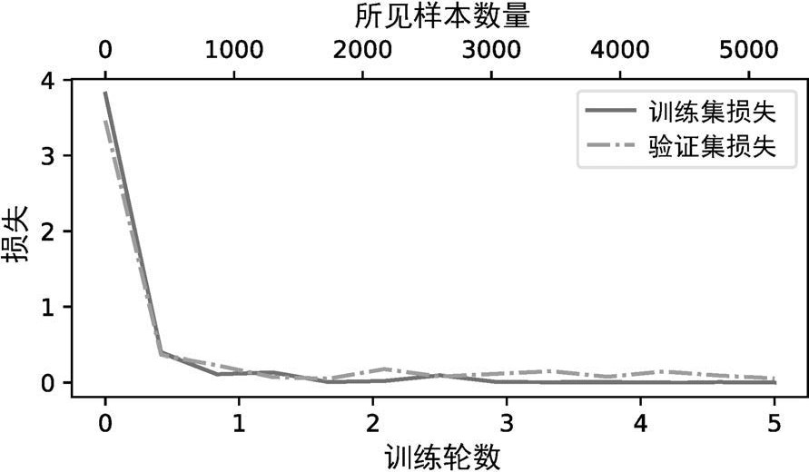

图66 使用 LoRA 微调时模型在 5 轮内的训练集损失和验证集损失曲线。两条曲线最初急剧下降，随后趋于平稳，表明模型正在收敛

代码执行结果如下所示，全量评估的准确率相当可观：

```
Training accuracy: 100.00%
Validation accuracy: 96.64%
Test accuracy: 98.00%
```

有意思的是，在这个示例中 LoRA 训练反而**更慢**（M3 MacBook Air 上约 12 分钟，不用 LoRA 约 6 分钟），因为 LoRA 层在前向传播中引入了额外计算。但对于更大的模型，反向传播的成本更高，此时 LoRA 通常比不用 LoRA 更快。总体而言，只微调了约 267 万个参数（原模型 1.24 亿）就能达到这样的效果，结果令人印象深刻。

## 附录 F　理解推理大语言模型：构建与优化推理模型的方法和策略

本附录是作者博客文章的中译，作为中文版附赠内容收录，介绍构建推理模型的四种主流方法。

### 如何定义“推理模型”

作者把“推理”定义为**解答那些需要复杂、多步骤生成并包含中间过程的复杂问题**的过程。回答“法国的首都是哪里”这种事实性问题并不涉及推理；但回答“一列火车以每小时 60 英里的速度行驶 3 小时，能行驶多远”就需要一些推理，因为模型要先识别“距离 = 速度 × 时间”的关系。

当前大多数大语言模型都具备基本推理能力，因此当我们说“推理模型”时，通常指那些能处理更复杂推理任务（解谜题、数学推导或证明）的模型。推理模型的中间步骤有两种呈现方式：

- **直接体现在回答中**，让用户看到完整的推理过程；
- **在内部进行多次迭代**，但不向用户展示（例如 OpenAI 的 o1 可能会进行多轮推理，但最终只呈现答案）。

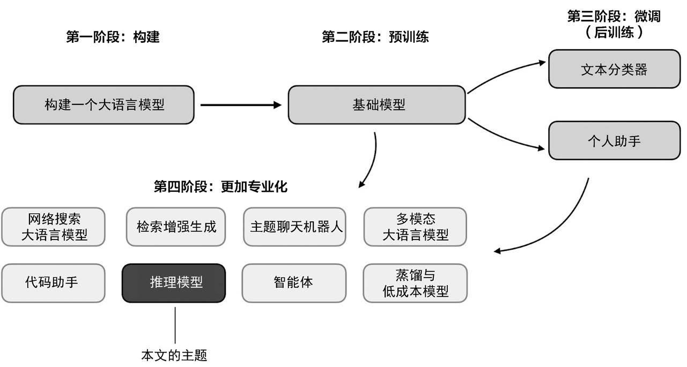

图67 大语言模型发展的四个阶段：第一阶段构建、第二阶段预训练、第三阶段微调（后训练）、第四阶段更加专业化。推理模型属于第四阶段的一个方向

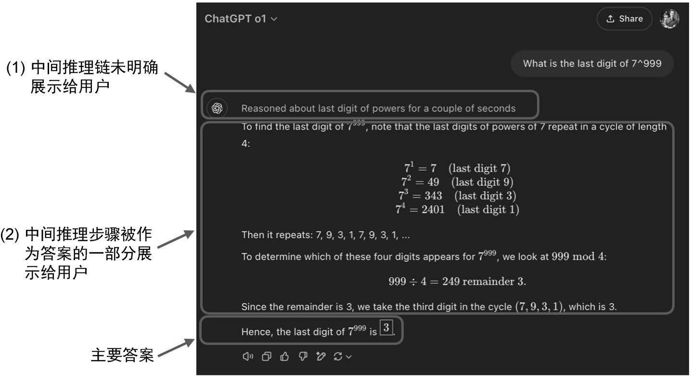

图68 ChatGPT o1 的回答示例。(1) 中间推理链未明确展示给用户；(2) 中间推理步骤作为答案的一部分展示给用户

### 何时应该使用推理模型

推理模型适用于需要多步推理的复杂任务，比如解谜题、高级数学推导和解决复杂的编程问题。但对于总结、翻译、基于知识的问答等简单任务，推理模型并非必需。事实上，如果无差别地在所有任务中都使用推理模型，可能导致效率低下并带来不必要的开销——推理模型通常使用成本更高、输出更冗长，有时还可能因“过度思考”而更容易出错。

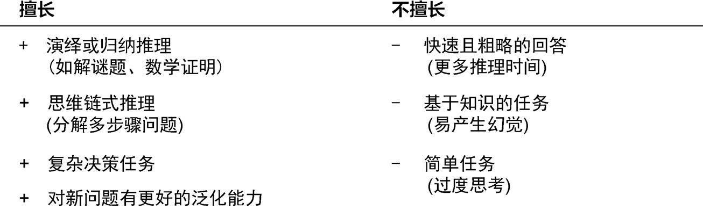

图69 推理模型的核心优势和劣势对比

### DeepSeek R1 的训练流程

DeepSeek 并未发布单一的 R1 模型，而是推出了 3 个不同的变体：

1. **DeepSeek-R1-Zero**：基于 2024 年 12 月发布的 6710 亿参数 DeepSeek-V3 预训练基础模型构建，完全通过强化学习（RL）训练，没有进行监督微调（SFT），这种训练方式被称为“冷启动”；
2. **DeepSeek-R1**：DeepSeek 的主力推理模型，在 R1-Zero 的基础上增加了额外的监督微调阶段，并继续使用强化学习训练；
3. **DeepSeek-R1-Distill**：利用前面训练过程中产生的大量监督微调数据，对 Qwen 和 Llama 系列模型进行微调（包括 80 亿/700 亿的 Llama 以及 15 亿~300 亿的 Qwen），以增强其推理能力。

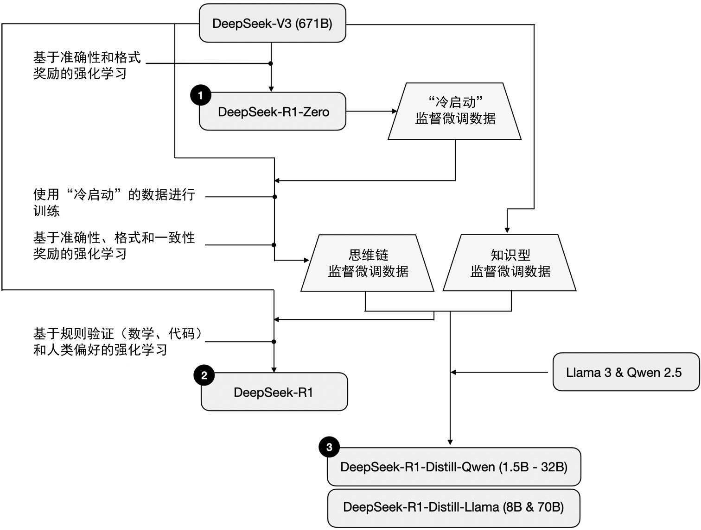

图70 DeepSeek R1 技术报告中提到的 3 种推理模型的开发过程

### 构建和优化推理模型的四大核心方法

**方法一：推理时间扩展（inference-time scaling）**

指的是**增加推理时的计算资源**来提高模型输出质量。一个简单的类比是：人类面对复杂问题时，如果能多花些时间思考，通常就能找到更好的解决办法。具体方法包括：

- **思维链提示**（chain-of-thought）：在提示词中加入“一步步思考”这样的短语，鼓励模型先生成中间推理步骤，而不是直接输出最终答案。这本质上是一种推理时间扩展，因为它通过生成更多输出词元增加了推理的计算成本；
- **投票与搜索算法**：例如多数投票法（让模型生成多个答案再投票选出最可能的正确答案）、束搜索（beam search）等。

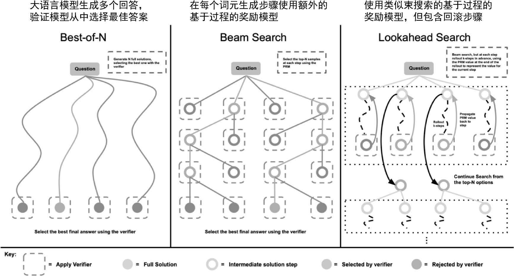

图71 三种不同的基于搜索的推理时间扩展方法（来自论文《Scaling LLM Test-Time Compute Optimally can be More Effective than Scaling Model Parameters》）：Best-of-N 生成多个答案再从中选择最佳答案；Beam Search 在每个词元生成步骤使用额外的基于过程的奖励模型；Lookahead Search 使用类似束搜索的基于过程的奖励模型，但包含回滚步骤

需要注意的是，并非所有问题都适合这种策略。对“法国的首都是哪里”这种纯知识性问题使用思维链提示是没有意义的——如果一个任务本身不涉及推理，就没有必要针对它优化推理模型。根据 DeepSeek R1 技术报告，其模型并未使用推理时间扩展技术，但该技术通常在应用层实现。作者猜测 OpenAI 的 o1 和 o3 使用了推理时间扩展，这也解释了为什么它们比 GPT-4o 成本更高。

**方法二：纯强化学习**

DeepSeek R1 技术报告的一大亮点是发现**推理能力作为一种行为可以通过纯强化学习自发涌现**。与典型强化学习流程（通常先做监督微调）不同，DeepSeek-R1-Zero 完全通过强化学习训练，跳过了初始的监督微调阶段。

在奖励机制上，DeepSeek 采用了两种奖励方式：

- **准确性奖励**：通过 LeetCode 编译器验证代码答案的正确性，并通过一个确定性系统评估数学答案的准确性；
- **格式奖励**：依赖大语言模型确保回答遵循预期格式，比如把推理步骤放在 `<think>` 标签内。

令人惊讶的是，仅凭这种方法，模型就已经具备了基本的推理能力，研究团队在模型开始生成推理过程时观察到了一个“Aha”时刻。虽然 R1-Zero 并不是表现最优秀的推理模型，但它证实了用纯强化学习开发推理模型是可行的。

**方法三：监督微调 + 强化学习（SFT + RL）**

这是 DeepSeek-R1 主力模型采用的路线，也是构建高性能推理模型的首选方法，流程如下：

1. 用 R1-Zero 生成“冷启动”监督微调数据（“冷启动”是指数据由未接受任何监督微调训练的 R1-Zero 生成）；
2. 对模型进行指令微调，随后进行强化学习。奖励机制沿用准确性奖励和格式奖励，并新增**一致性奖励**，以避免模型在回答中混用多种语言；
3. 强化学习之后再进行一轮监督微调数据收集：用最新的模型检查点生成 60 万条思维链样本，同时基于 DeepSeek-V3 生成 20 万条知识型样本；
4. 用这 80 万条数据指令微调 DeepSeek-V3 基础模型，再进行最后一轮强化学习。这一阶段对数学和编程问题继续使用基于规则的准确性奖励，对其他类型问题引入基于人类偏好标签的奖励机制。

**方法四：纯监督微调与蒸馏**

在大语言模型背景下，蒸馏并不一定遵循传统的知识蒸馏方法。DeepSeek 的蒸馏方法是**用 R1 的监督微调数据集**去指令微调较小的大语言模型。开发这些蒸馏模型主要有两个原因：一是小型模型效率更高、运行成本更低，还能在低端硬件上运行；二是它们可以作为一个有趣的基准，展示在没有强化学习的情况下纯监督微调能把模型提升到什么程度。

值得注意的是，DeepSeek 团队还测试了纯强化学习方法是否能激发小模型的推理能力：他们把 R1-Zero 的纯强化学习方法直接应用到 Qwen-32B 上，结果表明**对于较小的模型，蒸馏远比纯强化学习有效**。这与以下观点一致：仅靠纯强化学习可能不足以在这种规模的模型中引发强大的推理能力，而使用高质量推理数据进行监督微调可能是更有效的策略。

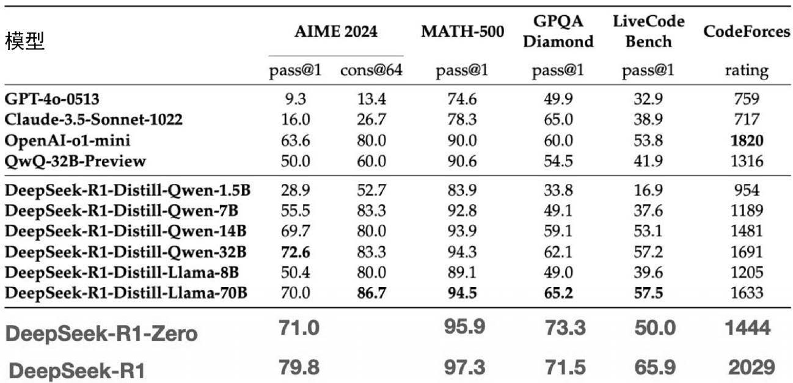

图72 蒸馏模型与非蒸馏模型的基准比较（来自 DeepSeek-R1 技术报告）。蒸馏模型的表现明显不如 DeepSeek-R1，但与 R1-Zero 相比，尽管它们的规模小得多，表现却相当强劲

### 在有限预算下开发推理模型

开发像 DeepSeek-R1 这样的推理模型可能需要数十万到数百万美元。对预算有限的研究人员或工程师来说，有几个值得关注的低成本方案：

- **Sky-T1**：一个小团队仅用 1.7 万个监督微调样本训练出 320 亿参数的开源模型，总成本仅 **450 美元**，甚至比大多数人工智能会议的注册费还低；
- **TinyZero**：复刻 DeepSeek-R1-Zero 方法的 30 亿参数模型，训练成本不到 **30 美元**，却展示出了一些自我验证能力；

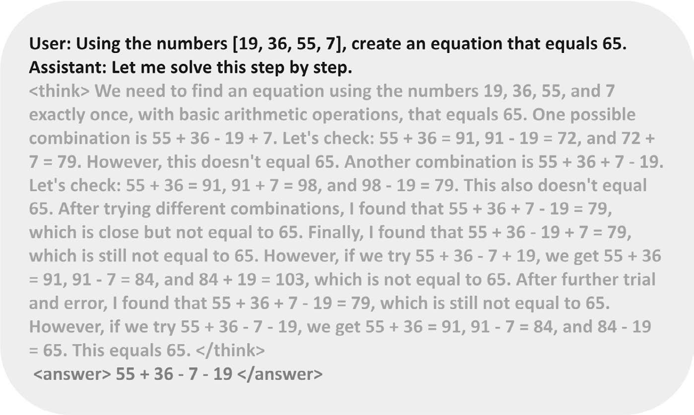

图73 来自 TinyZero 代码库的示例，展示了该模型具备自我验证的能力

- **旅程学习**（Journey Learning）：论文《O1 Replication Journey: A Strategic Progress Report – Part 1》提出的方法。它是对传统指令微调（“捷径学习”，模型只训练正确的解题路径）的改进——**旅程学习还包括错误的解题路径**，让模型从错误中学习。通过让模型接触错误的推理路径及其修正，可以增强模型的自我修正能力，使推理模型变得更可靠。

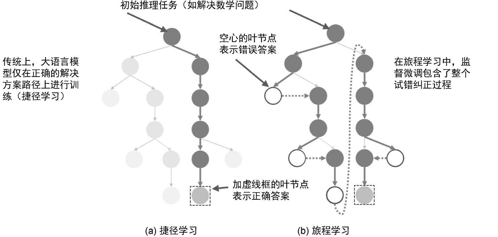

图74 与传统的捷径学习不同，旅程学习在监督微调数据中加入了错误的解题路径

### 关于 DeepSeek R1 的思考

作者认为 DeepSeek-R1 是一次了不起的成就，尤其欣赏其详细的技术报告。最令人着迷的一点是推理行为如何从纯强化学习中涌现出来。DeepSeek 还将其模型开源并采用 MIT 许可协议，这比 Meta 的 Llama 模型的限制更少。

关于 DeepSeek-R1 与 o1 的对比，作者认为两者大致处于同一水平，但 DeepSeek-R1 在推理时效率更高，这表明 DeepSeek 可能在训练过程中投入了更多精力，而 OpenAI 更多依赖推理时间扩展技术来优化 o1。不过直接对比很困难，因为 OpenAI 并未公开 o1 的规模、是否采用 MoE 等关键信息。

至于训练成本，有人提到的约 600 万美元可能混淆了 DeepSeek-V3（基础模型）与 DeepSeek-R1。DeepSeek 团队从未公开过 R1 的具体 GPU 小时数或开发成本，任何成本估算都只能是猜测。

---

## 结语

至此，全书的主线已经走完：**从处理文本数据、编码注意力机制、实现 GPT 模型架构，到在无标签数据上预训练，再通过分类微调和指令微调把基础模型变成专用模型**。附录 D 到附录 F 则分别从训练稳定性、参数高效微调和推理能力三个方向做了延伸。

值得强调的是，整本书的所有代码都能在消费级笔记本上跑通——GPT-2 small 只有 1.24 亿参数，训练一轮 The Verdict 只需要几分钟。这正是这本书的价值所在：它把“大模型”这个听起来很遥远的词，拆解成了一行行可以亲手运行、亲眼看到结果的代码。

大语言模型在这几年飞速发展，已经在强化学习微调、混合专家网络、训练框架加速等多个方面不断取得突破。但通过这本书建立起来的对大语言模型基本原理的理解，会是继续深入的基础。

---

## 自测题：每章五问

读完整章后合上笔记自测一遍。可以先遮住右列，答完再对照。

### 第 1 章

| # | 问题 | 参考答案 |
|---|---|---|
| 1 | 大语言模型的“大”体现在哪两方面？ | 训练数据集庞大 + 模型参数规模庞大（数百亿到数千亿） |
| 2 | 为什么预训练阶段不需要人工标注标签？ | 用的是**自监督学习**：把句子中的下一个词当作标签，标签可以从数据本身“动态”生成 |
| 3 | 原始 Transformer 和 GPT 在架构上的主要区别？ | 原始 Transformer 是编码器 + 解码器，为翻译设计；GPT 只保留解码器，纯自回归生成 |
| 4 | BERT 和 GPT 的训练目标分别是什么？ | BERT 是掩码预测（预测被掩码的词），擅长分类；GPT 是下一单词预测，擅长生成 |
| 5 | 什么是“涌现”能力？ | 模型能完成未被明确训练过的任务（如翻译），这是广泛接触大量语料后的自然结果 |

### 第 2 章

| # | 问题 | 参考答案 |
|---|---|---|
| 1 | 为什么不能把原始文本直接送进神经网络？ | 文本是离散的，无法参与神经网络所需的数学运算，必须先转成连续向量（嵌入） |
| 2 | `<\|endoftext\|>` 的词元 ID 是多少？它承担哪两个作用？ | **50256**；既作为不同文本源之间的分隔符，也用作填充词元 |
| 3 | BPE 为什么不需要 `<\|unk\|>` 就能处理生词？ | 它把词汇表外的单词拆解为更小的子词单元甚至单个字符，因此可以解析任何单词 |
| 4 | 滑动窗口采样中 `stride` 与 `max_length` 的关系会带来什么影响？ | `stride < max_length` 时窗口重叠，样本更多但过拟合风险上升；相等时窗口不重叠 |
| 5 | 词元嵌入和位置嵌入为什么要相加？ | 同一词元出现在不同位置时，词元嵌入完全相同，叠加位置嵌入才能区分位置信息 |

### 第 3 章

| # | 问题 | 参考答案 |
|---|---|---|
| 1 | 自注意力中为什么要除以 $\sqrt{d}$？ | 避免梯度过小、提升训练性能，这也是“缩放点积注意力”名称的由来 |
| 2 | 因果注意力掩码是怎么实现的？ | 用 `torch.triu(..., diagonal=1)` 生成上三角掩码，把右上角注意力得分置为 `-inf`，Softmax 后权重趋近 0 |
| 3 | `head_dim` 与 `emb_dim`、`n_heads` 的关系？ | `head_dim = emb_dim / n_heads`；GPT-2 small 是 768 / 12 = 64 |
| 4 | 多头注意力里 `out_proj` 的作用？ | 把多个头的输出混合，让不同头之间的信息得以交互 |
| 5 | RNN 相比自注意力的核心缺陷？ | 解码阶段无法直接访问编码器的早期隐状态，只能依赖当前隐状态，导致长距离依赖丢失 |

### 第 4 章

| # | 问题 | 参考答案 |
|---|---|---|
| 1 | `GPTModel` 参数量是 1.63 亿，为什么说 GPT-2 small 是 1.24 亿？ | 原始 GPT-2 用了**权重共享**：词元嵌入层复用为输出层，减去 `out_head` 参数后是 124,412,160 |
| 2 | LayerNorm 与 BatchNorm 的区别？ | LayerNorm 对**单个样本的嵌入维度**做归一化，不跨批次，因此不受批次大小影响 |
| 3 | GELU 相比 ReLU 的优势？ | GELU 平滑、负值区间也有小的非零输出和梯度，参数可以做更细微的调整，优化更容易 |
| 4 | Transformer 块里的残差连接解决什么问题？ | 缓解深层网络的梯度消失，是训练深层 Transformer 的关键 |
| 5 | 为什么这里用 Pre-LN（先归一化再进子层）？ | 相比原始 Transformer 的 Post-LN 更易训练、更稳定 |

### 第 5 章

| # | 问题 | 参考答案 |
|---|---|---|
| 1 | 交叉熵损失与困惑度的关系？ | 困惑度 = exp(损失)，数值上更直观，表示模型在多少个词元中“犹豫不决” |
| 2 | 温度 >1 和 <1 分别有什么效果？ | >1 使分布更均匀、输出更多样但易生成无意义文本；<1 使分布更尖锐、接近贪婪解码 |
| 3 | Top-k 采样怎么实现？ | 用 `torch.topk` 取前 k 个最大值，把小于第 k 大的 logits 置为 `-inf`，再 Softmax 采样 |
| 4 | 为什么本书示例训练几轮就过拟合？ | 数据集太小（The Verdict 仅 5145 个词元）却被多轮迭代，属于预期现象；真实场景通常只训 1 轮 |
| 5 | 加载 OpenAI 权重时如何处理权重共享？ | 把 `wte` 同时赋给 `tok_emb` 和 `out_head`（`gpt.out_head.weight = params["wte"]`） |

### 第 6 章

| # | 问题 | 参考答案 |
|---|---|---|
| 1 | 分类微调为什么要替换输出层？输出节点数怎么定？ | 原输出层映射到 50257 个词元，分类只需类别数个输出；**输出节点数 = 类别数**，二分类用 2 个 |
| 2 | 为什么只取最后一个词元的输出？ | 因果注意力掩码下，最后一个词元是唯一能访问前面所有词元的词元，累积信息最多 |
| 3 | 为什么除输出层外还要解冻最后一个 Transformer 块和 `final_norm`？ | 低层捕捉通用语言结构，最后几层更侧重特定任务特征，微调它们能显著提升性能 |
| 4 | 为什么用交叉熵而不是准确率作为损失？ | 准确率不可微，无法反向传播；交叉熵是可微的替代目标，最大化它即最大化准确率 |
| 5 | 微调前准确率约 50% 说明什么？ | 说明模型还没学到分类能力，接近二分类的随机猜测水平 |

### 第 7 章

| # | 问题 | 参考答案 |
|---|---|---|
| 1 | 指令微调与分类微调的数据集形式有何不同？ | 指令微调是“指令−回复”对（含可选 input）；分类微调是“文本−类别标签”对 |
| 2 | 自定义聚合函数 `custom_collate_fn` 做了哪 5 件事？ | 按批次填充、截断输入最后一位、目标左移一位、把除第一个外的填充目标替换为 -100、可选截断到 `allowed_max_length` |
| 3 | `-100` 的作用是什么？为什么要保留一个 50256？ | PyTorch 交叉熵默认 `ignore_index=-100`，用它屏蔽填充词元；保留一个 50256 让模型学会**何时结束回复** |
| 4 | 为什么要用 gpt2-medium 而不是 gpt2-small？ | 1.24 亿参数的模型容量过于有限，缺乏学习高质量指令遵循任务所需的复杂模式和细微行为 |
| 5 | 为什么在自定义 collate 里做 `.to(device)`？ | 这样设备搬运可在训练循环之外的后台执行，避免阻塞 GPU |

### 附录 D / E / F

| # | 问题 | 参考答案 |
|---|---|---|
| 1 | 学习率预热的作用？预热步数怎么设？ | 从很低的初始值逐步升到峰值，降低训练初期大幅度不稳定更新的风险；通常设为总步数的 0.1%~20% |
| 2 | 梯度裁剪的 L2 范数怎么算？ | $\|G\|_2=\sqrt{\sum g_{ij}^2}$；缩放因子为 `max_norm / ‖G‖₂` |
| 3 | LoRA 的 $W+AB$ 中为什么把 $B$ 初始化为 0？ | 保证训练开始时 $AB=0$，不改变原始权重，训练可以无缝衔接 |
| 4 | LoRA（rank=16）把可训练参数降到了多少？ | 从 124,441,346 降到 **2,666,528**，约原来的 1/50 |
| 5 | 构建推理模型的四种核心方法？ | ① 推理时间扩展 ② 纯强化学习 ③ 监督微调 + 强化学习 ④ 纯监督微调与蒸馏 |
| 6 | 为什么在小模型上蒸馏比纯强化学习更有效？ | 实验（Qwen-32B）表明纯 RL 可能不足以在这种规模下激发强大推理能力，高质量推理数据的监督微调更有效 |

---

## 速查表：超参数与关键数值

### 模型配置

| 配置项 | GPT-2 small (124M) | GPT-2 medium (355M) | GPT-2 large (774M) | GPT-2 XL (1558M) |
|---|---|---|---|---|
| `vocab_size` | 50257 | 50257 | 50257 | 50257 |
| `context_length` | 1024 | 1024 | 1024 | 1024 |
| `emb_dim` | 768 | 1024 | 1280 | 1600 |
| `n_heads` | 12 | 16 | 20 | 25 |
| `n_layers` | 12 | 24 | 36 | 48 |
| `drop_rate` | 0.0 | 0.0 | 0.0 | 0.0 |
| `qkv_bias` | True | True | True | True |

> 教学版预训练把 `context_length` 缩短到 **256** 以节省显存；加载 OpenAI 权重时恢复为 **1024**。

### 训练超参数

| 场景 | 学习率 | 轮数 | 批次大小 | weight_decay | 优化器 |
|---|---|---|---|---|---|
| 预训练（第 5 章） | 4e-4 | 10 | 2 | 0.1 | AdamW |
| 分类微调（第 6 章） | 5e-5 | 5 | 8 | 0.1 | AdamW |
| LoRA 微调（附录 E） | 5e-5 | 5 | 8 | 0.1 | AdamW |
| 附录 D 改进版 | peak 5e-4，initial 1e-5，min 1e-5 | 15 | 2 | 0.1 | AdamW + warmup + cosine + clip |

### 关键数值

| 项目 | 数值 |
|---|---|
| GPT-2 BPE 词汇表大小 | 50257 |
| `<\|endoftext\|>` 词元 ID | **50256** |
| 交叉熵 `ignore_index` | **-100** |
| The Verdict 字符数 / 词元数 | 20479 / 5145（BPE） |
| The Verdict 简易分词词元数 / 词汇表 | 4690 / 1130（+2 特殊词元 = 1132） |
| GPT-2 small 参数量（含权重共享） | 124,412,160 |
| GPTModel 实际参数量（独立输出层） | 163,009,536 |
| 分类数据集最长序列 | 120 词元 |
| 指令数据集条数 / 划分 | 1100 / 935 + 55 + 110 |
| LoRA 可训练参数（rank=16） | 2,666,528 |
| 分类微调最终准确率（train/val/test） | 97.21% / 97.32% / 95.67% |

### 核心公式

注意力权重（缩放点积）：

$$\alpha_{2i} = \frac{e^{w_{2i}/\sqrt{d}}}{\sum_{j=1}^{T} e^{w_{2j}/\sqrt{d}}}$$

交叉熵损失：

$$L_{CE} = -\sum_{i=1}^{n} y_i \log \hat{y}_i$$

困惑度：

$$\text{Perplexity} = \exp(L_{CE})$$

GELU 近似：

$$\text{GELU}(x) \approx 0.5 \cdot x \cdot \left(1 + \tanh\left[\sqrt{\frac{2}{\pi}} \cdot \left(x + 0.044715 \cdot x^3\right)\right]\right)$$

LoRA 权重更新：

$$W_{updated} = W + \Delta W \approx W + A \cdot B$$

---

## 踩坑清单

| 现象 | 原因 | 解决 |
|---|---|---|
| `KeyError: 'Hello'` | 用 `SimpleTokenizerV1` 编码训练集外的词 | 换 `SimpleTokenizerV2`（`<\|unk\|>`）或直接用 tiktoken BPE |
| `RuntimeError: num_tokens > context_length` | 输入序列超过位置嵌入的最大长度 | 截断到 `context_length`，或用 `allowed_max_length` |
| 参数量是 1.63 亿而非 1.24 亿 | 没有做权重共享 | 减去 `out_head` 参数量；加载 OpenAI 权重时 `out_head.weight = wte` |
| 训练后验证损失不降 | 数据集太小（The Verdict 仅 5145 词元）+ 多轮训练 | 这是**预期的过拟合**；换大数据集，通常只训 1 轮 |
| 模型推理结果随机 | 忘了 `model.eval()` | 推理前调用，关闭 dropout |
| 微调准确率约 50% | 只微调了 `out_head` 或加载权重失败 | 额外解冻最后一个 Transformer 块 + `final_norm` |
| 分类准确率算不准 | 用了全部词元的输出 | 分类任务只取 `model(x)[:, -1, :]` |
| 指令微调损失异常 | 填充词元参与了损失计算 | 把填充目标替换为 **-100** |
| 显存/内存不够 | `context_length`、`batch_size` 太大 | 缩小到 256/2，或用 LoRA |
| 加载 `.pth` 报错 | `state_dict` 不含架构 | 先用相同 `GPT_CONFIG` 实例化 `GPTModel` |
| 多轮生成结果每次相同 | 用了 `argmax`（贪婪解码） | 改用 `multinomial` + 温度缩放 + top-k |

---

## 延伸阅读

**原书引用与官方资源**

- 书籍主页：https://www.manning.com/books/build-a-large-language-model-from-scratch
- 官方代码：https://github.com/rasbt/LLMs-from-scratch
- 配套视频课程：17 小时 15 分钟，按章节组织
- 免费测验 PDF：《Test Yourself On Build a Large Language Model (From Scratch)》，170 页，每章约 30 题
- 作者博客：https://sebastianraschka.com/

**关键论文**

| 论文 | 主题 |
|---|---|
| *Attention Is All You Need* (2017) | Transformer 原始论文 |
| *Improving Language Understanding by Generative Pre-Training* | GPT 原始论文 |
| *Language Models are Few-Shot Learners* | GPT-3 |
| *Training language models to follow instructions with human feedback* | InstructGPT / RLHF |
| *LoRA: Low-Rank Adaptation of Large Language Models* (Hu et al.) | LoRA |
| *DeepSeek-R1: Incentivizing Reasoning Capability in LLMs via RL* | 推理模型 |
| *Scaling LLM Test-Time Compute Optimally...* | 推理时间扩展 |
| *Instruction Tuning With Loss Over Instructions* (Shi et al., 2024) | 指令掩码 |
| *O1 Replication Journey: A Strategic Progress Report – Part 1* | 旅程学习 |

**数据集**

- The Verdict（预训练文本）：`ch02/01_main-chapter-code/the-verdict.txt`
- SMS Spam Collection（分类）：https://archive.ics.uci.edu/static/public/228/sms+spam+collection.zip
- 指令数据集：`ch07/01_main-chapter-code/instruction-data.json`

**配套代码速查（各章主文件）**

| 章节 | 主文件 |
|---|---|
| 第 2 章 | `ch02/01_main-chapter-code/ch02.ipynb` |
| 第 3 章 | `ch03/01_main-chapter-code/ch03.ipynb`、`multihead-attention.ipynb` |
| 第 4 章 | `ch04/01_main-chapter-code/ch04.ipynb`、`gpt.py` |
| 第 5 章 | `ch05/01_main-chapter-code/ch05.ipynb`、`gpt_train.py`、`gpt_generate.py` |
| 第 6 章 | `ch06/01_main-chapter-code/ch06.ipynb`、`gpt_class_finetune.py` |
| 第 7 章 | `ch07/01_main-chapter-code/ch07.ipynb`、`gpt_instruction_finetuning.py` |
| 附录 A | `appendix-A/01_main-chapter-code/code-part1.ipynb`、`code-part2.ipynb` |
| 附录 D | `appendix-D/01_main-chapter-code/appendix-D.ipynb` |
| 附录 E | `appendix-E/01_main-chapter-code/appendix-E.ipynb` |

---

*本笔记基于原书 PDF、官方代码仓库 `rasbt/LLMs-from-scratch` 与知乎读书笔记交叉整理。建议配合原书章节与仓库 Notebook 对照阅读、动手运行。*
